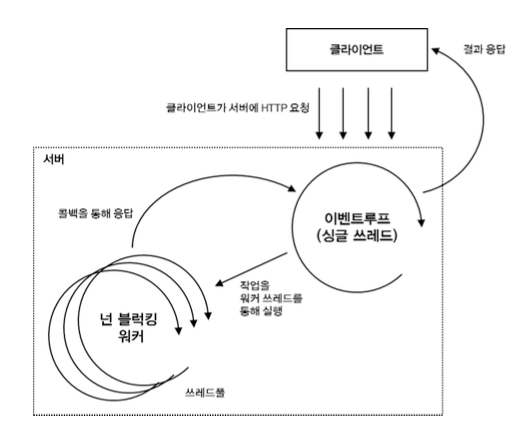

# JS && TS

### node.js
웹 브라우저밖에서 돌아가는 JS 런타임



### 특징
1. 단일 쓰레드와 이벤트 기반
	```
	1. 이벤트루프라는 싱글쓰레드에서 요청을 받아서 처리함.
	2. 많은 요청을 받아서 처리할 수 있는 구조이다. 따라서 대규모 네트워크 프로그램을 개발하기에 적합한 형태이다.
	3. 메모리나 CPU를 많이 사용하는 작업에는 적합하지 않다.
	```
2. 비동기 I/O
	```
	1. 작업을 다른 쓰레드에서 처리하고 작업이 완료되면 콜백을 통해 알림
	2. 실행순서를 보장하지 않는 대신 성능이 좋음
	```

### Promise
비동기처리시 사용되는 객체이며 실행 순서를 보장하지만 실행 완료 순서는 보장하지않는다.

Promise에는 3가지 상태에 대한 구분이 있다.
1. Pending(대기): 비동기 처리 로직이 아직 완료되지 않은 상태
2. Fulfilled(이행): 비동기 처리가 완료되어 프로미스가 결과 값을 반환해준 상태
3. Rejected(실패): 비동기처리가 실패하거나 오류가 발생한 상태

### async & await
프로미스 객체를 가독성있게 사용하기 위한 문법

async 함수를 만들고 이 함수를 사용할 때 await 키워드를 사용한다.

async 함수는 항상 Promise를 반환한다.

다만, 계속 남발할 경우 성능상의 문제가 있다. 그렇기에 동시에 작업을 진행해도 괜찮은 경우 Promise.all()과 Promise.allSettled()를 사용한다.

1. all(): []안의 모든 프로미스 객체를 실행한다. 하나라도 실패하는 경우 실패상태로 전부 반환된다.

2. allSettled(): all과 마찬가지로 []안의 모든 프로미스 객체를 실행하지만 각각의 상태를 관리한다.

결론적으로 all은 하나라도 실패하면 안되는 경우에 사용하고 allSettled은 각각 알아서 처리해도 괜찮은 경우에 사용한다.

### ORM
ORM을 사용하게 될 경우 객체와 관계형 DB를 매핑한다. 즉 객체가 DB 테이블이 되도록 만들어주는 것이다.

ORM을 사용하면 SQL을 작성하지 않아도 직관적인 메서드로 관리할 수 있다. 이는 개발자에게 생산성을 보장한다.

Node.js에서 ORM은 크게 3가지로 나뉜다. Sequelize, TypeORM, Prisma가 있다.

1. 특징
- 객체 중심 개발 가능
	```
    1. SQL 중심 개발이 이루어진다면, CRUD 작업이 반복해서 이루어져야한다.
    2. 하나의 테이블을 생성해야 할 때 이에 해당하는 CRUD를 전부 만들어야 한다.
	이는 추후에 컬럼이 생성되면 관련 SQL을 모두 수정해야 하는 번거로움이 있다.
	또한 개발 과정에서 실수할 가능성도 높아진다.
	```
- 생산성 증가
	```
	1. SQL 쿼리를 직접 생성하지 않고 만들어진 객체에 메서드를 활동해 DB를 다루기 때문에 개발자에게 매우 편리성을 제공한다.
	```
- 단, 복잡한 쿼리는 SQL이나 쿼리빌더로 짜는게 더 유리함.

### N+1 문제
한번의 쿼리로 N건의 데이터를 가져온 후 원하는 데이터를 얻기 위해서 N건의 데이터 수 만큼 2차 쿼리를 날리는 것으로 ORM의 성능 저하를 일으키는 대표적인 이슈이다.

먼저 ORM의 Lazy Loading과 Eager Loading에 대해서 설명을 필요함.

1. Lazy Loading
- 현재 접근하는 메인 모델과 관련이 있는 모델의 데이터를 조회할 때, 메인 모델에 먼저 접근하고 관련 모델은 필요할 때 접근한다.
2. Eager Loading
- 메인 모델에 접근할 때 관련 테이블을 조인해서 한번에 데이터를 조회한다.

Eager Loading 방식은 추가 쿼리문을 날리지 않고 한번의 쿼리문으로 관련 테이블의 데이터를 모두 가지고오기 떄문에 N+1 문제를 해결하여 데이터베이스 부하를 줄일 수 있다.

Sequelize에서는 find 메서드들의 include 옵션을 사용하게 되면 Eager Loading을 사용하게 된다.
