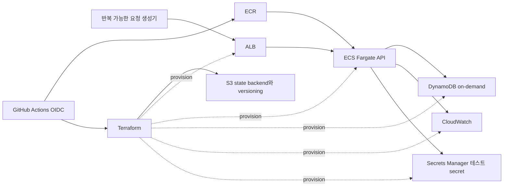

# 2027 DevOps 실전 로드맵

백엔드 서비스를 배포하고 관측하며 장애와 복구까지 책임지는 운영 역량을 보강한다. 2027년 상반기에는 업무에 필요한 내용만 다루고, 6월 실행 점검 뒤 하반기에 제한된 실습 트랙을 시작한다.

## 결정 요약

| 시기 | 실행 | 종료 조건 |
|---|---|---|
| 2027년 1월부터 5월 | 현업에 즉시 필요한 운영 지식만 학습 | 별도 진도표를 만들지 않는다 |
| 2027년 6월 | 최대 2회 준비 세션 | 시간 상한, 기준 아키텍처, 비용과 삭제 절차를 확정한다 |
| 2027년 7월부터 12월 | 최대 24회 실습 세션, 2주는 버퍼 | 아래 성공선까지만 순서대로 닫는다 |
| 2028년 | 닫히지 않은 단계와 확장 범위 | 2027년에 압축해서 끼워 넣지 않는다 |

검색 1차 성공선, 추천 baseline 1차 성공선이나 전체 학습 경로 완료 여부는 시작 조건이 아니다. 다만 DevOps 시간은 기존 수학, 검색과 추천 시간에 더하지 않고 주간 총상한 안에서 재배분한다.

## 성공선과 세션 상한

한 세션은 기본 2시간이다. 3시간째는 재실행이나 기록에만 쓰며 다음 단계 진도를 당기지 않는다.
6월 2회와 하반기 24회를 모두 쓰면 기본 52시간이고, 모든 주에 증액 조건을 충족해도 최대 78시간이다. 중단한 시간을 나중에 몰아서 보충하지 않는다.

| 성공선 | 포함 범위 | 하반기 세션 상한 | 판정 |
|---|---|---:|---|
| 최소 | 핵심 1 Linux와 핵심 2 Terraform/ECS/AWS | 11회 | 2027년의 필수 성공선 |
| 목표 | 최소 성공선과 핵심 3 CI/CD/rollback | 누적 17회 | 시간이 안정적일 때 진행 |
| 확장 목표 | 목표 성공선과 핵심 4 SRE/복구 | 누적 24회 | 남은 시간 안에서만 진행 |
| 별도 확장 | Kubernetes, EKS와 Redis | 배정 없음 | 원칙적으로 2028년 이후 |

단계별 상한은 핵심 1이 3회, 핵심 2가 8회, 핵심 3이 6회, 핵심 4가 7회다. 상한 안에 gate가 닫히지 않으면 다음 단계와 겹치지 않고 남은 작업을 2028년으로 넘긴다. 중단 규칙이 발동한 해에는 최소 성공선 미달을 실패로 계산하지 않는다.

## 시간 gate

1. 5월부터 실제 개인 학습 시간을 기록하고, 6월에 직전 4주의 중앙값을 주간 총상한으로 정한다. 4주 기록이 없으면 시작을 미룬다.
2. 기존 트랙을 유지하고 남는 시간이 주 2시간 이상일 때만 DevOps를 시작한다. 2시간보다 적으면 다음 4주 점검까지 미룬다.
3. 수학, 검색 또는 추천의 계획 산출물이 2주 연속 밀리면 DevOps를 4주 중단한다.
4. 기존 트랙이 4주 연속 계획대로 유지된 뒤에만 주 3시간까지 늘린다.
5. 쉬는 주와 재실행 주를 진도 실패로 채우지 않는다.

## 기준 아키텍처

- 샘플은 `/health`와 작은 CRUD만 가진 단일 HTTP API다. 합성 데이터만 사용한다.
- 학습용 VPC에서 public ALB와 public IP가 있는 Fargate task를 쓰고, task ingress는 ALB security group만 허용한다. NAT 구성을 생략하기 위한 학습용 선택이며 운영 표준으로 일반화하지 않는다.
- 최소 resource contract는 서로 다른 AZ의 public subnet 2개, internet gateway/route table, ALB listener/target group, ALB/task security group, ECS task execution role과 task role이다.
- 저장소는 DynamoDB on-demand 한 표로 고정한다. 기준 설정은 tags와 CloudWatch alarm이며 TTL, PITR, stream과 index는 제외하고 별도 표로 복원한다.
- 별도 `bootstrap/` Terraform 구성과 gitignored local state로 S3 state bucket을 먼저 만든다. 이 bucket은 서비스 teardown 뒤에도 유지하고, 복구 증거를 남긴 다음 object version과 delete marker를 비운 뒤 bootstrap stack에서 마지막으로 삭제한다.
- 배포는 ECS rolling update와 deployment circuit breaker 자동 rollback 한 경로만 사용한다.
- worker/SQS, RDS, blue/green, 다중 환경과 Kubernetes는 2027 핵심 범위에서 제외한다.
- 요청 수, 오류율과 지연 시간을 같은 명령으로 다시 측정할 수 있는 요청 생성 절차를 저장한다.

## 0단계: 6월 실행 준비, 최대 2회

1. 샘플 API와 인프라 저장소의 경계, 실행 명령과 삭제 순서를 정한다.
2. 예산 알림, 리소스 태그, 실습 종료 시각과 비용 중단선을 만든다.
3. 기준 요청을 보내 요청 수, 오류율과 지연 시간의 초기값을 기록한다.
4. 기존 경험을 아래 skip gate로 한 번 검증한다.

### 통과 gate

- [ ] 샘플 API와 인프라 저장소의 경계, 기준 아키텍처와 제외 범위를 문서 없이 다시 그려 설명한다.
- [ ] 직전 4주 기록으로 주간 총상한과 DevOps 시간을 계산했다.
- [ ] 최소 resource contract의 생성/삭제 순서, 예산 알림, 리소스 태그, 실습 종료 시각과 비용 중단선이 적혀 있다.
- [ ] 샘플 API를 로컬에서 한 명령 흐름으로 실행하고 종료하며, 반복 가능한 요청 명령과 요청 수, 오류율, 지연 시간의 초기값을 저장한다.

기존 문서는 통과 증거가 아니라 검증 대상이다. [[My-Tech-Cards-Ops]]의 ECS 경험을 문서 없이 재현하고 rolling 선택, autoscaling, graceful shutdown과 secret 경계를 설명하면 ECS 입문 읽기는 생략한다. 원시 지표로 SLI 분모, SLO와 통계형/건별 alert를 다시 정의하면 SLO 입문 읽기는 생략한다. Terraform state, OIDC, 복구와 실패 주입 gate는 생략하지 않는다.

## 핵심 1: Linux와 로컬 네트워크 진단, 최대 3회

- process, signal, file descriptor, socket, DNS, cgroup과 메모리 압력
- `ps`, `top`, `ss`, `lsof`, `dig`, `strace`와 `tcpdump` 결과 읽기

### 산출물과 gate

- [ ] 메모리 제한을 둔 로컬 container에서 pressure를 만들고 `ps`, `top`과 cgroup 지표로 process를 찾은 뒤 signal로 종료해 복구한다.
- [ ] 격리된 Linux container에서 포트 충돌과 DNS 실패를 각각 만들고 `ss`, `lsof`, `dig`와 `tcpdump`로 socket, 이름 해석과 packet 경로를 확인한다.
- [ ] Linux container에서 파일 디스크립터 고갈을 만들고 `lsof`와 `strace`로 실패 syscall과 열린 descriptor를 확인한 뒤 복구한다.
- [ ] 각 실습의 증상, 가설, 확인 명령, 원인, 복구와 재발 방지를 incident note로 남긴다.

## 핵심 2: Terraform과 ECS Fargate, 최대 8회

- provider, resource, data source, module과 단일 학습 환경
- state, plan review, drift, import, backup과 복구
- S3 backend의 `use_lockfile`, bucket versioning과 state 접근 통제
- ECS task/service, IAM 최소 권한, VPC 요청 경로, ALB health check와 CloudWatch 연결

State와 saved plan에는 민감 정보가 들어갈 수 있다. 버전 관리 저장소에 넣지 않고 최소 권한과 짧은 보존 기간을 적용한다. DynamoDB 기반 state 잠금을 새 기본값으로 두지 않으며 실행 시점의 S3 backend 문서를 다시 확인한다.

### 산출물과 gate

- [ ] 빈 학습 환경에서 재사용 가능한 module과 data source를 포함한 `plan`을 검토한 뒤 기준 아키텍처를 재구축한다.
- [ ] 의도적인 drift를 탐지하고 원복 또는 코드 반영 결정을 기록하며 리소스 하나를 import한다.
- [ ] S3 backend의 `use_lockfile`을 켜고 동시에 실행한 두 번째 명령이 잠금으로 차단되는지 확인하며 지정된 role만 state와 lock object에 접근하는지 검증한다.
- [ ] ECS task role에서 DynamoDB 작업 하나를 명시적으로 거부하고, IAM policy와 CloudWatch log에서 원인을 확인한 뒤 원복한다.
- [ ] ALB에서 task까지의 security group 경로를 끊고, VPC route/security group과 CloudWatch metric/log로 실패 지점을 확인한다. 연결 실패 alarm이 `ALARM`에서 `OK`로 돌아온 뒤 통과한다.
- [ ] 격리된 recovery key에서 S3의 이전 state object version을 실제로 복원하고, `plan`에 의도하지 않은 변경이 없는지 확인한다. 활성 state는 덮어쓰지 않는다.
- [ ] 서비스 stack을 먼저 삭제하고 state 복구 증거를 보존한 뒤, 학습용 bucket의 object version과 delete marker를 비우고 bootstrap stack까지 마지막으로 삭제한다.

## 핵심 3: CI/CD와 rollback, 최대 6회

- test, SBOM, dependency/image scan, build와 deploy 단계 분리
- GitHub Actions OIDC, 제한된 trust policy와 IAM permission policy를 사용해 장기 AWS key 제거
- `terraform fmt`, `validate`, `plan`과 IaC policy/security check
- 동일 commit의 saved plan 승인/apply와 적용 후 artifact 삭제
- commit SHA 기반 image와 ECS rolling update, deployment circuit breaker rollback

### 산출물과 gate

- [ ] test, SBOM, dependency/image scan, build와 deploy를 분리하고 `terraform fmt`, `validate`, `plan`과 IaC security check를 통과하며 scan 또는 policy 위반이 배포를 막는지 확인한다. commit SHA로 tag한 image를 배포하고 실행 task의 image digest를 build artifact와 대조한다.
- [ ] GitHub Actions가 장기 AWS key 없이 OIDC로 제한된 IAM role을 사용하고, workflow `permissions`와 IAM permission policy 증거를 남긴다.
- [ ] OIDC trust policy의 `aud=sts.amazonaws.com`와 실행 시점 형식에 맞는 repository/ref 또는 environment `sub` 제한을 증거로 남긴다. Environment 기반 `sub`를 쓰면 허용 branch/tag만 배포할 수 있는 environment protection rule도 함께 검증한다.
- [ ] 허용/거부 시험은 같은 `id-token: write`, OIDC action과 role ARN을 사용한다. Ref 기반이면 허용하지 않은 ref가 STS trust 조건에서 거부되는지 확인한다. Environment 기반이면 허용하지 않은 branch/tag가 environment protection에서 차단되고, 허용하지 않은 repository 또는 environment가 STS trust 조건에서 거부되는지 실패 지점까지 기록한다.
- [ ] 승인한 plan과 apply 대상 commit이 같고 적용 뒤 plan artifact가 삭제됐는지 확인한다.
- [ ] 잘못된 image 또는 health check 실패를 주입해 circuit breaker가 이전 완료 배포로 복구하는지 확인한다.
- [ ] 배포, 탐지와 복구 시간을 기록한 runbook을 남긴다.

## 핵심 4: SRE, 보안과 복구, 최대 7회

- 사용자 관점의 SLI, SLO, error budget과 symptom 기반 alert
- DynamoDB backup/restore, 측정한 RTO/RPO와 데이터 검증
- 테스트 secret 수동 회전, 새 task 반영과 audit trail
- 부하와 의존성 실패, incident 대응과 blameless postmortem

### 산출물과 gate

- [ ] 가용성 또는 지연 시간 SLI의 분자와 분모, SLO 목표와 error budget을 계산하고 CloudWatch dashboard와 symptom 기반 alarm에 연결해 `ALARM`에서 `OK`까지 확인한다.
- [ ] DynamoDB backup을 새 표로 복원하고 task-role 접근, tags와 CloudWatch alarm을 다시 적용한다. API를 복원 표로 전환해 저장한 요청 절차의 읽기/쓰기가 통과한 시점을 RTO 종료로 삼고, 데이터 손실은 목표 RPO와 비교한다.
- [ ] 테스트 secret 하나를 수동 회전하고 새 task의 서비스 동작과 audit log에서 결과를 확인한다.
- [ ] 부하와 의존성 실패를 각각 주입해 탐지, 완화와 복구를 수행하고 같은 SLO를 가리키는 error budget, alarm과 runbook 증거를 연결한 blameless postmortem을 남긴다.
- [ ] 재구축과 전체 삭제 절차를 다른 사람이 따라 할 수 있게 남긴다.

## 2028년 이후 확장

| 범위 | 시작 조건 | 최소 산출물 |
|---|---|---|
| 로컬 Kubernetes | 핵심 4까지 통과하고 업무 필요가 있음 | kind 배포, probe 오설정, resource/HPA와 rollback 기록 |
| EKS 단기 샌드박스 | 로컬 Kubernetes gate와 비용 통제 통과 | ECS 대비 비용, 권한과 운영 부담 비교 뒤 즉시 삭제 |
| Redis 신뢰성 | 실제 서비스 필요가 있음 | stampede 또는 전달 보장 장애 재현과 복구 기록 |

## 주간 운영과 자격증 규칙

- 한 주에는 새 개념 하나와 검증 가능한 실습 하나만 다룬다.
- 읽기보다 구축, 실패 주입, 복구와 기록에 더 많은 시간을 쓴다.
- 업무 긴급 학습은 허용하되 로드맵 진도를 당겼다고 계산하지 않는다.
- 자격증은 12월에 업무 필요, 공식 시험 가이드와 닫힌 실습 gate를 보고 판단한다. 열린 gate보다 시험 일정을 먼저 두지 않는다.

## 관련 문서

- [[2026-H2-Math-Roadmap|2026 하반기 수학 기초 로드맵]]
- [[2027-Search-Recommendation-Roadmap|2027 검색 엔진 우선, 추천 시스템 전환 로드맵]]
- [[My-Tech-Cards-Ops|내 기술 답변 카드, 관측과 인프라]]
- [[인프라&클라우드(Infrastructure&Cloud)|인프라와 클라우드]]
- [[CICD&배포(CICD&Delivery)|CI/CD와 배포]]
- [[관측가능성(Observability)|관측 가능성]]
- [[SRE|Site Reliability Engineering]]
- [[redis-deep-dive|Redis 심화]]
- [[roadmaps|학습 로드맵 인덱스]]

## 출처

- HashiCorp: [Terraform S3 backend](https://developer.hashicorp.com/terraform/language/backend/s3), [Terraform state](https://developer.hashicorp.com/terraform/language/state), [terraform plan](https://developer.hashicorp.com/terraform/cli/commands/plan)
- AWS: [Fargate task networking](https://docs.aws.amazon.com/AmazonECS/latest/developerguide/fargate-task-networking.html), [Application Load Balancer subnets](https://docs.aws.amazon.com/elasticloadbalancing/latest/application/application-load-balancers.html), [ECS rolling update](https://docs.aws.amazon.com/AmazonECS/latest/developerguide/deployment-type-ecs.html), [deployment circuit breaker](https://docs.aws.amazon.com/AmazonECS/latest/developerguide/deployment-circuit-breaker.html), [DynamoDB backup and restore](https://docs.aws.amazon.com/amazondynamodb/latest/developerguide/CreateBackup.html)
- AWS: [Budgets](https://docs.aws.amazon.com/cost-management/latest/userguide/budgets-managing-costs.html), [Secrets rotation](https://docs.aws.amazon.com/secretsmanager/latest/userguide/rotating-secrets.html), [Operational Excellence](https://docs.aws.amazon.com/wellarchitected/latest/operational-excellence-pillar/welcome.html)
- GitHub: [AWS에서 OpenID Connect 구성](https://docs.github.com/en/actions/how-tos/secure-your-work/security-harden-deployments/oidc-in-aws)
- Kubernetes: [probes](https://kubernetes.io/docs/concepts/workloads/pods/pod-lifecycle/#container-probes), [resource management](https://kubernetes.io/docs/concepts/configuration/manage-resources-containers/), [HPA](https://kubernetes.io/docs/concepts/workloads/autoscaling/horizontal-pod-autoscale/)
- [Google SRE Workbook](https://sre.google/workbook/table-of-contents/)
