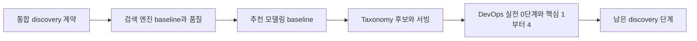

# 2027 검색 엔진 우선, 추천 시스템 전환 로드맵

수학 2단계 gate 뒤 검색 엔진의 baseline과 품질 평가를 먼저 실습하고, 그 결과를 추천 시스템 baseline으로 연결한다. 검색은 추천의 수학적 선행조건이 아니다. 현재 업무 우선순위와 공통 discovery 계약의 재사용 가치를 근거로 실행 순서만 검색 우선으로 정한다. 문서의 2027은 가장 이른 시작 목표이며 수학이 늦어지면 이 계획도 그대로 뒤로 미룬다.

## 시작 조건과 운영 원칙

- [[2026-H2-Math-Roadmap|2026 하반기 수학 기초 로드맵]]의 2단계 gate를 통과한 뒤 시작한다.
- 이 로드맵을 진행하는 동안 다른 체계적 개인 학습 트랙을 병행하지 않는다.
- 검색 1차 성공선을 통과한 뒤에만 추천 baseline으로 전환한다.
- 추천과 taxonomy 1차 성공선을 통과한 뒤에만 DevOps로 전환한다.
- 업무상 긴급한 검색/추천 학습은 즉시 수행할 수 있지만 로드맵 단계 통과로 자동 인정하지 않는다.

## 검색을 먼저 하는 이유

1. 현재 구축 업무에서 검색 엔진의 mapping, analyzer, query와 품질 평가를 먼저 이해할 필요가 있다.
2. 작품 ID, catalog 정본, eligibility와 요청/노출 로그 계약은 검색과 추천 양쪽에서 재사용할 수 있다.
3. 관련도 판단과 회귀 평가 절차를 먼저 익히면 추천에서도 baseline 고정, slice 분석과 변경 판정 습관을 재사용할 수 있다.
4. 검색 relevance와 추천 선호 예측은 목적과 label이 다르므로 한 점수나 한 모델로 합치지 않는다.

## 전체 순서

이 문서의 1차 성공선은 [[Search-Recommendation-Discovery-Learning-Path|검색과 추천 디스커버리 학습 경로]]의 0단계와 1단계, 이어서 2단계, D1의 3단계와 D2의 7단계 일부에 대응한다. 전체 완료는 연결 문서의 여덟 단계 산출물과 완료 조건으로만 판정한다.

## A. 통합 discovery 계약

검색 실습 전에 다음 계약을 작은 fixture로 고정한다.

- 작품 ID, title/alias, taxonomy, 공개 상태와 시청 가능성의 정본 및 snapshot 시각
- 검색 query, 추천 request, candidate source, ranked slate와 실제 impression을 구분하는 event schema
- 검색 relevance judgement와 추천 click/재생 outcome을 분리하는 label 정의
- eligibility가 적용되는 위치, fallback과 결과 version을 추적하는 필드

### 통과 gate

- [ ] Query-bound search, queryless recommendation과 taxonomy browse의 요청 흐름을 한 장에 그린다.
- [ ] 세 surface의 사용자 의도, candidate source, eligibility, ranking과 primary metric 차이를 표로 설명한다.
- [ ] 같은 작품 ID와 catalog snapshot을 사용하면서 label과 평가 protocol은 분리한 fixture를 만든다.

## B. 검색 엔진 baseline과 품질 평가

### 고정할 데이터와 실행 계약

- 첫 fixture는 작품 50개로 고정하고 title/alias와 검색에 필요한 필드를 포함한다.
- 서로 겹치지 않는 head, torso, tail 및 의도적 no-match query를 구간별 5개 이상 준비한다. Head/torso/tail에는 relevant 작품이 하나 이상 있어야 하며, 실제 query 빈도 로그가 없으면 구분을 가설로 표시한다.
- 모든 query-document 쌍을 0에서 3으로 판정하고 relevant threshold를 1로 고정한다. 의도적 no-match query는 모든 작품이 0인지 확인하며 판단 불일치는 별도로 기록한다.
- 첫 BM25 fixture의 no-match 정책은 `STRICT_EMPTY`로 고정해 원 검색 결과의 `returned_count=0`을 성공으로 본다. 교정, 제안이나 fallback을 시험한다면 `responseMode`로 원 검색과 분리하고 별도 label, 성공률과 guardrail을 정한다.
- 첫 calibration 기준은 OpenSearch 3.6.0으로 고정하고 node 수와 instance 자원, index settings, mapping, analyzer, query DSL 및 fixture hash를 결과에 남긴다. 실제 대상 version이 다르면 해당 tag의 core source와 REST 응답으로 API 기대값을 다시 고정한 뒤 제품 query 평가를 시작한다.
- 품질 평균과 분리한 `FORMULA_10` calibration fixture는 정확히 10개 문서를 고정 순서로 반환한다. 전체 judgment는 이 10개의 `(docId, rating)` 쌍으로만 구성하고 추가 judgment를 두지 않는다. 반환 rating 순서를 `[3, 0, 2, 1, 0, 3, 2, 0, 1, 0]`으로 두면 기대값은 `DCG=12.725156863494`, `IDCG=14.951597943563`, `nDCG=0.851090091609`다.
- `UNDERFILL_1_OF_3` calibration fixture는 전체 judgment rating을 `[3, 2, 1]`, 실제 반환 rating을 `[3]`, `k=10`, `details.<queryId>.unrated_docs=[]`와 `details.<queryId>.metric_details.dcg.unrated_docs=0`으로 고정한다. OpenSearch 3.6.0 API 기대값은 `DCG=7`, `IDCG=7`, `nDCG=1`이고, 독립 fixed-K 기대값은 `DCG=7`, `IDCG=9.392789260714`, `nDCG=0.745252534226`, `Recall@10=1/3`이다.

### 실습 순서

1. 명시적인 mapping/analyzer/query 계약으로 BM25 baseline을 만든다.
2. `_analyze`로 token을 확인하고 `_explain`으로 대표 문서의 match와 score 근거를 추적한다.
3. Relevant 작품이 하나 이상인 query만 대상으로 Rank Evaluation API를 두 번 호출한다. nDCG@10은 `dcg: {k: 10, normalize: true, unknown_doc_rating: 0}`, MRR은 `mean_reciprocal_rank: {k: 10, relevant_rating_threshold: 1}`로 고정한다.
4. 독립 script의 DCG@10은 실습에 고정한 OpenSearch version과 같이 반환 상위 10개의 각 순위 기여도를 `(2^r-1)/log2(rank+1)`로 합산한다. `rank`는 1부터 10까지 세고, 미반환 순위와 unknown rating은 `r=0`으로 둔다. IDCG@10은 반환 수와 무관하게 전체 judgment의 상위 10개 등급에 같은 식을 적용한다. `Recall@10`은 반환 상위 10개 중 `rating >= 1`인 문서 수를 전체 judgment 중 `rating >= 1`인 문서 수로 나눈다. Query별 `returned_count`도 저장하고 `underfill_query_rate@10`은 relevant query 중 반환 수가 10보다 작은 query 비율로 고정한다.
5. 두 calibration query의 OpenSearch 3.6.0 REST body `details.<queryId>.metric_details.dcg` 안에 있는 `dcg`, `ideal_dcg`, `normalized_dcg`, 숫자 `unrated_docs`와 독립 계산값을 위 기대값에 대조한다. 바깥 `details.<queryId>.unrated_docs` 배열도 별도로 저장한다. `FORMULA_10`은 양쪽 수치가 같아야 하고 `UNDERFILL_1_OF_3`은 API nDCG 1과 fixed-K nDCG 0.745252534226이 갈라져야 한다. 하나라도 절대오차가 `1e-9`를 넘거나 바깥 배열이 비어 있지 않거나 안쪽 숫자가 0이 아니거나 nDCG 차이가 재현되지 않으면 평가 구현 채택을 중단한다.
6. Profile API로 검색 구성 요소별 실행 시간을 비교한다. Profile 결과는 end-to-end 지연 시간과 동일하지 않으므로 p95 근거로 단독 사용하지 않는다.
7. 같은 client, 요청 집합, concurrency, warm-up, 반복 횟수와 cache 조건을 고정한 부하 절차로 end-to-end p95, timeout과 error rate를 측정한다.
8. Relevant query의 unexpected zero-result와 underfill을 집계한다. No-match는 `no_match_false_positive_query_rate = returned_count가 1 이상인 query 수 / no-match query 수`로 계산하고 `STRICT_EMPTY` fixture에서는 0만 통과시킨다. No-match query를 ranking metric 평균에 넣지 않는다.
9. mapping, analyzer 또는 query 변경 전에 fixed-K nDCG@10 primary metric, Recall@10, underfill, no-match false positive, query별 회귀와 latency/error guardrail을 고정한 뒤 채택 또는 기각한다.

### 검색 1차 성공선

- [ ] 작품 50개와 네 query 구간별 5개 이상의 fixture가 재현 가능하며, 빈도 근거가 없는 구간 분류는 가설로 표시했다.
- [ ] 모든 query-document 쌍의 rating, 판단 기준과 relevant threshold를 저장하고 query별 `details.<queryId>.unrated_docs` 배열 길이와 `details.<queryId>.metric_details.dcg.unrated_docs` 숫자가 모두 0인지 확인했다.
- [ ] 품질 평균에서 제외한 `FORMULA_10`과 `UNDERFILL_1_OF_3` fixture의 반환 순서, 전체 judgment, 기대 API/fixed-K 수치를 저장했다. 전자는 양쪽 수치가 일치하고 후자는 API와 fixed-K nDCG가 위 기대대로 갈라지며, fixed-K `Recall@10=1/3`을 포함한 모든 계산값의 절대오차가 각각 `1e-9` 이내임을 확인했다.
- [ ] Version이 고정된 BM25 baseline의 mapping, analyzer, query DSL, 두 Rank Evaluation payload와 fixed-K 검증 script를 저장했다.
- [ ] `_analyze`, `_explain`과 Profile 결과로 token, score 근거와 느린 구성 요소를 설명한다.
- [ ] 전수 판정 gold set에서 relevant query의 Rank Evaluation nDCG/MRR과 독립 fixed-K nDCG@10/Recall@10을 계산하고 query별 반환 수, unexpected zero-result와 underfill을 기록한다.
- [ ] `STRICT_EMPTY` no-match의 false-positive query rate가 0이며 교정, 제안이나 fallback 결과를 원 검색과 섞지 않았다.
- [ ] 반복 가능한 측정 절차로 end-to-end p95와 error rate를 계산한다.
- [ ] 변경 전에 정한 primary metric, query별 회귀와 latency/error guardrail에 따라 변경을 채택하거나 기각하고 이유를 남긴다.

검색 성공선에서 막히면 추천으로 넘어가 일정만 맞추지 않는다. corpus, judgement, query 계약 또는 측정 절차 중 실패한 항목을 먼저 수정한다.

## C. 추천 모델링 baseline

검색에서 만든 ID/event schema, versioning과 평가 규율은 재사용하지만 검색용 작품 fixture와 추천 모델링 데이터는 분리한다. 추천 첫 실습은 stable benchmark인 MovieLens 100K로 두고 배포판 URL, 내려받은 파일의 SHA-256, seed, 시간 cutoff와 동률 처리 규칙을 기록한다.

### 평가 계약

- Rating 4 이상을 relevant로 고정하고 전역 시간 순서로 train/validation/test를 나눈다. Validation에서는 train만으로 모델과 item 통계를 만들고 설정을 선택한다. 선택 뒤 train과 validation으로 한 번 다시 학습해 고정한 뒤 test는 한 번만 평가한다.
- Pinned MovieLens metadata snapshot의 모든 item이 각 prediction cutoff에 존재한다고 가정한다. Validation candidate는 전체 catalog에서 사용자의 train interaction item을 빼고, test candidate는 train+validation interaction item을 뺀다. 이 가정과 반복 추천 예외를 기록하며 label이나 sampled negative로 후보를 줄이지 않는다.
- Validation에서는 train에 interaction이 없는 item, test에서는 train+validation에 interaction이 없는 item을 cold-start로 판정한다. 이 item도 후보에서 빼지 않고 해당 단계의 과거 데이터만 사용하는 공통 deterministic fallback을 적용해 개수와 비율을 보고한다.
- Validation 평가 사용자는 train interaction과 validation relevant item이, test 평가 사용자는 train+validation interaction과 test relevant item이 하나 이상인 사용자로 각각 고정한다. 제외 사유와 사용자별 candidate 수의 min/median/p95를 단계별로 기록한다.
- Train/validation/test별 user/item/interaction 수와 모든 metric 분모를 남긴다. 최소 분모는 평가 사용자 100명과 test relevant pair 300개다.
- 최종 test의 사용자 활동량 구간은 train+validation interaction 수로 만들고 구간별 평가 사용자 30명 이상을 요구한다. 작품 인기도 구간도 train+validation interaction으로 만들며 구간별 test relevant pair 30개와 distinct item 10개 이상을 요구하고 distinct user/item/pair 수를 모두 보고한다. 미달 결과는 `insufficient`로 판정한다.

1. Popularity baseline
2. Item-item collaborative filtering
3. Matrix Factorization
4. 시간 기준 train/validation/test 분리와 데이터 누수 검사
5. 같은 candidate universe와 relevant 기준의 Recall@10 및 NDCG@10 비교
6. 사용자 활동량과 작품 인기도 slice별 결과 비교

### 2027 추천 baseline 1차 성공선

- [ ] Dataset version/hash, cutoff, split별 user/item/interaction 수, 평가 사용자와 제외 사유 및 모든 metric의 분모를 기록한다.
- [ ] Train-only validation, test one-shot, full-catalog candidate universe, cold-start fallback과 누수 검사를 고정하고 세 baseline을 같은 평가 사용자 집합에서 비교한다.
- [ ] Recall@10과 NDCG@10의 전체 결과와 사용자 활동량 및 작품 인기도 구간의 user/item/pair 분모를 함께 기록하며 최소 분모 미달은 `insufficient`로 표시한다.
- [ ] 성능 차이뿐 아니라 popularity 대비 복잡도를 늘릴 근거와 보류 조건을 적는다.

## D. Taxonomy 후보와 logging/serving

이 단계는 MovieLens 지표를 그대로 이어 붙이지 않는다. 검색에서 사용한 도메인 작품 fixture 또는 승인된 내부 catalog snapshot으로 돌아가고, A단계의 ID/event schema와 version 계약만 재사용한다.

### D1. Taxonomy candidate gate

- [ ] 작품 concept schema, version, assignment와 gold set 계약을 고정한다.
- [ ] Taxonomy item-to-item, 인기/편집과 behavior item-to-item의 candidate를 같은 eligible universe에서 비교한다.
- [ ] Baseline source 목록, source별 K, 총 candidate budget, merge/truncation, canonical ID dedup과 최종 eligibility 순서를 먼저 고정한다. 같은 gold set에서 `Recall@K(base ∪ taxonomy) - Recall@K(base)`와 중복, underfill 및 latency를 계산한다.
- [ ] Surface별 S0-S3 선택과 보류 이유를 데이터 성숙도 및 실패 fallback으로 방어한다.

### D2. Logging/serving gate

D1을 통과한 뒤 아래 축소 범위만 수행한다.

- [ ] request, candidate item/source, ranked slate, actual impression, position, timestamp/context와 click/재생 outcome의 join key 및 연결률을 audit한다.
- [ ] Bundle, feature, taxonomy, index와 policy version을 요청 단위로 추적한다.
- [ ] Redis/API의 cache hit/miss, 정확성, latency와 실패 fallback을 model quality와 분리해 검증한다.
- [ ] 검색, 추천과 taxonomy 결과의 채택/보류 이유를 하나의 재현 가능한 보고서로 설명한다.

### 추천과 taxonomy 1차 성공선

- [ ] C단계의 추천 baseline gate와 D1 taxonomy candidate gate, D2 logging/serving gate를 모두 닫았다.

이 gate를 통과하면 검색/추천 로드맵을 닫고 DevOps로 전환한다. Personalized Search, page 조립, OPE, 온라인 실험과 전체 장애 훈련은 DevOps 핵심 4 통과 뒤 [[Search-Recommendation-Discovery-Learning-Path|전체 학습 경로]]에서 재개한다. 현업에 즉시 필요한 경우가 아니면 OPE, Two-Tower, deep ranking, Transformer, GNN과 강화학습을 앞당기거나 병행하지 않는다.

## 관련 문서

- [[2026-H2-Math-Roadmap|2026 하반기 수학 기초 로드맵]]
- [[Search-Recommendation-Discovery-Learning-Path|검색과 추천 디스커버리 학습 경로]]
- [[OpenSearch|OpenSearch 학습 지도]]
- [[Recommendation-System-Modeling-Foundations|추천 시스템 모델링 기초]]
- [[2027-DevOps-Practical-Roadmap|2027 DevOps 실전 로드맵]]
- [[roadmaps|학습 로드맵 인덱스]]

## 출처

- GroupLens: [MovieLens datasets](https://grouplens.org/datasets/movielens/)
- OpenSearch: [Analyze API](https://docs.opensearch.org/latest/api-reference/analyze-apis/)
- OpenSearch: [Explain API](https://docs.opensearch.org/latest/api-reference/search-apis/explain/)
- OpenSearch: [Rank evaluation API](https://docs.opensearch.org/latest/api-reference/search-apis/rank-eval/)
- OpenSearch 3.6.0 core: [DiscountedCumulativeGain.java](https://github.com/opensearch-project/OpenSearch/blob/3.6.0/modules/rank-eval/src/main/java/org/opensearch/index/rankeval/DiscountedCumulativeGain.java), [EvalQueryQuality.java](https://github.com/opensearch-project/OpenSearch/blob/3.6.0/modules/rank-eval/src/main/java/org/opensearch/index/rankeval/EvalQueryQuality.java), [RankEvalResponse.java](https://github.com/opensearch-project/OpenSearch/blob/3.6.0/modules/rank-eval/src/main/java/org/opensearch/index/rankeval/RankEvalResponse.java), [MeanReciprocalRank.java](https://github.com/opensearch-project/OpenSearch/blob/3.6.0/modules/rank-eval/src/main/java/org/opensearch/index/rankeval/MeanReciprocalRank.java)
- OpenSearch: [Profile API](https://docs.opensearch.org/latest/api-reference/search-apis/profile/)
