<!-- _class: lead -->
<!-- _paginate: false -->

# 키노라이츠 1차 기술 발표

### 작은 팀이 큰 트래픽을 감당하게

<br>

[이름], 4년차 백엔드 개발자
2026.06.08

---

<!-- _header: 약력 -->

## 각 자리에서 부족한 한 축씩 채워온 4년

- **트라이포드랩** (IoT VMI) — 0에서 1, 백엔드를 사실상 단독으로 설계하고 운영
- **시솔지주** (국제 배송) — 운영 품질을 처음으로 직접 책임 (환율 배치 안정화, 테스트 게이트, FIDO 인증)
- **이썸테크** (SI) — Java, Spring으로 백엔드 기본기

<span class="note">42서울, 멋쟁이사자처럼 부트캠프 수강생 100명 중 최우수 수료</span>

> 오늘은 트라이포드랩에서 내린 기술 의사결정을 **실제로 겪은 순서대로** 풀어갑니다.

---

<!-- _header: 출발점 → 목적지 -->

## 한 번에 만든 그림이 아니라, 문제에 반응해 키운 그림

**합류 시점** — 단일 EC2 한 대에 nginx와 NestJS, SSL은 Certbot 수동

**현재**

<div style="text-align:center; margin-top:6px;">
  
</div>

<div class="acmline">
  인증서는 ACM으로 자동 발급과 갱신, CloudFront와 ALB에 연결
</div>

---

<!-- _class: step -->
<!-- _header: 1단계 -->
<!-- _footer: 정상화 → 관측 → 인프라+동시성 → 정합성과 성능 → 발주 자동화 -->

## 깨진 프로덕트를 테스트로 정상화

<p class="note">합류 직후 핵심 기능이 동작하지 않아 박람회 데모도 어려운 상태</p>

- 저 혼자 풀 규모가 아니라 **팀 전체가 매달림**<br/>PM은 규칙 기준, 프론트는 화면, **저는 백엔드에서 비즈니스 규칙을 테스트로 못 박음**
- 단위로 부족해 **컨테이너로 실제 DB에 붙는 통합 테스트** — 모킹이 아니라 진짜 DB에서 숨은 버그와 정합성 문제를 드러냄

**성과** — 박람회 데모 가능 → 대형 제약바이오회사, F&B 2000억 규모 회사 PoC 수주, 정상화 기반 덕에 무사 완수

---

<!-- _class: step -->
<!-- _header: 2단계 -->
<!-- _footer: 정상화 → 관측 → 인프라+동시성 → 정합성과 성능 → 발주 자동화 -->

## 운영이 안 보인다 → 관측 인프라 구축

<p class="note">오류는 반복되는데 원인을 빨리 짚을 수 없었다</p>

- CloudWatch에서 시작 → 한계 → **Prometheus, Loki, Grafana 자체 호스팅**
- **왜 오픈소스** — Datadog은 트래픽 따라 비용 급증, 작은 팀엔 비용 예측성이 더 중요
- **3계층** — 메트릭(Prometheus + Thanos S3), 로그(Loki + Compactor 핫/콜드), 앱(AsyncLocalStorage 트레이싱)
- **카디널리티**는 고유 값을 라벨에서 빼서 관리

<span class="note">흑자 단계의 키노라이츠가 Datadog을 쓰는 건 합리적 — 직접 굴려본 경험이 그대로 전이</span>

---

<!-- _class: step -->
<!-- _header: 3단계 -->
<!-- _footer: 정상화 → 관측 → 인프라+동시성 → 정합성과 성능 → 발주 자동화 -->

## 관측이 드러낸 한계 ① 인프라 전환

- **이중 로드밸런서** — IoT는 펌웨어 IP 하드코딩이라 고정 IP가 필요(NLB), 웹은 경로 라우팅(ALB)
- **ECS Fargate vs EKS** — 운영 인력과 트래픽 규모에서 K8s 오버헤드가 가치보다 컸다. 기존 Docker를 그대로 확장
- 이미지 **909MB → 513MB (43%↓)**, 배포 시간 **26%↓**, Read Replica로 조회 **40%↑** DB CPU **30%↓**

> **동시성도 한 묶음의 결정** — 한 대에서 여러 인스턴스로 늘리면 인메모리 락이 무력화된다. 그래서 정합성을 같이 설계했다.

---

<!-- _class: step -->
<!-- _header: 3단계 -->
<!-- _footer: 정상화 → 관측 → 인프라+동시성 → 정합성과 성능 → 발주 자동화 -->

## 관측이 드러낸 한계 ② 데이터 정합성

**동시성** — 같은 품목에 입출고가 동시에 (최대 5대)

- `SELECT FOR UPDATE NOWAIT` 배타 락, 충돌 시 100ms 간격 3회 재시도 (디바이스 타임아웃 1초 안에 결정)
- 낙관적 락은 충돌 잦아 재실행 비용 과도, Redis 분산 락은 **트랜잭션 밖이라 만료나 크래시 때 재고와 어긋날 위험에 인프라만 추가** (락 대상이 DB 행이라 SELECT FOR UPDATE가 적합)

**정밀도** — 금액과 재고를 number로 하면 부동소수점 오류 → **Decimal 연산과 통화별 반올림**

<span class="note">발주 금액과 거래명세서가 1원이라도 틀리면 신뢰가 깨지는 도메인</span>

---

<!-- _class: step -->
<!-- _header: 3단계 -->
<!-- _footer: 정상화 → 관측 → 인프라+동시성 → 정합성과 성능 → 발주 자동화 -->

## 관측이 드러낸 한계 ③ 성능

| 영역 | 문제 | 해결 | 결과 |
|---|---|---|---|
| 인덱스 | 100만 건 filesort | 복합 인덱스 설계 | 행당 15.4ms → 0.1ms (**154배**) |
| ORM | Prisma include N+1 | relationLoadStrategy join | **82~90%↑** |
| ORM | 복잡 쿼리 한계 | prisma-kysely 도입 | 리포트 2400ms → 40ms (**60배**) |

- **2단계 전략** — 단순 CRUD는 Prisma, 크리티컬 복잡 쿼리만 실행계획 보고 Kysely로
- **k6 성능 테스트 프레임워크** — 최적화 회귀 방지로 주요 엔드포인트마다 부하 테스트 작성
  - 실제 트래픽이 오르내리는 패턴을 모사한 부하로, **리틀의 법칙으로 동시성을 역산해 SLA 임계 자동 생성**
  - 발주는 장바구니부터 발주까지 전체를 추적하는 **E2E 트랜잭션 성능 테스트**

<span class="note">TypeORM을 쓰셔도, 추상화 비용을 실행계획까지 내려가 검증하는 사고는 그대로 적용</span>

---

<!-- _class: step -->
<!-- _header: 클라이맥스 -->
<!-- _footer: 정상화 → 관측 → 인프라+동시성 → 정합성과 성능 → 발주 자동화 -->

## 발주 자동화 — 왜 이벤트 기반 아키텍처인가

<p class="note">VMI 발주는 발주사, 수주사를 거쳐 발주와 수주 처리, 발주서, 거래명세서까지 여러 단계가 한 흐름에 묶인 복잡한 비즈니스 로직</p>

- **문제** — 단계를 동기로 묶으면 강결합이라 확장이 어렵고, 한 단계 실패가 발주 전체를 막음
- **해결** — 발주 이벤트 기준으로 각 단계를 **디커플링**, 액션마다 독립 처리 + 채널별 DLQ<br/>(월 10만 발주 × 5 액션 = 월 50만 메시지, 프리티어)

```
발주 이벤트 → EventBridge → SQS(발주처리, 수주처리, 발주 카톡, 발주서 메일, 거래명세서 메일) → ECS 워커 병렬
```

<div style="text-align:center; margin-top:8px;">
<span class="big">99.99%</span> <span class="note">Kafka(MSK) 대비 비용 절감, 비즈니스 로직 결합도 대폭 감소</span>
</div>

---

<!-- _header: 클라이맥스 -->

## 가장 고민한 결정 — 메시징 인프라

| 항목 | MSK (관리형 Kafka) | EventBridge + SQS (선택) |
|---|---|---|
| 월 비용 | **$574 고정** | **$0 ~ 18** |
| 적정 트래픽 | 초당 수만 건 이상 | 월 50만 건 (프리티어 내) |
| 순서, 리플레이 | 강함 | 발주는 최종 일관성으로 충분 |
| 운영 부담 | 클러스터 운영 | 관리형, 운영 부담 0 |

**기술 결정을 사업 단계와 함께** — PMF 단계 스타트업에 Kafka는 과한 비용

> 지금이라면 — **Transactional Outbox**를 적용했을 것 같습니다 (우리 규모엔 폴링으로 충분)

---

<!-- _header: AI 워크플로우 -->

## 혼자여도 속도와 품질을 동시에

- 백엔드를 사실상 혼자 맡다 보니, **Claude Code를 개발 파이프라인 자체로 재설계**
- 계층형 컨텍스트, MCP, 서브에이전트, 작업 종료 시 자가 리뷰 훅 → 코드 품질 회귀 통제
- **원칙 — 설계와 의사결정은 사람, 반복 작업만 AI**

<span class="note">EventBridge와 Kafka 비교 같은 판단은 직접, AI는 그 결정을 구현하고 테스트로 검증</span>

---

<!-- _class: lead -->
<!-- _header: 마무리 -->

## 작은 팀이 큰 트래픽을 감당하게

정상화로 영업을 가능하게, 관측과 인프라로 운영을 안정화, 정합성과 성능을 잡고, 발주를 자동화

<br>

키노라이츠 백엔드 팀이 서버, 인프라, CI/CD, 관측, 장애를 한 팀이 책임지는 구조가 제 경험과 맞닿아 있습니다.

**여러 OTT에 흩어진 메타데이터를 정합성 있게 맞추고 최신으로 유지해 검색과 추천으로 연결하는 일**은,<br/>제가 수천 대 IoT 기기가 동시에 보내는 데이터의 정합성을 잡아 발주와 리포트로 연결해온 일과 본질이 같다고 느꼈습니다.

<span class="note">검색과 추천은 다음 단계로 가장 파고들고 싶은 영역입니다. 감사합니다.</span>
