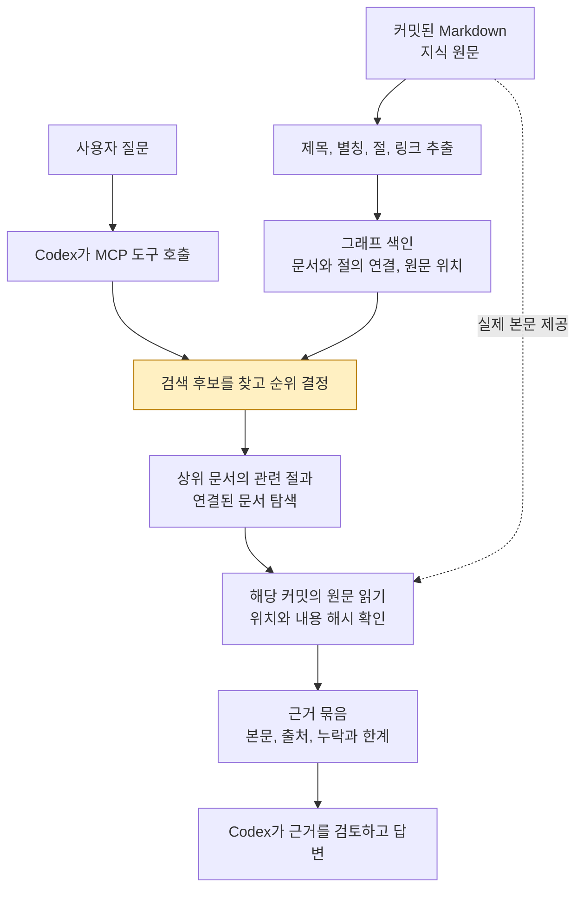
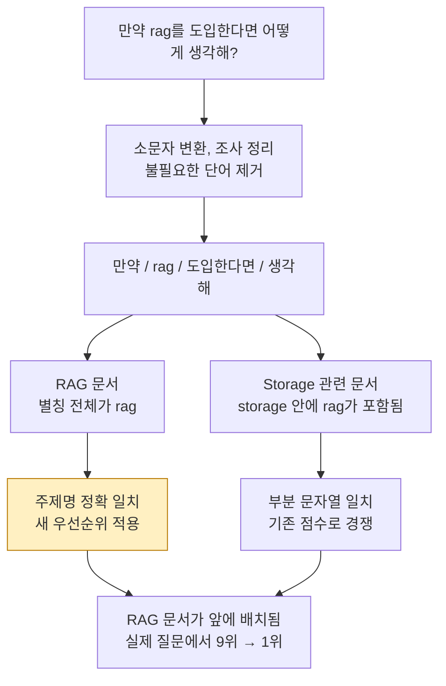
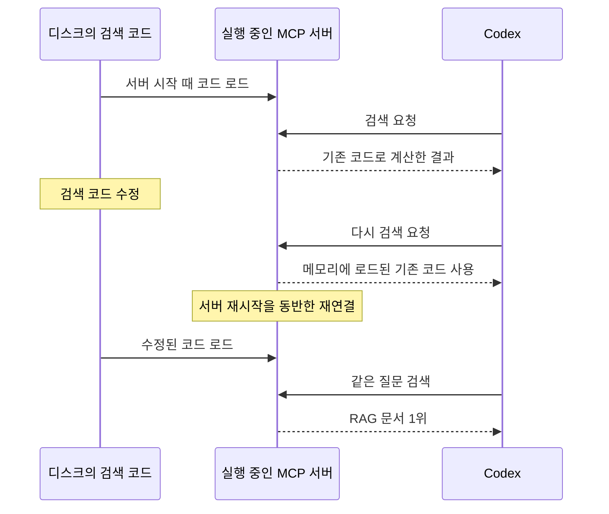

# 온톨로지 검색 흐름: 원문에서 답변까지

이 Vault는 **원문 → 탐색용 색인 → 후보 선정 → 원문 확인 → 답변** 순서로 지식을 활용한다. 2026-09-15 검색 개선과 재연결을 사례로, 전체 흐름과 각 단계의 역할을 설명한다.

## 1. 전체 구조: 문서를 찾아 근거로 답하기

아래는 `context_lookup`으로 근거를 가져오는 대표 흐름이다. MCP는 Codex가 검색 서버의 도구를 호출하고 결과를 받는 연결 규약이다.

노란 부분이 이번에 개선한 후보 정렬 단계다. 그래프 색인은 원문을 찾아가는 지도이며, 근거 본문은 해당 Git 커밋의 Markdown에서 읽는다.

| 개념 | 이 시스템에서 맡는 역할 |
| --- | --- |
| 온톨로지 | 어떤 종류의 문서, 절, 관계를 표현할지 정한 규칙 |
| 지식 그래프 | 그 규칙으로 추출한 문서와 절의 연결 구조 |
| 검색 | 질문과 관련된 문서와 본문을 고르는 작업 |
| RAG | 검색한 근거를 AI에게 함께 제공해 답변에 활용하는 흐름 |

현재 검색 서버는 키워드와 원문에 명시된 관계를 사용한다. 임베딩이나 벡터 DB는 사용하지 않으며, 답변 생성은 Codex 같은 AI host가 담당한다. `source_confirmed`는 원문에서 연결을 확인했다는 뜻이다. 내용의 정확성이나 현재 프로젝트에 대한 적용 가능성은 별도로 판단한다.

## 2. 검색 개선: RAG 문서가 1위로 올라온 이유

실제 질문은 `만약 rag를 도입한다면 어떻게 생각해?`였다. 소문자 변환, 조사 정리와 불필요한 단어 제거를 거쳐 검색용 단어 조각으로 바꾼다.

`storage`는 `sto` + `rag` + `e`로 나눌 수 있다. 기존 부분 문자열 검색에서는 이것도 `rag`에 걸렸다. 질문 속 단어가 문서의 제목이나 별칭 전체와 같으면 먼저 배치하도록 보강했다.

정렬은 다음 순서로 우선권을 비교한다.

1. 질문 전체와 문서 또는 절의 메타데이터가 정확히 일치하는 후보
2. 짧은 질문의 단어와 Document 제목 또는 별칭 전체가 일치하는 후보
3. 기존 검색 점수, 동점이면 문서 ID 순서

2번은 정규화, 키워드 확장과 중복 제거 후 검색 토큰이 **8개 미만**일 때 적용한다. 조건 힌트를 전달했다면 그 토큰도 함께 센다. `status: index`인 목차 문서는 이 추가 우선권에서 제외한다. 태그도 2번의 판단에는 쓰지 않지만, 기존 메타데이터 검색과 질문 전체의 정확 일치에는 계속 참여한다.

여기서 토큰은 **검색용 단어 조각**이며 LLM의 과금 토큰과 별개다. 제목이나 별칭 전체가 단어 하나와 같아야 하므로, 별칭에 `RAG`가 있는 문서가 이 예시에 해당한다.

8개 경계는 이 구현의 경험적 규칙이다. 긴 복합 질문에서 일반 주제 문서가 구체적인 조건의 근거를 밀어내는 문제를 줄이기 위해 적용 범위를 제한했다. 모든 질문의 의미를 이해한다는 뜻은 아니다.

### 순위와 탐색 제한

`context_lookup`은 최대 6개 문서를 탐색의 시작점으로 삼는다. RAG 문서가 9위에서 1위로 올라오면서 시작 후보에 포함됐고, 실제 질문에서 필요한 원문이 반환됐다. 상세 평가와 남은 실패는 [[Ontology-Retrieval-Quality#짧은 문장 속 주제명 검색]]에 기록한다.

관계 탐색은 허용된 원문 범위 안에서 1 또는 2단계로 제한한다. 문서와 절의 수, 연결 수, 응답 크기에도 상한이 있어 연결된 그래프 전체를 매번 읽지는 않는다. 제한으로 빠진 결과는 응답에 표시한다.

| 도구 | 역할 |
| --- | --- |
| `context_search` | 문서 후보를 페이지로 반환. 본문은 반환하지 않으며 상위 6개 시작점 제한을 적용하지 않음 |
| `context_lookup` | 관련 본문과 연결 관계를 근거 묶음으로 반환 |
| `context_outline` | 찾은 문서의 절 목록과 원문 읽기에 필요한 식별 정보 확인 |
| `context_read` | 선택한 절을 같은 커밋과 내용 해시로 이어 읽기 |

### 검색 순위와 근거 검증

검색 1위는 먼저 읽을 후보라는 뜻이다. 답변의 정확성은 그 본문이 질문을 실제로 뒷받침하는지 확인해야 판단할 수 있다.

| 반환 정보 | 확인할 수 있는 것 |
| --- | --- |
| `source_uri` | 어느 원문 파일인가 |
| `source_revision` | 어느 Git 커밋의 내용인가 |
| `anchor` | 파일 안의 어느 heading과 byte 구간인가 |
| `content_hash` | 읽은 구간이 색인할 때 기록한 내용과 일치하는가 |

해시 일치는 원문 구간의 무결성을 확인한다. 그 문장의 사실성, 최신성, 답변에 대한 의미적 지지는 별도 검토 대상이다.

## 3. 재연결: 실행 중인 서버에 새 코드 적용하기

검색 코드 파일을 수정해도 실행 중인 서버는 이미 메모리에 로드한 코드를 사용한다. 현재 구현에는 코드 변경을 자동으로 다시 읽는 기능이 없다.

단순히 검색 요청을 다시 보내는 것과 서버 프로세스를 새로 시작하는 것은 다르다. 이 사례에서는 기존 연결의 이전 결과와 새 프로세스의 RAG 1위를 대조했고, 이후 현재 MCP 연결에서도 같은 질문의 RAG 1위를 확인했다.

| 변경 대상 | 반영 방법 |
| --- | --- |
| 학습 문서 내용 | 커밋 후 조회 시 현재 `HEAD`와 색인 revision을 비교해 필요하면 갱신 |
| 검색 프로그램 | 새 서버 프로세스가 수정된 코드 파일을 로드 |

현재 등록의 `--committed-only`는 근거로 읽을 문서의 범위를 Git `HEAD`로 고정한다. 실행 코드 자체를 Git `HEAD`에서 로드한다는 뜻은 아니다. 따라서 미커밋 검색 코드를 실행하면서도 근거는 커밋된 원문만 반환할 수 있다. 미커밋 문서는 저장만 해서는 검색 근거에 포함되지 않는다.

## 이해 확인

1. RAG 문서가 검색 1위라면 답변도 정확하다고 판단할 수 있는가?
2. 새로 작성한 Markdown을 저장만 하고 커밋하지 않았다면 검색 근거에 포함되는가?
3. 검색 코드 파일을 수정한 뒤 기존 MCP에 다시 요청하면 새 코드가 자동 적용되는가?

세 질문 모두 아니며, 각각 본문 지지 여부 확인, 원문 커밋, 서버 재시작이 필요하다.

## 출처

- [후보 정렬과 관계 탐색 구현](../src/query.mjs): `words`, `exactMetadataMatch`, `retrieve`
- [MCP 도구와 색인 갱신 구현](../src/server.mjs): `createContextServer`, `serveMcp`, `ensureFreshSnapshot`
- [원문 읽기와 해시 검증 구현](../src/read-evidence.mjs)
- [2026-09-15 검색 개선 평가 보고서](../evaluation/named-query-report-2026-09-15.json)

## 관련 문서

상위: [[Ontology-Guides]]. 전체 지도: [[Development-Ontology]]

- [[Ontology-Operations]]
- [[Ontology-Retrieval-Quality]]
- [[RAG-Retrieval-Engineering]]
