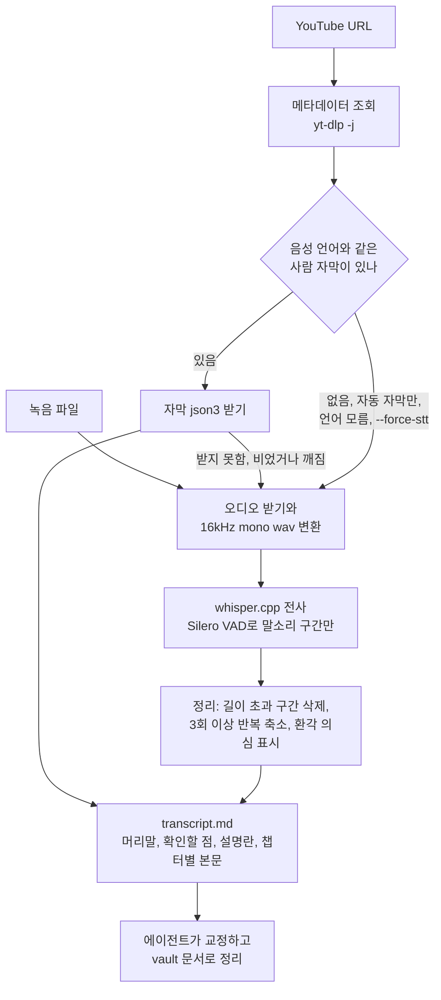

# 영상 전사 파이프라인 구현

memo 스킬이 YouTube 링크나 녹음 파일을 받으면 쓰는 전사 스크립트의 구조와 설계 판단을 기록한다. 음성 인식 엔진을 고른 근거와 실측 결과는 [[Local-Speech-to-Text|로컬 음성 인식으로 영상 전사하기]]에 있다. 내용은 2026-09-24 구현 기준이다(yt-dlp 2026.08.19, whisper.cpp 1.9.4, mlx-audio 0.5.5).

- 스크립트: `.claude/skills/memo/scripts/yt_transcript.py`, Codex용 사본 `.agents/skills/memo/scripts/yt_transcript.py`(두 파일은 같아야 한다)
- 사용 절차: 두 memo `SKILL.md`의 `영상과 녹음` 절
- 결과: `<출력 폴더>/<작업 폴더>/transcript.md`. `--out`이 출력 폴더이고, 작업 폴더는 입력마다 따로 만든다. 문서 작성의 입력이며 vault에 저장하지 않는다.

## 만든 이유

틸노트 같은 요약 서비스는 YouTube 자막을 가져와 서버에서 요약할 뿐이라(2026-09-23 클라이언트 코드 확인), 자막이 없는 영상은 처리하지 못하고 긴 자막은 잘린다. 자막 추출은 직접 할 수 있고, 한국어 자동 자막은 로컬 음성 인식보다 오류가 2배 이상 많았다. 그래서 사람이 단 자막이 있으면 자막을, 그 밖에는 로컬 음성 인식을 쓰고, 요약과 교정은 에이전트가 맡는 구조로 만들었다.

## 흐름

스크립트는 표준 라이브러리만 쓰는 파이썬 파일 하나다. 음성 인식과 YouTube 파싱은 직접 구현하지 않고 외부 도구를 호출하며, 모든 호출은 단계별 로그 파일을 남기는 `run()`을 거친다.

| 역할 | 도구 |
|---|---|
| 메타데이터, 자막, 오디오 받기 | yt-dlp, `uvx`로 설치 없이 매번 최신판 실행 |
| 오디오 변환과 길이 확인 | ffmpeg, ffprobe |
| 말소리 구간 검출과 전사 | whisper.cpp(`whisper-cli`), Silero VAD, Whisper large-v3-turbo |
| 용어 교차 확인(선택) | mlx-audio의 Qwen3-ASR 1.7B 8bit |

## 단계별 구현

1. **메타데이터 조회**(URL만): 모든 yt-dlp 호출에 `--no-playlist`를 붙이고, `-j --skip-download --flat-playlist --ignore-no-formats-error`로 JSON 한 줄을 받는다.
   - 재생목록 파라미터가 붙은 영상 URL은 영상 하나로 처리한다. 결과가 여러 줄이거나 `_type`이 영상이 아닌 재생목록, 채널 URL과 진행 중이거나 예정된 라이브는 멈춘다.
   - deno가 없고 node가 있으면 `--js-runtimes node`를 붙인다. JS 런타임이 없으면 YouTube 추출에서 일부 형식이 빠질 수 있다는 경고가 나오기 때문이다.
2. **언어 판정** `detect_lang()`: `--lang`이 있으면 그 값을 쓴다(`auto`는 모름). 로컬 녹음은 ko가 기본이다. URL은 메타데이터 `language`, 원어 자동 자막 트랙(`-orig`, 여럿이면 ko 우선) 순서로 정하고, 그래도 모르면 whisper 자동 감지에 맡겨 감지 결과를 로그에서 읽어 출처에 적는다.
3. **자막 경로** `pick_manual_sub()`, `fetch_subs()`, `read_subs()`
   - 사람이 단 자막 목록에서 음성 언어와 같은 트랙만 고른다. 한국어 발표에 달린 번역 자막을 원문으로 쓰지 않기 위해서다. 언어를 모르면 사람 자막도 쓰지 않는다.
   - json3로 받는다. 받지 못했거나, 파일이 비었거나 깨졌거나, 텍스트가 없으면 사유를 기록하고 음성 인식으로 넘어간다. 깨진 파일은 지워서 다음 실행이 재사용하지 않게 한다.
   - 사람 자막은 정리 단계를 거치지 않고 그대로 문서가 된다.
4. **음성 인식 경로** `ensure_wav()`, `transcribe_whisper()`
   - URL 입력에서 오디오가 필요한데 받을 수 있는 형식이 없으면(스토리보드 이미지만 있는 경우 포함) ffmpeg, whisper.cpp 검사 전에 멈춘다.
   - `bestaudio/best`를 받아 ffmpeg로 16kHz mono 16bit wav로 바꾼다. 임시 파일에 쓴 뒤 이름을 바꿔 최종 wav가 잘린 채 남지 않는다.
   - `whisper-cli -m ggml-large-v3-turbo.bin -l <언어> -t 4 --vad -vm ggml-silero-v6.2.0.bin -vt 0.25 -vp 300 -osrt`로 전사한다. SRT가 비었고 로그에 말소리 구간 0개가 찍혔으면 음악이나 무음 위주 오디오라고 알린다.
5. **정리** `clean_segments()`: 음성 인식 결과(whisper.cpp, Qwen3)에만 적용한다.
   - 길이보다 1초 이상 뒤에서 시작하는 구간을 버린다. 길이는 메타데이터 값이고, 없으면 ffprobe로 잰다.
   - 같은 문장이 3번 이상 이어지면 1번으로 줄이고 확인할 점에 남긴다. 2번 되풀이는 실제 발화일 수 있어 그대로 둔다.
   - "시청해 주셔서", "thanks for watching" 같은 환각 의심 문장은 실제 발화일 수 있어 지우지 않고 목록으로 남긴다.
6. **문서 생성** `render()`: 머리말(제목, URL, 채널, 업로드일, 길이, 텍스트 출처), 확인할 점, 설명란, 본문 순서로 쓴다. 본문은 챕터가 바뀌거나 문단 첫 구간에서 60초 이상 지나면 새 문단을 시작하고 `[mm:ss]`를 붙인다. 영상이 1시간 이상이면 모든 시각을 `h:mm:ss`로 쓴다.

## 캐시와 안전장치

| 파일 | 재사용 조건 |
|---|---|
| `audio16k.wav` + `audio16k.json` | URL은 추출기, 영상 ID, 메타데이터의 정규 URL. 로컬 녹음은 절대경로, 파일 이름, 크기, 전체 sha1 앞 16자리 |
| `whisper.srt` + `whisper.json` | 오디오 키, 모델과 VAD 모델 파일(이름, 크기, sha1 앞 16자리. 2MB 초과는 앞뒤 1MB, 이하는 전체 해시), VAD 인자, 언어, 프롬프트 |
| `qwen3.srt` + `qwen3.json` | 오디오 키, 모델, mlx-audio 판, 언어 |
| `subs.<언어>.json3` | 파일이 있으면 재사용(비었거나 깨졌으면 지우고 다시 받음) |

- whisper.cpp 판과 `--threads`는 캐시 키에 없다. brew로 whisper.cpp를 올린 뒤 다시 전사하려면 `--force`를 준다.
- 작업 폴더는 YouTube면 영상 ID, 다른 사이트면 `<추출기>-<ID>-<URL 해시>`, 로컬 녹음이면 `<파일명>-<경로 해시>`다. 서로 다른 입력이 한 폴더를 쓰지 않는다.
- 작업 폴더가 정해지면(URL은 메타데이터 조회 뒤) `fcntl.flock`으로 잠가 같은 입력의 동시 실행을 막고, 이전 `transcript.md`와 `transcript.qwen3.md`를 지운다. 그 전에 끝난 실패는 이전 결과를 지우지 않으므로, 호출하는 쪽은 종료 코드 0과 마지막 줄의 경로로만 성공을 판정한다.
- 사람 자막 본문은 받는 즉시 저장한다. 뒤이은 `--qwen3` 단계가 실패하면 오류 메시지에 저장된 본문 경로를 함께 알린다.

## 옵션과 종료 코드

| 옵션 | 동작 |
|---|---|
| `--out` | 출력 폴더, 기본값은 임시 폴더의 `yt-transcript` |
| `--lang` | 음성 언어 코드나 `auto` |
| `--force-stt` | 사람 자막이 있어도 음성 인식 |
| `--prompt` | whisper.cpp 용어 힌트, 매 창에 유지 |
| `--qwen3` | Qwen3-ASR 2차 전사 `transcript.qwen3.md` 생성, ko, en, ja, zh 음성만 지원 |
| `--threads` | whisper.cpp 스레드 수, 기본값 4 |
| `--force` | 다운로드부터 다시 |

종료 코드는 성공 0, 실패 1, 인자 오류 2(argparse), 도구나 모델 없음 3이다. 3이면 그 시점에 없는 도구와 모델에 맞춰 `brew install`과 모델 `curl -fL` 명령을 출력한다. URL 입력은 uv를 먼저 따로 검사하고 음성 인식 도구는 필요할 때 검사하므로, 새 장비에서는 안내가 두 번에 나뉘어 나올 수 있다. 설치는 사용자 확인 뒤 진행한다.

## 설계 결정

| 결정 | 이유 | 버린 대안 |
|---|---|---|
| 자동 자막을 쓰지 않음 | 한국어 CER 35.6%, 로컬 전사 13.7% | 자동 자막을 우선 사용 |
| VAD 임계값 0.25, 여유 300ms | 기본값은 청중 환호와 겹친 첫머리 발화를 지움. 바꾼 값에서도 그 발화는 일부만 남음 | VAD 없음(박수 구간 환각) |
| 프롬프트 기본 끔 | 개선분 상당수가 표기 차이이고 실제 발화를 제목 표기로 바꾼 사례 | 제목과 설명란으로 자동 프롬프트 |
| Qwen3는 선택 옵션 | 정답이 있는 영상에서 용어 우위가 없었고, 실측에서 whisper.cpp보다 1.3~2배 느림 | Qwen3 기본 엔진 |
| 2번 반복은 남기고 3번 이상만 축소 | 짧은 말을 두 번 되풀이하는 실제 발화를 지우지 않기 위해 | 연속 중복을 모두 제거 |
| yt-dlp는 최신판, mlx-audio는 0.5.5 고정 | YouTube 대응은 최신판이 필요하고, mlx-audio는 인자와 출력 파일명을 검증한 판을 유지 | 둘 다 고정하거나 둘 다 최신 |
| 전사문은 vault 밖 | 원문 전사는 재사용 지식이 아니라 입력이고, 교정 전 오인식이 섞임 | vault에 원본 보존 |

## 검증 과정과 교훈

- 엔진 선택은 조사, 벤치마크, 독립 검증을 나눈 워크플로로 진행했다. 검증 에이전트가 직접 구현한 채점기로 벤치마크 CER을 다시 계산해 모든 수치가 일치했다. 채택한 VAD 설정의 수치는 그 뒤 작성자가 같은 채점 스크립트로 측정했다.
- 스크립트는 리뷰 에이전트가 다섯 차례 반증 검토했고, 문서화 단계에서 다른 검증 에이전트가 코드와 문서를 다시 대조했다. 라운드마다 결함을 고친 뒤 재현 테스트로 확인했다. 마지막 수정(해시 범위, 반복 축소 기준, 깨진 자막 처리)은 작성자 테스트로만 확인했다.
- 리뷰에서 나온 교훈은 다음과 같다.
  - 캐시 재사용은 파일 존재가 아니라 입력 내용과 옵션으로 판단한다. 첫 구현은 옵션을 바꾸거나 같은 폴더에 다른 영상을 넣어도 이전 전사를 돌려줬다. 자막 파일은 내용이 영상 ID로 정해져 존재만 보되, 깨진 파일은 지운다.
  - 외부 도구의 종료 코드만 믿지 않는다. yt-dlp는 자막이 없어도, whisper.cpp는 말소리가 없어도 종료 코드 0으로 끝나므로 결과 파일로 판정한다.
  - 실패 경로에서 이전 결과를 지워야 한다. 남겨 두면 호출한 에이전트가 낡은 결과를 새 결과로 오해한다.
  - 식별용 해시는 경계에서 틀리기 쉽다. 앞뒤 1MB만 해시한 첫 판은 1~2MB 파일의 뒷부분과 큰 파일의 중간 편집을 놓쳐서, 녹음은 전체 해시로 바꿨다.
  - 문서와 코드는 따로 어긋난다. 흐름도는 사람 자막도 정리 단계를 거친다고 그렸고, 설명은 3번 이상 반복만 줄인다고 했지만 코드는 2번부터 줄이고 있었다.
  - 테스트 입력이 경계를 지나지 않으면 통과해도 근거가 되지 않는다. 뮤직비디오로 음성 인식 경로를 시험하다 VAD가 노래를 말소리로 보지 않는 한계를 발견했다.

## 한계와 미검증

- CER은 사람 자막이 있는 영상 1편 기준이다.
- JS 런타임이 없는 장비, 네트워크가 막힌 Codex 샌드박스, 방송이 끝난 직후의 라이브 다시보기, 로그인이 필요한 영상에서는 동작을 확인하지 않았다.
- 화면의 슬라이드와 코드는 전사에 없다.

## 출처

- [whisper.cpp — GitHub, ggml-org](https://github.com/ggml-org/whisper.cpp)
- [yt-dlp — GitHub](https://github.com/yt-dlp/yt-dlp)
- [mlx-audio — GitHub, Blaizzy](https://github.com/Blaizzy/mlx-audio)
- [whisper-vad 모델 파일 — Hugging Face, ggml-org](https://huggingface.co/ggml-org/whisper-vad)

## 관련 문서

- [[Local-Speech-to-Text|로컬 음성 인식으로 영상 전사하기]]
- [[Agent-Skills|에이전트 스킬]]
- [[Claude-Code-Workflows|Claude Code 개발 워크플로우 (Skills, 서브에이전트)]]
