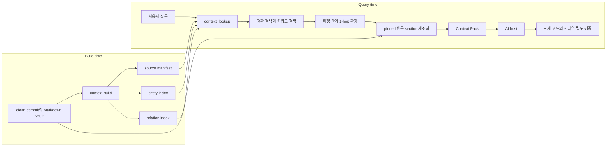

# Markdown Vault를 읽는 AI 런타임: 조회, Context Pack과 MCP

> 유형: 조회 계약과 후속 확장 설계. 실제 구현 범위는 [[Ontology-Operations|루트 실행 절차]]에서 확인한다.
> 현재 상태: 루트 `ontology/`에 build CLI, `context_lookup`과 MCP 서버 구현 (2026-09-05). 아래 `context-build`는 논리적 역할이며 실제 명령은 `npm run build`다.
> 현재 범위: 이 Vault의 Markdown. 코드 저장소, 배포 상태와 실제 런타임은 아직 색인 대상이 아니다.

## 여기서 AI가 학습한다는 의미

이 설계는 모델의 파라미터를 다시 학습시키는 fine-tuning이 아니다. 지속할 지식은 Markdown에 기록하고, AI는 작업할 때마다 파생 색인으로 관련 원문을 찾아 컨텍스트로 받는다. 따라서 새 지식이 다음 작업에도 반영되는 경로는 `Markdown 수정 -> 검토와 commit -> 색인 재생성`이다.

완료 상태는 AI가 Vault 전체를 읽는 것이 아니라 질문과 관련된 문서와 관계를 찾고, manifest에 고정된 원문 section을 다시 읽고, 근거와 한계를 작은 Context Pack으로 받으며, 코드와 런타임 사실은 현재 환경에서 별도로 확인하는 것이다.

## 전체 실행 경로



그래프는 원문을 찾는 지도다. 답변과 구현 판단의 근거는 그래프의 요약 문장이 아니라 다시 읽은 EvidenceUnit이다.

## 구성 요소와 경계

| 구성 요소 | 책임 | 경계 |
|---|---|---|
| `context-build` | Markdown을 파싱해 manifest와 JSONL 색인을 생성 | canonical Markdown을 수정하지 않음 |
| 로컬 캐시 | entity, relation과 source revision을 보관 | Git 밖에 두며 삭제 후 재생성 가능 |
| `context_lookup` | 후보 검색, 관계 확장과 Context Pack 조립 | 읽기 전용, 전체 Vault 반환 금지 |
| Evidence loader | revision, anchor와 hash로 원문 section 재조회 | 불일치한 원문을 근거로 사용하지 않음 |
| MCP adapter | 같은 조회 함수를 AI host에 Tool로 노출 | 정확성, 권한과 최신성을 대신 보장하지 않음 |
| AI host | 질문 작성, Tool 호출과 현재 환경 검증 | candidate를 확정 사실로 승격하지 않음 |

이것들은 논리적 역할이다. MVP에서는 별도 서비스로 나누지 않고 한 CLI 내부 함수와 얇은 MCP wrapper로 충분하다.

## Build-time: Markdown에서 파생 색인 만들기

상세 schema와 추출 규칙은 [[Ontology-Context-Platform-Implementation#수집과 갱신 파이프라인|수집과 갱신 파이프라인]]을 따른다.

1. clean checkout의 commit과 수집 범위를 source manifest에 고정하고, 그 revision의 Git tree에 있는 tracked regular Markdown blob만 읽는다.
2. frontmatter, heading과 위키링크를 결정론적으로 추출한다.
3. Document와 EvidenceUnit인 Section 및 relation assertion record, relation, 결정론적 coverage gap을 canonical byte 형식의 fingerprint별 불변 snapshot에 완성하고 artifact hash를 검증한 뒤 active pointer만 원자적으로 교체한다.
4. LLM을 쓰더라도 비명시 관계는 별도 candidate queue에 두고 serving index와 재현성 비교에서 제외한다.
5. 사람이 승인한 typed relation은 캐시가 아니라 Markdown의 `ontology_relations`에 기록하고 commit한 뒤 다시 색인한다.

기본 build는 dirty worktree를 거부한다. `--committed-only`를 명시하면 `HEAD`만 색인하고 `unindexed_worktree`를 보고한다. 실행 코드와 캐시는 분리하며 캐시를 지워도 지식이 유실되지 않아야 한다.

## Query-time: 질문을 Context Pack으로 바꾸기

1. 각 `context_lookup` 요청 시작에 active pointer를 한 번 읽고 그 요청 동안 고정한다. 해당 snapshot의 manifest와 artifact hash를 검증한 뒤 source별 index sync와 요청 scope의 수집 여부를 계산하고, 최신 run log의 오류 코드는 snapshot과 섞지 않고 `errors`에 요약한다.
2. 제목, ID와 alias의 정확 일치를 먼저 찾는다.
3. 없거나 부족할 때 entity의 heading metadata와 manifest revision의 tracked Markdown blob을 allowlist 안에서 literal 검색해 후보를 넓힌다. 본문은 캐시나 current worktree에서 읽지 않는다.
4. 시작 엔터티가 subject나 object인 incident edge를 모두 탐색하되 반환 triple의 원래 방향은 보존한다. 기본 깊이는 1이고 연쇄 영향 질문만 2를 요청한다.
5. 선택된 EvidenceUnit을 현재 worktree가 아니라 Git의 manifest revision에서 읽고 anchor와 content hash를 검증한다.
6. index sync, 충돌, coverage gap과 limitations용 byte 예산을 먼저 예약하고, 남은 예산에서 직접 근거를 우선한다. 초과하면 excerpt와 보조 관계부터 줄인다.

MVP의 본문 검색은 작은 Vault를 직접 훑는다. 측정된 병목이 생길 때만 snapshot에 hash로 보호된 lexical postings를 추가하고, 임베딩 검색은 정확 검색과 키워드 검색의 실제 누락 사례가 쌓였을 때만 fallback으로 검토한다. 벡터 DB는 그 전에는 필요 없다.

MVP의 서버 상한은 `MAX_ARGUMENT_BYTES=8192`, `MAX_QUERY_BYTES=4096`, `MAX_SCOPE_ENTRIES=20`, `MAX_SCOPE_PATH_BYTES=512`, `SERVER_MAX_BYTES=65536`, `MAX_DEPTH=2`, `MAX_MATCHED_ENTITIES=20`, `MAX_EDGES_PER_ENTITY=50`으로 시작한다. depth는 1이나 2만 허용하고 `effective_max_bytes = min(request.max_bytes, SERVER_MAX_BYTES)`로 계산한다. 후보나 edge 상한에 닿으면 `partial`과 `retrieval_limit_reached` coverage gap을 반환한다.

## Context Pack과 MCP 계약

MVP는 읽기 전용 Tool 하나만 둔다. 아래 JSON은 MCP의 wire format이 아니라 Tool arguments와 `structuredContent`에 담을 도메인 payload 예시다. `max_bytes`는 직렬화된 `structuredContent`의 UTF-8 byte 상한이며 AI host는 받은 결과에 별도의 모델별 token budget을 적용한다. 일반 MCP 구조와 보안 경계는 [[MCP]]에서 다룬다.

```json
{
  "name": "context_lookup",
  "arguments": {
    "query": "이 이벤트를 바꾸면 무엇을 함께 확인해야 하는가?",
    "scope": ["tech/ai-engineering"],
    "depth": 1,
    "max_bytes": 24000
  }
}
```

MVP에는 `revision` 입력이 없다. 항상 활성 manifest revision을 읽으며 과거 시점 조회가 실제로 필요해질 때만 source별 revision 입력을 추가한다.

```json
{
  "query": "이 이벤트를 바꾸면 무엇을 함께 확인해야 하는가?",
  "result_status": "ok",
  "index_sync": [{"source_id": "interview-vault", "status": "synced", "revision": "<commit>", "fingerprint": "<hash>", "manifest_hash": "<hash>", "artifacts_verified": true, "requested_scope_indexed": true, "indexed_paths": ["tech/ai-engineering"], "excluded_paths": [], "schema_version": "<version>", "extractor_version": "<version>", "completed": true, "errors": []}],
  "entities": [{"id": "document:interview:tech/<source>.md", "label": "<source-title>", "aliases": []}, {"id": "document:interview:tech/<target>.md", "label": "<target-title>", "aliases": []}],
  "evidence_units": [
    {
      "id": "unit:interview:tech/<source>.md:<heading-path>#1",
      "source_uri": "tech/<path>.md",
      "anchor": "<heading-path-and-occurrence>",
      "source_revision": "<commit>",
      "content_hash": "sha256:<hash>",
      "excerpt": "<bounded-original-text>",
      "truncated": false
    }
  ],
  "relations": [{"id": "edge:sha256:<canonical-tuple-hash>", "subject": "document:interview:tech/<source>.md", "predicate": "links_to", "object": "document:interview:tech/<target>.md", "verification": "source_confirmed", "freshness": "not_checked", "conflict": "not_checked", "evidence_unit_id": "unit:interview:tech/<source>.md:<heading-path>#1", "assertion_occurrence": 1}],
  "conflict_check_status": "not_supported",
  "conflicts": null,
  "coverage_gaps": [],
  "limitations": ["freshness_not_checked", "semantic_conflict_not_checked", "runtime_not_checked"],
  "traversal": {"depth": 1, "max_matched_entities": 20, "max_edges_per_entity": 50, "limit_reached": false},
  "budget": {"requested_max_bytes": 24000, "server_max_bytes": 65536, "effective_max_bytes": 24000, "used_bytes": 4096, "exhausted": false, "omitted_evidence_units": 0, "omitted_relations": 0}
}
```

MVP는 별도의 claim 문장을 생성하지 않는다. AI가 만드는 각 판단은 반환된 EvidenceUnit을 인용해야 하며, excerpt를 줄였으면 `truncated: true`로 표시하고 원문 위치는 유지한다. relation, entity와 그 EvidenceUnit은 함께 유지하거나 함께 제외한다. excerpt 일부만 줄이는 경우를 제외하고 record 하나라도 생략하면 `partial`, `budget.exhausted=true`, 생략 건수와 `output_limit_reached` coverage gap을 반환하며, 직접 근거 하나도 byte 상한 안에 넣지 못하면 `budget_too_small`을 반환한다. 호출과 반환한 근거 ID는 감사 가능하게 남긴다.

`result_status`는 `ok`, `partial` 또는 `insufficient_evidence`다. `conflicts`는 `conflict_check_status`가 `checked`일 때만 배열이며 `not_supported`이면 `null`이다. conflict 항목은 관련 relation과 EvidenceUnit ID, coverage gap은 source, scope와 사유를 가진다. 입력 검증과 `budget_too_small`은 부분 payload 대신 Tool 오류로 반환한다.

서버는 manifest의 `indexed_paths`, host별 allowlist와 요청 `scope`의 교집합만 조회한다. 입력 경로를 저장소 상대 경로로 정규화하고 절대경로, `..`와 symlink 경로 이탈을 거부한다. 직렬화된 전체 arguments, query, scope 개수와 각 경로, depth와 `max_bytes`의 타입과 크기를 서버 상한으로 검증한다. 콘텐츠 기반 secret 탐지는 보장하지 않으므로 첫 파일럿은 민감 자료가 없다고 검토한 경로만 allowlist에 넣는다.

## AI가 결과를 사용하는 규칙

- Vault 지식이 필요한 질문은 `context_lookup`으로 후보를 먼저 좁힌다.
- 원문 EvidenceUnit, `source_confirmed` 관계와 index sync를 확인한 뒤 판단에 사용한다.
- `not_checked`, `disputed`, `stale_risk`와 coverage gap은 숨기지 않고 표시하거나 답변을 보류한다.
- Context Pack에 없는 영역을 확인한 것처럼 말하지 않는다.
- 코드 변경 전에는 현재 source, 호출부, 테스트와 설정을 다시 읽고, 배포와 실제 동작은 런타임 근거로 따로 확인한다.

## 실패 시 동작

| 상태 | 조회기의 동작 |
|---|---|
| `revision_mismatch` | pinned revision의 결과임을 밝히고 현재 상태 질문에는 재색인을 요구 |
| `unindexed_worktree` | 미커밋 변경을 색인된 사실로 섞지 않고 상태를 반환 |
| `source_unavailable` | 가용한 다른 근거가 없으면 해당 판단을 확정하지 않고 coverage gap에 기록 |
| 확정 근거 없음 | `insufficient_evidence`로 반환하고 확정 판단을 만들지 않음 |
| byte 상한 초과 | 필수 상태 metadata를 보존하고 record 생략 시 `partial`, 생략 건수와 `output_limit_reached`를 반환 |
| 필수 metadata보다 작은 예산 | 일부 결과 대신 `budget_too_small` 오류를 반환 |

깨진 위키링크, 삭제된 anchor와 hash 불일치도 조용히 무시하지 않고 source별 coverage gap으로 노출한다.

한 source에서 조건이 겹치면 `source_unavailable`, `unindexed_worktree`, `revision_mismatch`, `synced` 순서로 대표 status를 정하고 나머지 사유는 `errors`에 보존한다.

## 최소 구현과 학습 순서

| 단계 | 만들어 볼 것 | 완료 조건 |
|---|---|---|
| 1 | 과거 질문의 정답 문서와 anchor 표 | calibration과 holdout 질문이 분리됨 |
| 2 | Markdown parser와 `context-build` | 같은 fingerprint에서 실행 시각을 제외한 모든 artifact byte와 hash가 같음 |
| 3 | CLI용 `context_lookup` | exact, keyword와 1-hop 결과가 원문 anchor를 반환 |
| 4 | Context Pack 조립 | 근거 없는 판단이 없고 필수 상태를 보존하며 UTF-8 byte 상한을 지킴 |
| 5 | MCP wrapper | 두 AI host가 같은 읽기 전용 계약을 사용 |
| 6 | holdout 평가 | 누락, 무관 근거, 탐색 시간과 크기가 사전 목표를 충족 |

처음에는 JSONL 선형 조회로 충분하다. 측정된 병목이 생길 때만 SQLite를, 의미 검색이 recall을 실제로 높일 때만 embedding을, 가변 길이 관계 탐색이 반복 병목일 때만 graph DB를 검토한다. 실제 MCP가 생긴 뒤에만 `AGENTS.md`에 Tool 호출 규칙을 추가한다.

## 검증 시나리오

- 제목과 alias 정확 검색, 위키링크 1-hop과 object에서 incoming edge 탐색
- 중복 heading의 occurrence 구분, rename과 삭제 전파
- dirty worktree와 revision mismatch 표시
- candidate queue가 조회 결과에 섞이지 않고 conflict와 coverage gap은 보존
- 같은 fingerprint 재빌드의 artifact byte와 hash 동일성, 손상되거나 미완료인 snapshot의 활성화와 serving 금지, 요청 중 pointer 교체 시 현재 요청은 기존 snapshot을 유지하고 다음 요청은 새 snapshot 사용
- arguments, query, scope와 depth 초과 입력 거부, 후보와 edge 상한의 `partial` 처리, byte 상한 안에서 원문 anchor와 잘림 상태 유지

평가 세트와 확장 판단은 [[Ontology-Context-Platform-Implementation#단계별 구축 순서|단계별 구축 순서]]와 [[Ontology-Context-Platform-Implementation#성공 기준과 보류 기준|성공 기준]]을 따른다.

## 출처

- [Model Context Protocol, Architecture overview](https://modelcontextprotocol.io/docs/learn/architecture)
- [Model Context Protocol, Tools](https://modelcontextprotocol.io/specification/2025-11-25/server/tools)

## 관련 문서

- [[Development-Ontology|개발 판단 지도와 적용 절차]]

- [[Ontology-Context-Platform-Implementation|Markdown Vault 기반 온톨로지 구축 방법]]
- [[Agentic-Context-Platform|에이전트 컨텍스트 플랫폼]]
- [[Context-Engineering|컨텍스트 엔지니어링]]
- [[Agent-Context-Budget|에이전트 컨텍스트 예산]]
- [[Tool-Output-Filtering|도구 출력 필터링]]
- [[MCP|Model Context Protocol]]
