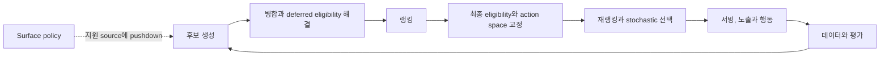

# 추천 시스템 지식 지도

추천 시스템은 후보를 찾고 순서를 정하는 모델뿐 아니라 자격 조건, 노출과 행동을 다시 학습 데이터로 만드는 폐루프 시스템이다. 아래 문서는 같은 시스템을 단계별 책임으로 나눈다.

## 카테고리

- [[Recommendation-System-Foundations|기초와 학습 경로]]
- [[Recommendation-System-Retrieval-Ranking|후보 생성과 랭킹]]
- [[Recommendation-System-Contracts|데이터와 서빙 계약]]
- [[Recommendation-System-Evaluation|평가와 실험]]
- [[Recommendation-System-OTT-Discovery|OTT 추천과 통합 디스커버리]]
- [[Recommendation-System-Industry-Case-Studies|산업 사례]]

| 순서 | 문서 | 중심 질문 |
|---|---|---|
| 1 | [[Recommendation-System-Candidate-Generation\|후보 생성]] | 전체 카탈로그에서 무엇을 랭커에 올릴 것인가 |
| 2 | [[Recommendation-System-Eligibility-Availability\|자격 조건과 가용성]] | 어떤 제약을 어느 화면에서 hard 또는 soft로 적용할 것인가 |
| 3 | [[Recommendation-System-Ranking-Reranking\|랭킹과 재랭킹]] | 후보의 효용과 최종 목록 품질을 어떻게 결정할 것인가 |
| 4 | [[Recommendation-System-Feedback-Data\|피드백 데이터]] | 노출과 행동을 편향을 통제한 학습 데이터로 어떻게 만들 것인가 |
| 5 | [[Recommendation-System-Evaluation-Experimentation\|평가와 실험]] | 오프라인 품질과 실제 사용자 가치를 어떻게 검증할 것인가 |
| 6 | [[Recommendation-System-Serving-Operations\|서빙과 운영]] | 모델, 특징과 선택적 인덱스를 지연 예산 안에서 어떻게 안전하게 운영할 것인가 |

학습 순서는 후보 생성에서 시작하지만 운영에서는 여섯 계약을 함께 설계한다. 특히 이전 노출 정책이 다음 학습 데이터를 만들기 때문에 평가와 로깅을 모델 뒤에 붙이는 부가 기능으로 다루면 안 된다.

## 적용 설계

- [[Recommendation-System-OTT-Discovery-Architecture|OTT 디스커버리 통합 아키텍처]] — query-bound 검색, 무질의 추천과 taxonomy browse의 공유 계약 및 분리 정책
- [[Recommendation-System-OTT-Aggregator-Design-Proposal|OTT 통합 서비스 추천 시스템 초기 설계안]] — 공개 제품 표면에서 시작해 내부 데이터, 가용성, 이벤트 계약을 검증하는 production discovery 초안
- [[Recommendation-System-OTT-Discovery-Scenarios|OTT 추천 구축 시나리오]] — taxonomy와 behavior 성숙도에 따른 surface별 2x2 분기
- [[Recommendation-System-Taxonomy-Content-Based|택소노미 기반 콘텐츠 추천]] — 통제된 작품 concept, 사용자 affinity와 후보 생성 계약
- [[Recommendation-System-Page-Level-Optimization|추천 페이지 단위 최적화]] — row 선택, row 내부 순위, cross-row 중복과 viewport attribution

## 검증과 숙련

- [[Recommendation-System-Modeling-Foundations|추천 시스템 모델링 기초]] — 벡터, 확률, implicit feedback, 분할, baseline과 알고리즘 사다리
- [[Recommendation-System-Off-Policy-Evaluation|Off-Policy Evaluation]] — IPS, SNIPS, DM, DR과 support 및 분산 진단
- [[Recommendation-System-Online-Experimentation-Statistics|온라인 실험 통계]] — 실험 단위, ratio metric, CUPED, SRM과 sequential testing
- [[Search-Recommendation-Discovery-Learning-Path|검색과 추천 디스커버리 학습 경로]] — 읽기 여부가 아니라 재현 가능한 산출물로 확인하는 8단계 숙련 게이트

## 인접 정본

- [[Recommendation-System-Industry-Case-Studies|추천 시스템 산업 사례 지도]]
- [[Content-Availability-Data-Contract|콘텐츠 가용성 snapshot과 offer 계약]]
- [[Personalization-Recommendation|개인화와 추천의 비즈니스 관점]]
- [[Vector-Similarity-Search|벡터 유사도 검색과 ANN]]
- [[System-Design-Practice-Topics#1. 추천 피드 시스템|추천 피드 시스템 설계 연습]]
