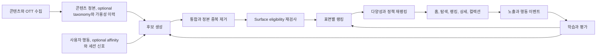

# OTT 통합 서비스 추천 시스템 초기 설계안

이 문서는 OTT 통합 검색과 추천 제품의 공개 표면을 기준으로 만든 초기 기술 제안이다. 실제 데이터 규모, 현재 추천 로직, 이벤트 품질, 조직의 운영 제약은 내부 디스커버리에서 검증해야 한다. 공개될 수 있는 개인 저장소이므로 사내 구조, 수치와 비공개 의사결정은 기록하지 않는다. `verified_at`은 공개 제품 기능을 확인한 날짜이며, 아래 아키텍처와 우선순위는 검증된 내부 사실이 아니라 시작 가설이다.

## 문제 정의

OTT 통합 서비스의 추천은 사용자가 좋아할 작품을 맞히는 데서 끝나지 않는다. 추천된 작품이 현재 사용자의 조건에서 실제 시청 경로로 연결되어야 한다.

```text
취향 적합성 + 작품 판단 정보 + 현재 시청 가능성
                -> 유효한 OTT 시청 경로 연결
```

2026-07-21 공개 웹과 `llms.txt`에서 홈, 검색과 탐색, 키노라이츠와 OTT별 랭킹, 신작과 예정작, 컬렉션, 작품 상세와 OTT 바로보기, 리뷰, 인물과 공개 프로필을 확인했다. 앱 설명에는 구독 OTT 기반 홈 추천, 시청 기록 기반 취향 분석과 이어보기도 있다. 신규 웹과 레거시 모바일 웹이 이전 중이므로 URL을 추천 surface ID로 사용하지 않고 제품 의미가 같은 화면과 module에 안정 ID를 부여한다. Netflix처럼 플랫폼 안의 시청 시간을 직접 최대화하는 문제와도 다르므로 서비스가 관측하고 개선할 수 있는 연결 결과를 먼저 정의해야 한다.

## 제안하는 제품 표면

| 공개 표면 | 사용자 의도 | 구독 OTT 처리 | 추천과 랭킹의 우선 책임 |
|---|---|---|---|
| 홈의 여러 module | 트렌드, 신작, 컬렉션과 개인 발견 | 지금 보기 module만 hard | Module별 후보와 목적을 분리하고 전체 피로도 조정 |
| 검색과 탐색 | 질의와 OTT, 장르, 연도, 평점 조건으로 찾기 | 명시적 filter | 검색 relevance와 무질의 인기 추천을 구분 |
| 키노라이츠, OTT와 박스오피스 랭킹 | 현재 화제작과 집단별 선호 확인 | 랭킹 종류의 filter | 산정 기준과 집계 시점이 있는 비개인화 또는 세그먼트 순위 |
| 작품 상세 | 판단 정보, 시청 경로와 다음 작품 탐색 | Offer와 CTA에 hard | 작품 맥락의 item-to-item 추천과 유효 CTA |
| 신작, 예정작과 컬렉션 | 카탈로그 변화와 테마 탐색 | 표면에 따라 다름 | Freshness, 편집 의도와 선택지 확장 |

표면마다 목적과 자격 조건이 다르므로 하나의 전역 점수로 모든 목록을 만들지 않는다. 공통 feature와 모델을 공유할 수는 있지만 후보 source, label과 재랭킹 정책은 표면별로 구분한다.

## 성공 정의

### 제안 North Star

지금 보기 약속이 있는 module에서는 `추천 노출 후 유효한 OTT 시청 경로로 이동한 비율`을 초기 핵심 지표로 둔다. 검색, 랭킹과 컬렉션까지 같은 지표를 강제하지 않고 각 surface의 완료 행동을 별도 primary로 정의한다.

OTT 이동 이후의 실제 재생과 완주를 관측할 수 없다면 바로보기 클릭은 대리 지표일 뿐이다. 파트너 callback이나 심리스 재생 데이터가 확보되기 전에는 이를 실제 시청으로 표현하지 않는다.

| 계층 | 지표 후보 |
|---|---|
| Surface primary | 지금 보기의 유효 OTT 이동률, 검색 성공률, 발견 surface의 상세 진입과 찜률 |
| 장기 결과 | 재방문율, 탐색 후 실제 시청을 확인할 수 있을 때의 검증된 재생률 |
| 추천 품질 | Recall@K, NDCG@K, catalog coverage, novelty |
| Guardrail | 가용성 오추천률, 중복률, 장르와 제공처 편중, 숨김률 |
| 운영 | 응답 p95와 p99, 후보 source timeout, fallback 비율 |

지표의 정확한 정의, attribution window와 실험 단위는 현재 event와 product funnel을 확인한 뒤 확정한다.

## 전체 아키텍처



가용성은 단순 rank feature가 아니다. 지금 볼 수 있다는 약속을 하는 표면에서는 후보 생성 시 가능한 범위를 줄이고, 최종 응답 직전에 [[Recommendation-System-Eligibility-Availability|versioned surface policy]]로 다시 검사하는 hard eligibility다.

## 후보 생성

현재 taxonomy와 behavior 성숙도는 미확인이다. [[Recommendation-System-OTT-Discovery-Scenarios|2x2 discovery 시나리오]]로 surface별 시작점을 고른 뒤 검증된 후보 source를 조합한다.

| Source | 역할 | 시작 조건 |
|---|---|---|
| OTT별 랭킹, 인기와 편집 | 홈 module, 무질의 탐색과 fallback | 산정 기준과 집계 품질 확인 |
| [[Recommendation-System-Taxonomy-Content-Based\|택소노미 콘텐츠 유사도]] | 신작, 롱테일과 상세의 관련 작품 | 통제 concept, 할당 품질과 version 확인 |
| 사용자 taxonomy affinity | 장기 선호 반영 | 통제 concept와 할당 품질 및 version, 행동 상태 의미와 support 모두 확인 |
| Item-to-item | 상세의 다음 작품과 함께 탐색한 관계 반영 | Impression과 행동량 확보 |
| 신작과 종료 임박 | 카탈로그 변화 반영 | 가용성 시작과 종료 시각 신뢰성 확보 |
| 시청 중과 최근 의도 | 현재 세션 연결 | 이어보기 상태 또는 최근 행동 확보 |

초기 가중 조합이 운영되면 source별 Recall, 최종 기여, 중복과 latency를 기록한다. 후보 단계에서 빠진 작품은 랭커가 복구할 수 없으므로 최종 CTR만으로 source를 제거하지 않는다. 반대로 전체 eligible catalog를 지연 예산 안에서 정확히 점수화할 수 있다면 별도 retrieval 계층을 먼저 만들지 않는다.

## 자격 조건과 가용성

정확한 offer와 상태 의미는 [[Content-Availability-Data-Contract|가용성 데이터 계약]], 노출 결정은 [[Recommendation-System-Eligibility-Availability|추천 eligibility 정책]]을 정본으로 삼는다.

| 입력 상태 | 내 OTT 홈 | 전체 발견과 상세 |
|---|---|---|
| `OBSERVED + FRESH`, 유효 offer와 구독 일치 | 허용 | 허용 |
| `OBSERVED + FRESH`, `offers=[]` 또는 종료된 offer | 제거 | 작품은 유지 가능, 해당 CTA 제거 |
| `OBSERVED + STALE`, 최대 stale 나이 안 | bounded refresh 성공 때만 직접 CTA | 마지막 관측 시각과 함께 표시 가능 |
| 최대 나이를 넘은 `STALE` 또는 `UNAVAILABLE` | 제거 후 fallback | 작품은 유지 가능, 현재 제공처로 단정하지 않음 |
| 구독 `UNKNOWN` | 일치로 추정하지 않고 중립 fallback | 카드와 제공처 선택은 유지 가능 |

법적, 연령과 안전 제약은 모든 surface에서 우회하지 않는다. 구독의 `MATCHED`, `NOT_MATCHED`, `NOT_REQUIRED`, `UNKNOWN`, 재소비와 다중 offer 중복은 surface별 hard 또는 soft 조건이며, 캐시된 목록도 반환 직전에 같은 policy version으로 재검사한다.

## 랭킹과 재랭킹

첫 학습형 랭커는 GBDT 같은 해석 가능한 scorer의 pointwise, pairwise 학습이나 LambdaMART 같은 Learning-to-Rank를 우선 비교한다. 내부 데이터가 이를 정당화하기 전에는 Two-Tower, sequence model과 실시간 feature store를 선행 조건으로 두지 않는다.

주요 feature 후보는 다음과 같다.

- 후보 source 점수와 source 내부 순위, 사용한다면 taxonomy version, 축별 overlap과 사용자 affinity
- 평가, 찜과 시청 기록의 장기 취향, 최근 검색과 상세 조회의 현재 의도
- 구독 제공처 일치, 이용 방식과 가격, 작품 평점, 인기도와 신선도
- 가용성 관측 나이와 신뢰도, 최근 노출과 반복 피로도

랭커 뒤에서는 장르, 제공처, 제작자 중복을 줄이고 신작, 롱테일과 익숙한 작품의 균형을 맞춘다. 다양성은 모델 점수에 암묵적으로 기대하지 않고 별도 정책으로 측정한다.

## 이벤트와 학습 데이터 계약

모델보다 먼저 다음 흐름을 event 결과로 audit reconstruction할 수 있어야 한다.

```text
request -> candidate -> ranked slate -> 실제 impression
        -> 상세 클릭, 찜, 평가, OTT 이동 -> attributed outcome
```

[[Recommendation-System-Feedback-Data|피드백 데이터]]를 이벤트 정본으로 삼아 event ID chain, `surfaceId`, 홈의 `moduleId`와 module 위치, module 안의 item 위치, `bundleId`, candidate와 score, [[Recommendation-System-Eligibility-Availability#공유 AvailabilityEvaluation|AvailabilityEvaluation]]을 기록한다. 학습형 랭커 전에는 불변 feature snapshot, watermark, policy input, tie-break, 난수 생성기 version과 seed를 보존해 decision replay를 별도로 검증한다. API response와 실제 impression을 구분한다.

Label은 강도를 나눠 해석한다.

- 상세 클릭은 관심의 약한 신호고, 찜과 평가는 더 강하지만 자기선택 편향이 있다.
- OTT 이동은 플랫폼이 직접 관측 가능한 강한 전환 신호지만 노출 후 미클릭은 곧 dislike가 아니다.
- 실제 재생과 완주는 partner data가 있을 때만 label로 사용한다.

Point-in-time join을 보장하지 못하면 미래의 가용성이나 feature가 과거 학습 row에 섞여 offline 평가가 과대 추정된다.

## 서빙 전략

초기에는 batch와 online의 책임을 분리한다.

- Batch 또는 nearline: 사용자 취향, item-to-item, 인기와 기본 후보를 사전 계산한다.
- Online: 현재 surface와 session context를 조합하고 최종 자격 조건과 재랭킹을 적용한다.
- Cache: 사용자와 표면별 후보를 보관하되 가용성은 응답 전에 재검사한다.
- Fallback: 표면 정책을 만족하는 OTT별 인기, 신작과 편집 목록을 준비한다.

기존 검색 엔진과 캐시가 요구 latency와 recall을 만족하면 먼저 재사용한다. ANN 전용 저장소나 별도 feature platform은 측정된 병목이 생긴 뒤 도입한다.

## 단계별 구축

| 단계 | 범위 | 다음 단계로 넘어가는 조건 |
|---|---|---|
| 0. 계약 확인 | 정본 ID, offer, event와 funnel audit | 중복 제거와 요청 단위 audit reconstruction, 동의와 삭제 전파 검증 |
| 1. Surface별 후보 Baseline | 인기와 편집, S1 taxonomy, S2 behavior item-to-item/CF 또는 S3의 두 source | 품질, Eligible Recall, 가용성 오추천, underfill과 SLO 충족 |
| 2. 학습형 랭킹 | 다중 후보와 경량 ranker, 재랭킹 | Decision replay, online 효과와 모든 실험, 운영 gate 통과 |
| 3. 후보 source 확장 | 아직 쓰지 않은 taxonomy 또는 behavior source, implicit CF | Source별 incremental recall과 전환 기여 확인 |
| 4. 고도화 | Two-Tower, sequence, bandit 검토 | 규모와 신선도 요구가 추가 복잡성을 정당화 |

단계 번호는 일정이 아니며 S1, S2와 S3 판정에 따라 1단계 source가 달라진다. [[Recommendation-System-Evaluation-Experimentation#출시와 단계 승급 게이트|실험 유효성, primary, guardrail과 slice gate]]와 [[Recommendation-System-Serving-Operations#Rollout, Replay와 Rollback|SLO, canary와 rollback gate]] 중 적용 가능한 조건을 모두 통과해야 승급한다.

## 대안과 보류 이유

| 대안 | 장점 | 초기 한계 |
|---|---|---|
| 규칙 기반만 사용 | 빠르고 설명 가능 | 취향과 장기 개선 한계 |
| 협업 필터링만 사용 | 행동 관계 학습 | 신작, 신규 사용자와 동적 가용성에 약함 |
| 대규모 Deep retrieval | 큰 catalog에서 높은 표현력 | 데이터, ANN 운영과 디버깅 비용 |
| LLM 직접 랭킹 | 의미 이해와 설명 생성 | 비용, latency, 재현성과 정책 통제 문제 |

Taxonomy가 검증된 시나리오에서 LLM은 허용 concept 안의 할당 후보와 근거를 만들 수 있다. 새 concept, 현재 가용성 판단과 최종 랭킹의 단일 truth로 사용하지 않는다.

## 내부 디스커버리 체크리스트

- 현재 웹과 앱의 surface 및 module ID, 제품 목표, 후보 생성과 랭킹 규칙, fallback은 무엇인가
- 콘텐츠 정본과 OTT 매핑 외에 taxonomy, owner, version, 할당 가이드와 품질 지표가 존재하는가
- 가용성 이력, 관측 시각, 종료 시각과 stale 상태를 보존하는가
- Request부터 impression, click과 OTT 이동까지 연결할 수 있는가
- 평가, 찜과 시청 기록의 정의, 보유 기간과 재생 feedback 범위는 무엇인가
- Surface별 트래픽, latency budget과 장애 허용 수준은 무엇인가
- 사용자 동의와 삭제, 실험 assignment 단위와 핵심 guardrail은 무엇인가

이 질문에 답한 뒤 v1에서 실제 baseline, 목표, 소유 서비스, 데이터 schema와 rollout 순서를 확정한다. 실제 구현 RFC와 내부 계약의 정본은 회사의 비공개 저장소에 둔다.

## 관련 문서

- 제품과 조립: [[Recommendation-System-OTT-Discovery-Architecture|통합 디스커버리]], [[Recommendation-System-OTT-Discovery-Scenarios|구축 시나리오]], [[Recommendation-System-Page-Level-Optimization|페이지 단위 최적화]]
- 파이프라인: [[Recommendation-System-Architecture|지식 지도]], [[Recommendation-System-Taxonomy-Content-Based|택소노미]], [[Recommendation-System-Candidate-Generation|후보 생성]], [[Recommendation-System-Ranking-Reranking|랭킹]], [[Recommendation-System-Eligibility-Availability|가용성]], [[Recommendation-System-Feedback-Data|피드백]], [[Recommendation-System-Evaluation-Experimentation|평가]], [[Recommendation-System-Serving-Operations|서빙]]
- 도메인: [[Recommendation-System-Industry-Media|미디어 추천 사례]], [[Content-Availability-Data-Contract|가용성 데이터 계약]], [[Content-Availability-System-Design|가용성 조회 시스템 설계]]

## 출처

- 키노라이츠 공개 제품: [웹 안내 llms.txt](https://m.kinolights.com/llms.txt), [홈](https://kinolights.com/), [검색](https://kinolights.com/search), [앱 설명과 버전 기록](https://apps.apple.com/kr/app/%ED%82%A4%EB%85%B8%EB%9D%BC%EC%9D%B4%EC%B8%A0/id1411855404)
- [Learning to Rank - XGBoost](https://xgboost.readthedocs.io/en/stable/tutorials/learning_to_rank.html)
