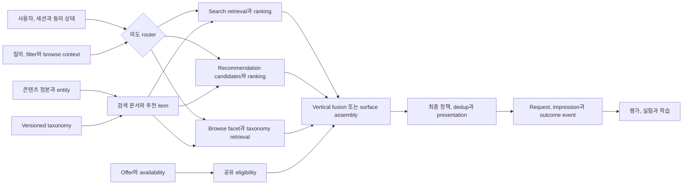

# OTT 디스커버리 시스템 아키텍처

OTT 디스커버리는 검색, 무질의 추천과 택소노미 탐색이 공통 콘텐츠 정본 위에서 서로 다른 사용자 의도를 해결하는 시스템이다. 세 경로는 feature와 인프라를 공유할 수 있지만 후보 universe, label, 실패 의미와 품질 기준을 하나로 합치지 않는다.

키노라이츠의 실제 내부 서비스 경계, 모델, 이벤트 품질과 운영 수치는 공개 정보만으로 알 수 없다. 이 문서는 내부 디스커버리에서 검증할 설계 프레임워크이며 구현 현황을 서술하지 않는다.

## 세 경로의 계약

| 경로 | 입력 의도 | Retrieval 기준 | 개인화 역할 | 대표 성공 |
|---|---|---|---|---|
| Query-bound search | 사용자가 입력한 작품, 인물, 주제와 조건 | 질의 관련도와 명시적 filter가 우선 | 관련도가 비슷한 후보의 보조 순위 | 의도에 맞는 결과 선택과 후속 행동 |
| Queryless recommendation | 무엇을 볼지 발견하려는 열린 의도 | 사용자, 세션, 맥락과 편집 목적별 후보 | 후보 생성과 랭킹의 중심 | 상세, 찜, 유효 OTT 이동 등 surface 목표 |
| Browse와 taxonomy | 장르, 분위기, 인물과 컬렉션을 따라 탐색 | 선택한 concept, facet과 계층 범위 | 범위 안에서 순서와 다음 탐색을 보조 | 탐색 지속, 선택과 범위 축소 |

검색어가 비었다고 검색 결과를 개인화 홈으로 조용히 바꾸지 않는다. 빈 질의 browse가 제품 계약이라면 별도 `surfaceId`, 요청 schema와 평가 지표를 갖는다.

## 전체 구조



Intent router는 질의를 추천으로 번역하는 단일 모델이 아니다. 요청한 surface와 명시적 filter를 보존하고, 필요한 retrieval 경로와 vertical만 선택한다.

## 공유해야 하는 정본과 분리해야 하는 정책

| 공유 계약 | 최소 내용 | 분리 원칙 |
|---|---|---|
| 콘텐츠 정본 | `contentId`, 작품과 시즌 관계, 인물과 제작자 entity | 검색 문서 ID와 OTT offer ID를 작품 ID로 오인하지 않음 |
| Availability | market, provider, access type, 유효 구간, 관측 시각과 revision | 검색 표시, 지금 보기 추천과 상세 CTA의 hard 조건은 다를 수 있음 |
| Taxonomy | `conceptId`, 축, 계층, 동의어, 할당과 version | 검색 facet, query mapping과 추천 feature의 적용 policy는 별도 version |
| 사용자와 세션 | 동의 상태, 장기 affinity, 최근 의도, locale과 구독 상태 | 허용 목적과 보유 기간 밖에서 검색어를 추천 profile로 재사용하지 않음 |
| Event | request, candidate, ranking, actual impression, action ID chain | 응답 반환을 impression으로 세지 않고 surface와 module 위치를 기록 |
| Experiment | stable assignment, variant, eligible population과 bundle | Surface별 primary와 guardrail을 사전 정의 |

정본 의미는 [[Content-Entity-Resolution|콘텐츠 entity resolution]], [[Content-Availability-Data-Contract|가용성 계약]], [[Recommendation-System-Taxonomy-Content-Based|택소노미 계약]]이 소유한다. Discovery 계층은 이를 요청 시점의 정책으로 조합한다.

## Query-bound search

1. 정규화, 오타 후보, entity와 taxonomy concept를 추출하되 원문과 rewrite provenance를 보존한다.
2. 작품, 인물, 컬렉션 같은 vertical을 선택하고 각 vertical 안에서 lexical, semantic 또는 hybrid retrieval을 수행한다.
3. 명시적 filter, exact title과 entity 일치, phrase와 field relevance를 먼저 지킨다.
4. 개인화 feature는 질의 관련도가 충분한 후보 안에서 보조 신호로 사용한다.
5. Vertical별 결과를 calibration한 뒤 blended list, section 또는 전용 진입점으로 표현한다.

### 개인화 검색 guardrail

- 개인화가 exact title, 인물과 명시적 filter를 뒤집지 않도록 relevance floor와 최대 boost를 둔다.
- 짧거나 모호한 질의에서만 세션과 장기 취향의 효과를 넓히고, 강한 navigation 의도에서는 줄인다.
- 익명, 신규 사용자, 동의 철회와 user feature timeout에는 비개인화 검색으로 결정론적으로 degrade한다.
- Query text, locale, filter와 taxonomy interpretation을 포함한 기본 결과와 개인화 delta를 재현할 수 있게 기록한다.
- 개인화가 없는 control, head와 tail query, 신규 작품과 사용자 slice에서 관련도 회귀를 막는다.

개인화 점수가 원래 관련 없는 작품을 구제하게 두면 검색은 추천 surface가 된다. Search ranker의 label도 클릭 하나가 아니라 query-item judgment, reformulation과 후속 성공을 함께 사용한다.

## Queryless recommendation과 browse

추천은 surface 목적에 따라 인기, 편집, taxonomy, item-to-item, behavior와 freshness source를 병합한다. Browse는 선택한 taxonomy subtree와 facet을 candidate universe로 고정한 뒤 그 안에서 인기, 품질과 개인화를 적용한다.

- 추천 label은 홈 module, 상세 유사 작품과 지금 보기처럼 surface별로 구분한다.
- Browse concept 선택은 현재 세션의 명시적 의도다. 장기 취향보다 강하게 쓰되 영구 profile 반영은 별도 정책으로 정한다.
- 가용성은 모든 경로의 공통 입력이지만 hard 여부는 surface 약속을 따른다.
- Taxonomy assignment가 없거나 version이 맞지 않는 작품은 무조건 제거하지 않고 정형 metadata나 비개인화 source로 degrade할 수 있다.

## Federated vertical과 결과 혼합

Federated search는 여러 collection 중 질의에 맞는 source를 고르고, 각 결과를 하나의 사용자 경험으로 합치는 문제다. 작품, 인물, 컬렉션의 원점수는 scale과 의미가 달라 직접 비교하지 않는다.

1. Query와 surface별 vertical 선택 기준과 호출 예산을 정하고, stochastic exploration을 사용하면 propensity도 기록한다.
2. Vertical별 retrieval, eligibility와 내부 ranking을 수행한다.
3. Canonical entity와 작품 관계로 중복을 합치되 작품, 시즌과 인물을 잘못 축약하지 않는다.
4. 공통 feature로 cross-vertical ranker를 학습하거나 rank fusion, calibrated score와 고정 layout baseline을 비교한다.
5. Vertical card의 크기와 시각적 주목도가 다르면 일반 목록의 position bias model을 그대로 재사용하지 않는다.

## Event와 cross-surface attribution

```text
discoverySessionId -> requestId -> decisionId -> impressionId
                   -> actionId -> destinationRequestId -> attributedOutcome
```

- `surfaceId`, `verticalId`, `moduleId`, row와 item 위치, query와 filter fingerprint, taxonomy와 policy version을 남긴다.
- 검색 결과에서 상세, 추천 module, OTT 이동으로 이어져도 각 surface의 직접 성과와 보조 경로를 분리한다.
- Attribution window와 last-touch, first-touch 또는 multi-touch 규칙을 metric마다 versioning한다.
- 검색 노출이 추천 학습 데이터로 들어갈 때 source와 position을 보존한다. 미클릭을 공통 dislike로 만들지 않는다.
- 실제 재생을 관측하지 못하면 OTT 이동을 재생 또는 만족으로 표현하지 않는다.

## 실패와 의도 보존 fallback

| 실패 | 허용 fallback | 금지할 변환 |
|---|---|---|
| 개인화 feature timeout | 같은 질의의 비개인화 relevance, 공개 인기 baseline | 질의를 버리고 개인 홈 반환 |
| Semantic retrieval 실패 | Lexical 결과와 명시적 filter 유지 | Zero result로 단정 |
| 특정 vertical timeout | 나머지 vertical과 부분 응답 표시 | 실패 vertical의 stale entity를 현재 사실로 표시 |
| 추천 source 실패 | Surface 정책에 맞는 인기, 신작과 편집 목록 | 가용성 검사를 건너뜀 |
| Taxonomy lookup 실패 | 정형 metadata browse 또는 범위 축소 안내 | 다른 concept로 조용히 치환 |
| Availability 불명 | 작품 발견은 유지 가능, 직접 CTA 제거 | 현재 볼 수 있다고 추정 |

Fallback event에는 원인, 빠진 source, 이전과 최종 policy 및 latency budget을 기록한다. 부분 결과가 정상 성공률에 섞이지 않도록 별도 지표로 본다.

## 평가와 단계별 도입

| 단계 | 추가 범위 | 통과 기준 |
|---|---|---|
| 0. 계약 | 공통 ID, taxonomy, availability와 event chain | 요청부터 outcome까지 audit 재구성 가능 |
| 1. Surface baseline | 검색, browse와 추천을 각각 비학습 baseline으로 운영 | Surface별 relevance, eligible recall, SLO와 fallback 검증 |
| 2. 공유 feature | Taxonomy와 session feature를 경로별 ranker에 추가 | 기본 의도와 주요 slice 비열화 없음 |
| 3. Federated blend | 작품, 인물과 컬렉션 selection 및 fusion | Vertical coverage와 blended UX 온라인 검증 |
| 4. Cross-surface 최적화 | 세션 흐름과 장기 결과 활용 | 직접 지표와 guardrail을 모두 통과한 무작위 실험 |

실제 시작 단계는 내부 트래픽, label, taxonomy와 event 품질을 확인한 뒤 정한다. OpenSearch, 별도 ANN과 feature store의 선택도 이 계약에서 자동으로 나오지 않는다.

## 내부 디스커버리 질문

- 각 surface의 사용자 약속, primary, guardrail과 owner는 무엇인가
- Search, recommendation과 browse가 공유하는 ID와 서로 다른 candidate universe는 무엇인가
- Query, click, 찜, OTT 이동과 실제 재생 중 어느 신호를 합법적이고 정확하게 관측하는가
- Taxonomy version과 assignment 품질이 facet, rewrite와 recommendation feature 사용을 허용하는가
- Vertical, feature와 availability 장애에서 현재 fallback이 의도를 보존하는가
- Assignment, actual impression과 cross-surface outcome을 같은 session에서 재구성할 수 있는가

## 관련 문서

- [[Recommendation-System-OTT-Aggregator-Design-Proposal|OTT 추천 시스템 초기 설계안]], [[Recommendation-System-Page-Level-Optimization|페이지 단위 최적화]]
- [[Recommendation-System-Taxonomy-Content-Based|택소노미]], [[Recommendation-System-Eligibility-Availability|추천 eligibility와 가용성]]
- [[Recommendation-System-Feedback-Data|피드백 데이터]], [[Recommendation-System-Evaluation-Experimentation|평가와 실험]]
- [[OpenSearch-Query-Understanding|검색 쿼리 이해]], [[OpenSearch-Hybrid-Search|하이브리드 검색]], [[OpenSearch-Search-Quality-Evaluation|검색 품질 평가]]
- [[Search-UX|검색 UX]], [[Content-Availability-System-Design|가용성 조회 시스템]]

## 출처

- [The Netflix Recommender System: Algorithms, Business Value, and Innovation - ACM](https://doi.org/10.1145/2843948)
- [Recommendations and Results Organization in Netflix Search - Netflix Research](https://arxiv.org/abs/2105.14134)
- [Real-time Personalization using Embeddings for Search Ranking at Airbnb - KDD](https://www.kdd.org/kdd2018/accepted-papers/view/real-time-personalization-using-embeddings-for-search-ranking-at-airbnb)
- [Federated Search - Microsoft Research](https://www.microsoft.com/en-us/research/publication/federated-search/)
- [Beyond Ten Blue Links: Enabling User Click Modeling in Federated Web Search - Microsoft Research](https://www.microsoft.com/en-us/research/publication/beyond-ten-blue-links-enabling-user-click-modeling-in-federated-web-search/)
- [Hybrid search - OpenSearch Documentation](https://docs.opensearch.org/latest/vector-search/ai-search/hybrid-search/index/)
- [SKOS Simple Knowledge Organization System Reference - W3C](https://www.w3.org/TR/skos-reference/)
