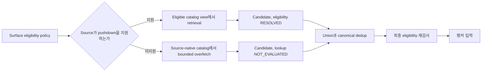

# 추천 시스템 후보 생성

후보 생성은 전체 eligible catalog를 지연 예산 안에서 직접 scoring하기 어려울 때 관심 가능성이 있는 수백 개 또는 수천 개를 빠르게 찾아 랭커에 넘기는 단계다. 최종 순서보다 **높은 Recall, source 다양성, 낮은 지연**을 우선하며, 여기서 빠진 아이템은 뒤의 랭커가 복구할 수 없다. 전체를 정확히 평가할 수 있는 규모라면 별도 retrieval 계층이 필수는 아니다.

## 전체 위치



후보 생성기는 하나의 알고리즘 이름이 아니다. 인기 목록, item-to-item, matrix factorization, Two-Tower가 모두 같은 단계의 서로 다른 source가 될 수 있다.

## 후보 source 포트폴리오

| Source | 사용하는 정보 | 강점 | 주요 한계 |
|---|---|---|---|
| 인기와 트렌딩 | 전체 또는 세그먼트 행동 집계 | 데이터가 적어도 안정적, fallback 가능 | 인기 집중과 개인화 부족 |
| 이어보기와 최근 행동 | 사용자 직접 이력 | 의도가 명확하고 설명 가능 | 발견보다 재개에 가까움 |
| Item-to-item | 함께 소비된 아이템 또는 콘텐츠 유사도 | 현재 맥락 반영이 빠름 | 비슷한 아이템 반복 |
| 콘텐츠 기반 | 장르, [[Recommendation-System-Taxonomy-Content-Based\|택소노미]], 설명, 이미지와 임베딩 | 신규 아이템과 niche에 유리 | 메타데이터 품질과 overspecialization |
| 협업 필터링 | 여러 사용자의 user-item interaction | latent 취향과 의외의 발견 | 희소성, Cold Start, 노출 편향 |
| Two-Tower와 ANN | 사용자, 아이템, 맥락 특징 | 큰 카탈로그를 저지연 검색 | 학습과 인덱스 운영 복잡성 |
| 편집과 비즈니스 | 운영자가 정한 목록과 캠페인 | 품질 보장과 긴급 대응 | 과도하면 개인화 목적을 덮음 |

강한 시스템은 source를 경쟁시키기보다 역할을 분리한다. 한 source가 전체 후보를 독점하지 않도록 관측하되, 최소와 최대 quota는 제품 목표가 필요할 때 적용하는 정책이지 보편 규칙은 아니다.

## Baseline이 먼저다

인기, 최신, 편집 목록은 임시방편이 아니라 비교 기준이다.

- 지역, 기기, 시간대 같은 넓은 맥락으로 segment를 나눌 수 있다.
- 시간 감쇠를 두면 오래 누적된 인기와 최근 상승을 구분할 수 있다.
- 빈 결과, 신규 사용자, 개인화 장애에서 fallback으로 재사용할 수 있다.
- 복잡한 모델은 이 baseline 대비 증분 품질과 비용을 입증해야 한다.

Baseline도 법적 차단, 연령과 안전 정책 같은 보편 제약에서 예외가 아니다. 현재 가용성, 구독, 재소비와 offer 중복은 [[Recommendation-System-Eligibility-Availability|surface별 eligibility 계약]]에 따라 적용한다.

## 콘텐츠 기반 추천

콘텐츠 기반 방식은 사용자가 선호한 아이템과 후보 아이템을 같은 feature 공간에 놓고 유사도를 계산한다. 다른 사용자의 행동이 없어도 장르, 출연진, 설명과 임베딩으로 시작할 수 있다. 통제된 concept ID와 할당 품질을 사용하는 구체적인 계약은 [[Recommendation-System-Taxonomy-Content-Based|택소노미 기반 콘텐츠 추천]]이 소유한다.

```text
user profile = aggregate(과거에 선호한 item features)
score(user, item) = similarity(user profile, item features)
```

장점은 신규 아이템이 metadata만으로 후보에 들어올 수 있다는 점이다. 반대로 metadata가 빈약하면 품질도 같이 떨어지고, 과거 취향과 너무 비슷한 것만 고르면 탐색 범위가 좁아진다. 콘텐츠 기반은 비개인화가 아니다. 사용자별 행동으로 profile을 만들면 개인화된 추천이다.

## 협업 필터링과 Matrix Factorization

협업 필터링은 여러 사용자의 interaction 구조에서 비슷한 사용자, 아이템 또는 latent pattern을 학습한다. User-user KNN만을 뜻하지 않으며 item-item과 matrix factorization도 포함한다.

Matrix factorization은 희소한 user-item 행렬을 낮은 차원의 두 행렬로 근사한다.

```text
A ≈ U Vᵀ
affinity(user i, item j) = dot(Uᵢ, Vⱼ)
```

전체 `m x n` 행렬 대신 `m x d`, `n x d` embedding을 학습해 latent 구조를 압축한다. 다만 latent 축이 장르처럼 사람이 해석 가능한 의미를 가진다고 보장할 수 없다.

### Explicit와 implicit 목적의 차이

- 별점 같은 explicit feedback은 관측된 값의 예측 오차를 줄이는 목적을 세울 수 있다.
- 시청과 클릭 같은 implicit feedback에서는 관측을 선호의 단서로 보고 강도를 confidence로 다룰 수 있다.
- 미관측 항목은 dislike가 아니다. 모든 0을 확정적 negative로 보면 노출되지 않은 아이템까지 거절로 오해한다.
- WALS는 관측과 미관측에 다른 가중치를 둔 squared loss에 효율적이고, BPR은 관측 아이템이 sampled unobserved 아이템보다 위에 오도록 pairwise 순서를 학습한다.

## Two-Tower Retrieval

Two-Tower는 query tower와 item tower를 독립적으로 계산한다.

```text
queryEmbedding = queryTower(user, session, context)
itemEmbedding  = itemTower(item features)
score          = dot(queryEmbedding, itemEmbedding)
```

아이템 embedding을 미리 계산해 ANN 인덱스에 넣을 수 있으므로 큰 카탈로그의 Top K 검색에 적합하다. 양쪽 tower가 feature를 사용하면 학습에 없던 사용자나 아이템도 처리할 여지가 있지만, ID embedding만 사용하면 같은 Cold Start 한계가 남는다.

독립 인코딩은 확장성의 조건이면서 표현력의 제약이다. 사용자와 아이템의 세밀한 cross feature를 모든 조합에 적용하기 어렵기 때문에, Two-Tower는 대개 후보 생성에 쓰고 더 비싼 ranker가 작은 후보군에서 교차 특징을 계산한다.

ANN의 HNSW와 IVF, 거리 함수와 Recall 조정은 [[Vector-Similarity-Search|벡터 유사도 검색]]에서 다룬다. 여기서는 paired tower와 index가 같은 embedding 공간을 써야 하는 이유만 다루고, 배포와 rollback 계약은 [[Recommendation-System-Serving-Operations|서빙과 운영]]이 소유한다.

## Negative Sampling은 학습 목표의 일부다

전체 카탈로그에 softmax를 계산하기 비싸면 positive와 일부 negative로 근사한다.

| 방식 | 장점 | 주의점 |
|---|---|---|
| Uniform | 단순하고 전체 영역을 넓게 봄 | 너무 쉬운 negative가 많을 수 있음 |
| In-batch | 추가 검색 없이 batch의 다른 item 활용 | batch 구성과 인기 분포의 영향을 받음 |
| Hard negative | 현재 모델이 높게 점수화한 오답에 집중 | 미관측이지만 관련 있는 false negative 위험 |
| Mixed | 서로 다른 분포를 섞어 편향 완화 시도 | 혼합 비율도 실험 대상 |

In-batch negative에서 같은 positive item이 우연히 negative로 들어가는 accidental hit를 제거해야 한다. 어떤 분포로 negative를 뽑는지가 학습할 ranking 문제를 바꾸므로, sampling 구현을 단순 성능 최적화로만 보면 안 된다.

## 병합 계층의 계약

각 생성기는 최소한 다음 정보를 함께 내보낸다.

- `itemId`, 필요하면 `offerIds`, `candidateSource`, `sourceScore`, `generatorVersion`
- 후보를 만든 기준 시각과 사용한 embedding 또는 index 버전
- source 내부 rank와 필요한 디버깅 metadata
- `surfaceId`와 [[Recommendation-System-Eligibility-Availability#공유 AvailabilityEvaluation|공유 AvailabilityEvaluation]]
- Source 응답 단위의 `requestedK`, `returnedK`, overfetch와 retry 횟수

병합 계층은 정본 `itemId`를 기준으로 합치되, 여러 offer를 보존할지는 surface가 결정한다. 법적, 안전상 보편 제약과 surface별 가용성, 구독, 재소비 정책을 구분해 검사한다. 서로 다른 source 점수는 scale이 같다고 보장할 수 없으므로 공통 ranker가 비교 가능한 특징과 목적함수로 다시 scoring한다.

Source가 surface eligibility를 적용할 수 없으면 candidate에는 `lookupStatus=NOT_EVALUATED`, reason=`SOURCE_UNSUPPORTED_DEFERRED`를 기록한다. 병합 또는 최종 재검사는 이를 slate 전까지 `RESOLVED`나 `FAILED`로 전이한다.

## Filter 순서와 underfill

선택도가 높은 조건을 각 source의 Top K 뒤에서만 적용하면 적격 후보가 K 밖에 남아도 복구할 수 없다. 신뢰할 수 있고 source가 지원하는 보편 제약과 surface 정책은 retrieval에 push down한다.

Push down할 수 없는 source는 최근 filter pass rate를 기준으로 제한된 overfetch를 적용한다. 목표 개수에 못 미치면 남은 deadline 안에서 횟수와 최대 K가 정해진 adaptive retry를 수행하고, 그래도 부족하면 surface가 정의한 fallback 또는 축소 응답을 사용한다. 병합 뒤 최종 재검사는 freshness를 보장하지만 retrieval에서 잃은 후보를 되살리지는 못한다.

## Cold Start를 둘로 나눈다

| 문제 | 없는 정보 | 우선 대응 |
|---|---|---|
| 신규 사용자 | 장기 취향과 interaction | onboarding 선호, 현재 session, 유입 맥락, 세그먼트 인기, 제한적 탐색 |
| 신규 아이템 | interaction과 노출 | 콘텐츠 특징, attribute 기반 embedding, 최신 source, 제한적 탐색 |

평균 embedding 하나는 fallback일 뿐 완전한 해결이 아니다. 탐색은 학습 데이터를 만들지만 단기 경험 비용이 있으므로 비율, 대상과 안전 범위를 통제한다.

## 후보 단계 평가와 운영 지표

- `Recall@K`, `eligible Recall@K`, `Hit Rate@K`: relevant하고 적격인 item이 랭커 입력에 들어왔는가
- Source별 candidate 수, 중복률, 최종 노출 기여율
- 신규 아이템과 long-tail의 candidate coverage
- 생성기별 p95, p99 지연과 timeout, 빈 결과율
- ANN을 쓰는 source의 exact 대비 Recall과 index freshness
- Filter pass rate, overfetch와 retry, fallback, underfill과 탈락 사유

후보 수를 늘리면 Recall이 좋아질 수 있지만 병합, 필터와 ranker 비용도 증가한다. `K`는 모델 정확도만이 아니라 전체 요청의 지연 예산 안에서 정한다.

## 도입 순서

1. 인기, 최신과 편집 baseline을 만든다.
2. 이어보기, item-to-item과 콘텐츠 기반 source를 추가한다.
3. interaction 밀도와 품질이 충분하면 협업 필터링을 비교한다.
4. 카탈로그와 지연 요구가 필요성을 증명하면 Two-Tower와 ANN을 도입한다.
5. Source별 증분 효과가 확인된 것만 유지하고 중복 비용을 줄인다.

## 관련 문서

- [[Recommendation-System-Architecture|추천 시스템 지식 지도]], [[Recommendation-System-OTT-Discovery-Scenarios|OTT 구축 시나리오]]
- [[Recommendation-System-Taxonomy-Content-Based|택소노미 기반 콘텐츠 추천]], [[Recommendation-System-Ranking-Reranking|추천 랭킹과 재랭킹]]
- [[Recommendation-System-Feedback-Data|추천 피드백 데이터]]
- [[Vector-Similarity-Search|벡터 유사도 검색과 ANN]]
- [[Content-Entity-Resolution|콘텐츠 정본과 제공처 레코드 분리]]
- [[Recommendation-System-Eligibility-Availability|추천 자격 조건과 가용성]], [[Content-Availability-System-Design|콘텐츠 가용성과 최신성 설계]]

## 출처

- [Candidate generation overview - Google for Developers](https://developers.google.com/machine-learning/recommendation/overview/candidate-generation)
- [Content-based filtering - Google for Developers](https://developers.google.com/machine-learning/recommendation/content-based/basics)
- [Collaborative filtering - Google for Developers](https://developers.google.com/machine-learning/recommendation/collaborative/basics)
- [Matrix factorization - Google for Developers](https://developers.google.com/machine-learning/recommendation/collaborative/matrix)
- [Deep neural network models - Google for Developers](https://developers.google.com/machine-learning/recommendation/dnn/softmax)
- [Softmax training and negative sampling - Google for Developers](https://developers.google.com/machine-learning/recommendation/dnn/training)
- [Collaborative Filtering for Implicit Feedback Datasets - Hu, Koren, Volinsky](https://yifanhu.net/PUB/cf.pdf)
- [BPR: Bayesian Personalized Ranking from Implicit Feedback - Rendle et al.](https://arxiv.org/abs/1205.2618)
- [Mixed Negative Sampling for Two-Tower Networks - Google Research](https://research.google/pubs/mixed-negative-sampling-for-learning-two-tower-neural-networks-in-recommendations/)
- [Recommending movies: retrieval - TensorFlow Recommenders](https://www.tensorflow.org/recommenders/examples/basic_retrieval)
- [Filtering vector matches - Google Cloud](https://docs.cloud.google.com/gemini-enterprise-agent-platform/build/vector-search/filtering)
- [개인화 추천 시스템 1, Multi-Stage Recommender System - 오늘의집](https://www.bucketplace.com/post/2024-03-26-%EA%B0%9C%EC%9D%B8%ED%99%94-%EC%B6%94%EC%B2%9C-%EC%8B%9C%EC%8A%A4%ED%85%9C-1-multi-stage-recommender-system/)
