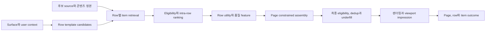

# 추천 페이지 단위 최적화

멀티 캐러셀 홈은 좋은 아이템 목록 여러 개를 이어 붙이는 문제가 아니다. 어떤 row를 만들고, 각 row 안에서 무엇을 보여주며, row를 어떤 순서로 배치할지를 전체 viewport와 세션 피로도 안에서 함께 결정해야 한다.

키노라이츠의 실제 홈 조립 방식, module 정책, 로그와 모델은 공개 정보만으로 알 수 없다. 이 문서는 내부 디스커버리를 위한 page assembly 프레임워크이며 현재 구현을 설명하지 않는다.

## 세 단계의 책임

| 단계 | 결정 | 최적화 단위 | 대표 실패 |
|---|---|---|---|
| Row candidate generation | 계속 보기, 내 OTT, taxonomy와 인기 등 어떤 row를 만들 수 있는가 | `rowTemplateId`와 context | 비슷한 row만 생성, 목적 row 누락 |
| Intra-row ranking | Row 안에서 어떤 작품을 어떤 순서로 둘 것인가 | item slate | 개별 관련도는 높지만 중복과 부적격 item 발생 |
| Page assembly | 어떤 row를 선택하고 어느 위치에 둘 것인가 | 전체 page slate | 상단 편중, cross-row 중복, 하단 row 미노출 |

Item ranker의 점수를 합산해 row와 page 가치를 계산하면 아래쪽 item과 row가 실제로 보이지 않는 문제를 숨긴다. Row 노출 확률, item 선택 확률과 surface 목적을 분리해 추정한다.

## 전체 조립 흐름



Page assembler는 새로운 콘텐츠 정본이 아니다. 각 row의 provenance, eligibility와 점수를 보존한 채 page-level 제약을 적용한다.

## 조립 계약

```text
RowCandidate {
  rowInstanceId, rowTemplateId, objective, candidateSourceVersions[],
  items[]{contentId, source, sourceRank, rankScore, eligibilityRef},
  rowFeatures, fallbackClass, expiresAt
}

PageDecision {
  pageDecisionId, surfaceId, bundleId, assemblyPolicyVersion,
  rows[]{rowInstanceId, pagePosition, items[]{contentId, rowPosition}},
  constraintResults[], fallbackReasons[], decidedAt
}
```

- `rowTemplateId`는 row의 제품 의미, `rowInstanceId`는 특정 요청에서 생성된 결과다.
- 작품 정본과 offer를 분리하고, 지금 보기 row의 item은 최종 응답 직전 가용성을 재검사한다.
- Score, feature snapshot, taxonomy와 policy version을 serving bundle에 pin한다.
- 결정론적 tie-break를 두고 같은 입력과 bundle로 page를 replay할 수 있어야 한다.

## Row 선택과 순서

먼저 규칙 기반 baseline을 운영한다.

1. Surface가 보장하는 필수 row와 고정 위치를 제품 계약으로 분리한다.
2. 나머지 row마다 예상 노출, 선택 가치, 신선도, coverage와 운영 신뢰도를 계산한다.
3. 상단부터 한 row씩 선택하되 이미 고른 row와의 중복에 marginal penalty를 적용한다.
4. 최소와 최대 row 수, latency budget, taxonomy와 provider 편중 같은 제약을 검사한다.
5. 목표를 채우지 못하면 같은 의미의 fallback class만 사용하고, 없으면 page를 짧게 반환한다.

```text
marginalRowValue = expectedSurfaceValue
                 + coverageGain + freshnessGain
                 - itemOverlap - conceptOverlap - recentFatigue
                 - latencyRisk - availabilityRisk
```

계수는 예시이며 내부 실험 없이 고정하지 않는다. Greedy constrained assembler를 해석 가능한 baseline으로 두고, 로그와 트래픽이 충분할 때 학습형 row ranker, slate model 또는 end-to-end page model을 비교한다.

## Intra-row ranking

- Row의 목적에 맞는 candidate universe와 label을 사용한다. 계속 보기와 신작 row를 같은 label로 학습하지 않는다.
- Row 안에서 읽기 방향의 선행 위치와 초기 viewport가 더 자주 보이는 노출 편향을 학습과 평가에서 통제한다.
- Item score 뒤에 동일 franchise, taxonomy concept, provider와 최근 노출 반복을 줄이는 slate reranking을 적용한다.
- 동일 작품의 시즌, 판본과 여러 OTT offer는 [[Content-Entity-Resolution|정본 관계]]와 surface 계약에 따라 합치거나 분리한다.
- Row 제목과 실제 item 의미가 맞는지 semantic cohesion을 검사한다. 범위를 벗어난 인기 item으로 underfill을 숨기지 않는다.

## Cross-row 중복과 피로도

Cross-row 중복은 요청 안의 중복과 여러 세션의 반복을 분리한다.

| 종류 | 기본 정책 | 허용 예외 |
|---|---|---|
| 초기 viewport의 동일 작품 | 한 번만 노출 | 계속 보기처럼 행동 완료에 직접 필요한 row |
| 같은 franchise와 매우 유사한 concept | 상한 또는 거리 제약 | 명시적 franchise, 배우와 장르 browse |
| 같은 provider 편중 | Surface별 노출 상한과 분포 감시 | 사용자가 해당 OTT만 선택한 지금 보기 surface |
| 최근 viewable impression 반복 | 시간 감쇠 penalty와 frequency cap | 미완료 상태, 종료 임박과 사용자가 고정한 항목 |

중복 제거는 무조건적인 hard rule이 아니다. 서로 다른 row에서 같은 작품이 다른 의도를 충족한다면 예외 사유를 기록하고 실험한다. Fatigue는 API response가 아니라 실제 viewable impression을 기준으로 계산한다.

## Viewport와 scroll attribution

응답에 포함된 row와 item을 노출로 세지 않는다. Client가 실제 가시성을 관측해 다음 event를 보낸다.

- `PAGE_RENDERED`: page bundle이 렌더링됐지만 개별 노출은 아님
- `ROW_IMPRESSION`: row가 정한 가시 면적과 지속 시간 기준을 충족
- `ITEM_IMPRESSION`: item 카드가 기준을 충족, row와 page 위치를 함께 기록
- `ROW_SCROLL`: 수평 캐러셀의 시작과 종료 index, 방향과 timestamp
- `PAGE_SCROLL`: 수직 scroll depth, viewport와 체류 구간
- `ACTION`: 상세, 찜, 숨김, 재생 또는 OTT 이동과 선행 impression ID

웹에서는 Intersection Observer로 viewport 교차를 관측할 수 있다. 이 API는 교차 영역과 위치를 비동기로 알려줄 뿐 실제 픽셀 표시나 다른 요소에 의한 가림까지 보장하지 않는다. 가시 면적과 지속 시간 임계값은 광고 표준을 복사하지 말고 제품, 기기와 카드 형태별로 정의하고 `impressionPolicyVersion`을 기록한다. Background tab, 빠른 관통 scroll, 재렌더링과 동일 decision 내 중복 event를 처리한다.

Attribution은 `pageDecisionId -> rowInstanceId -> impressionId -> actionId`를 보존한다. Row 클릭률의 분모는 응답 row가 아니라 viewable row이며, 하단 row의 낮은 raw CTR을 낮은 relevance로 단정하지 않는다.

## Underfill과 fallback

| 원인 | 처리 |
|---|---|
| Eligibility 후 item 부족 | 제한된 overfetch, 같은 row 의미의 다음 source, row 축소 순서로 처리 |
| Row 의미 불일치 | Row를 제거하고 다른 목적 row 후보를 선택 |
| Row source timeout | Cache가 policy 안에서 유효하면 사용하고 아니면 동급 fallback row 선택 |
| Page assembler timeout | 검증된 baseline ordering을 사용하고 원인을 기록 |
| Availability 불명 | 직접 시청 CTA item을 제거하고 최신 조건으로 다시 채움 |
| 전체 후보 부족 | 중복이나 부적격 item으로 채우지 않고 row 또는 page를 짧게 반환 |

Fallback에서도 법적, 안전, 구독과 가용성 hard constraint를 우회하지 않는다. Cache된 page도 반환 전에 최종 eligibility를 검사한다.

## 지표

| 계층 | Primary 후보 | 진단과 guardrail |
|---|---|---|
| Page | Discovery session 성공, 유효 OTT 이동, 장기 재방문 | Time to first action, scroll depth, 빈 page와 latency |
| Row | 목적별 완료 행동과 viewable row당 가치 | Row viewability, horizontal scroll, underfill과 fallback |
| Item | Viewable impression당 상세, 찜과 이동 | Position별 NDCG, 숨김, 부적격 노출 |
| 생태계 | Catalog와 taxonomy coverage | Cross-row 중복, provider 편중, novelty와 fatigue |

Page primary 하나만 보면 특정 row가 희생될 수 있고 row CTR 합계만 보면 전체 발견 경험이 왜곡된다. Page 결과, row 진단과 공급 및 안전 guardrail을 함께 본다.

## 실험 계약

- 사용자 또는 household처럼 안정된 단위로 page assembly variant를 배정하고 assignment와 actual exposure를 분리한다.
- Page-level primary, 주요 row diagnostics, 가용성, 중복, latency와 공급자 slice를 사전 등록한다.
- Scroll depth, impression과 click 같은 ratio metric은 분석 단위와 분산 추정법을 고정한다.
- 여러 row별 유의성 검정을 반복하면 거짓 양성이 늘어나므로 핵심 비교를 제한하거나 다중 검정 보정을 사용한다.
- UI layout, row selection과 item ranker를 동시에 바꾸면 원인을 분리할 수 없다. 단계 실험이나 factorial 설계를 검토한다.
- 낮은 위치의 row는 노출 표본이 적다. 응답 기준 ITT와 viewable 기준 triggered 분석을 함께 보고 사후 노출자만 전체 효과로 일반화하지 않는다.

Offline replay는 제약 위반, 중복과 latency 회귀를 거르는 데 유용하지만 새 page가 만드는 scroll과 선택 행동을 완전히 재현하지 못한다. 출시는 [[Recommendation-System-Evaluation-Experimentation#출시와 단계 승급 게이트|무작위 온라인 실험 gate]]를 따른다.

## 내부 디스커버리 질문

- 현재 row template, 고정 위치, product owner와 각 row의 완료 행동은 무엇인가
- Row와 item의 actual impression, 수평 및 수직 scroll을 신뢰할 수 있게 관측하는가
- 같은 작품과 franchise 중복을 어떤 surface와 예외에서 허용하는가
- Availability와 user state가 page cache 수명보다 빨리 바뀌는가
- Row underfill, assembler timeout과 fallback이 현재 로그에서 구분되는가
- 실험 assignment, page decision과 후속 OTT 이동을 같은 경로로 재구성할 수 있는가

## 관련 문서

- [[Recommendation-System-OTT-Discovery-Architecture|OTT 디스커버리 아키텍처]], [[Recommendation-System-OTT-Aggregator-Design-Proposal|OTT 추천 초기 설계안]]
- [[Recommendation-System-Ranking-Reranking|랭킹과 재랭킹]], [[Recommendation-System-Eligibility-Availability|eligibility와 가용성]]
- [[Recommendation-System-Feedback-Data|피드백 데이터]], [[Recommendation-System-Evaluation-Experimentation|평가와 실험]]
- [[Recommendation-System-Serving-Operations|서빙과 운영]], [[Recommendation-System-Industry-Media|미디어 추천 사례]]
- [[Content-Availability-Data-Contract|가용성 데이터 계약]], [[Metrics-Framework|제품 지표 설계]]

## 출처

- [The Netflix Recommender System: Algorithms, Business Value, and Innovation - ACM](https://doi.org/10.1145/2843948)
- [How Netflix's Recommendations System Works - Netflix](https://help.netflix.com/en/node/100639)
- [Full-Page Recommender: A Modular Framework for Multi-Carousel Recommendations - ACM RecSys](https://doi.org/10.1145/3705328.3748753)
- [Seq2Slate: Re-ranking and Slate Optimization with RNNs - Google Research](https://research.google/pubs/seq2slate-re-ranking-and-slate-optimization-with-rnns/)
- [Reinforcement Learning for Slate-based Recommender Systems - Google Research](https://research.google/pubs/reinforcement-learning-for-slate-based-recommender-systems-a-tractable-decomposition-and-practical-methodology/)
- [Intersection Observer - W3C](https://www.w3.org/TR/intersection-observer/)
- [Trustworthy Analysis of Online A/B Tests - Microsoft Research](https://www.microsoft.com/en-us/research/publication/trustworthy-analysis-of-online-a-b-tests-pitfalls-challenges-and-solutions/)
