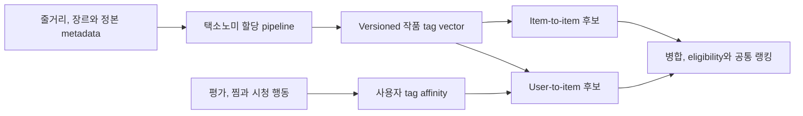

# 추천 시스템 택소노미와 콘텐츠 기반 추천

택소노미 기반 추천은 작품을 통제된 개념 집합으로 표현하고, 작품 간 유사도와 사용자의 개념별 선호를 후보 생성과 랭킹 feature로 사용하는 콘텐츠 기반 방식이다. 자유 해시태그와 달리 표준 ID, 의미 범위, 동의어, 계층과 version을 관리한다.

키노라이츠가 이 방식을 실제 추천 기준으로 사용한다는 것은 현재 사용자 가설이며 공개 자료로 확인된 내부 사실이 아니다. Taxonomy와 behavior 성숙도에 따른 선택은 [[Recommendation-System-OTT-Discovery-Scenarios|OTT 추천 구축 시나리오]], 이 문서는 해당 가설을 구현할 때의 계약을 소유한다.

## 전체 위치



택소노미는 콘텐츠 유사도를 만들고 신규 작품의 Cold Start를 완화하는 candidate source다. 현재 가용성, 구독, 법적 조건과 최종 순서를 단독 결정하지 않으며 인기, 편집, 행동 기반 source와 함께 사용한다.

## 자유 태그와 택소노미를 구분한다

| 구분 | 자유 태그 | 운영 택소노미 |
|---|---|---|
| 식별 | 문자열 자체 | 의미가 안정된 `conceptId` |
| 동의어 | 킬러, 암살자, hitman이 분리될 수 있음 | 대표 label과 alternative label로 한 개념에 연결 |
| 관계 | 평면 목록 | `broader`, `narrower`, 필요하면 `related` |
| 의미 변경 | 조용히 덮어쓸 수 있음 | version, 폐기와 대체 mapping 필요 |
| 품질 관리 | 작성자마다 기준이 다름 | `scopeNote`, 할당 가이드와 검수 상태 사용 |

W3C SKOS는 concept scheme, preferred와 alternative label, 직접 상하위 관계와 연관 관계를 표현하는 참고 모델이다. 내부 저장소를 RDF로 만들어야 한다는 뜻은 아니며, 필요한 의미 계약만 도메인 schema에 반영한다. SKOS 자체가 사내 배포 version과 폐기 lifecycle을 정해 주지는 않으므로 이 부분은 별도 application 계약으로 둔다.

## 다축 개념 체계

| 축 | 예 | 경계 |
|---|---|---|
| `GENRE` | 범죄, 액션, 스릴러 | 기존 공식 장르와 mapping을 보존 |
| `NARRATIVE` | 추격, 구출, 복수, 권력형 비리 | 줄거리에 존재하는 것과 중심 서사를 구분 |
| `CHARACTER` | 암살자, 형사, 검사 | 배우나 인물 entity와 역할 개념을 구분 |
| `SETTING_PLACE` | 도시, 태국, 일본 | 제작 국가와 극중 배경을 구분하고 국가와 지역 ID를 저장 |
| `SETTING_TIME` | 현대, 일제강점기, 근미래 | 공개 연도와 극중 시대를 구분 |
| `TONE_MOOD` | 암울함, 긴장감, 따뜻함 | 개인 감상보다 할당 기준을 문서화 |
| `STYLE_PACING` | 추격 액션, 느린 전개, 군상극 | 장르와 중복되지 않는 연출 특성 |

출연진, 감독, 제작 국가처럼 안정된 entity와 facet은 별도 정형 필드로 유지한다. 연령 등급, 유해성, 법적 차단은 취향 택소노미와 분리된 정책 입력으로 관리해 유사도 점수로 완화되지 않게 한다.

## 작품 예시는 할당 정답이 아니다

| 작품 | 공식 정보에서 시작할 축 | 검토할 세부 개념 | 검수 포인트 |
|---|---|---|---|
| 아수라 | 범죄, 액션 | 권력형 비리, 배신, 형사, 검사, 암울한 분위기 | 줄거리의 중심성과 tone 기준을 근거로 확인 |
| 다만 악에서 구하소서 | 범죄, 액션, 태국과 일본 배경 | 추격, 구출, 복수, 암살자 | 암살자가 등장한다고 첩보를 자동 부여하지 않음 |

위 표는 taxonomy 구조를 설명하는 예시다. 실제 운영 할당은 승인된 synopsis와 metadata, concept별 `scopeNote`와 편집 검수를 거쳐야 한다. `해외 배경`은 기준 시장에 따라 달라지는 표현이므로 보편 concept로 고정하지 않고 `settingCountryIds`에서 surface의 시장을 기준으로 파생한다.

## Concept와 Assignment 계약

```text
TaxonomyConcept {
  taxonomyVersion, schemeId, conceptId, axis,
  preferredLabelsByLanguage{languageTag: value},
  alternativeLabels[]{languageTag, value}, hiddenLabels[]{languageTag, value},
  definition, scopeNote, broaderConceptIds[], relatedConceptIds[],
  status, replacedByConceptIds[], createdAt, deprecatedAt
}

ContentTaxonomyAssignment {
  contentId, conceptId, taxonomyVersion,
  relevance, confidence, source, evidenceRef,
  taggerVersion, reviewStatus, assignedAt
}
```

- 정본 key는 `{contentId, conceptId, taxonomyVersion}`다.
- `relevance`는 그 개념이 작품에서 얼마나 중심적인지, `confidence`는 할당 판단이 얼마나 확실한지를 뜻한다.
- Confidence는 기본적으로 검수와 공개 gate다. Ranking weight로 곱하려면 calibration을 별도로 검증한다.
- LLM이 스스로 출력한 confidence를 확률로 해석하지 않는다. Gold set에서 보정되기 전에는 검수 우선순위를 정하는 신호로만 사용한다.
- `source`는 `EDITORIAL`, `RULE`, `MODEL`처럼 provenance를 구분하고 `evidenceRef`는 재검수 가능한 입력 snapshot을 가리킨다.
- 같은 `conceptId`의 의미를 바꾸지 않는다. 개념 merge와 split은 새 version과 대체 mapping으로 전환한다.
- 언어별 preferred label은 하나만 허용한다. Label은 추가되거나 바뀔 수 있지만 추천과 event는 문자열 대신 `conceptId`를 기록한다.

## LLM 보조 태깅 pipeline

1. 사용 권한과 품질이 확인된 줄거리, 장르와 정형 metadata snapshot을 입력으로 고정한다.
2. 현재 `taxonomyVersion`의 허용 `conceptId`, `scopeNote`와 positive 및 negative 예시를 제공한다.
3. LLM 또는 multi-label classifier는 허용 ID, `relevance`, `confidence`와 `evidenceRef`만 구조화 출력한다.
4. Schema, 존재하지 않는 ID, 축별 범위, 금지 조합과 evidence 누락을 deterministic validator가 검사한다.
5. 낮은 confidence, 새 작품의 핵심 태그와 분포 이상은 편집 검수 queue로 보낸다.
6. 승인 snapshot을 publish하고 `taggerVersion`, prompt 또는 model artifact와 input lineage를 보존한다.

Model은 새 운영 concept를 즉시 만들지 않는다. 미등록 표현은 `candidateConcept` queue에 제안하고 의미 중복, 범위와 migration 영향을 검토한 뒤 다음 taxonomy version에 반영한다. LLM 설명문을 그대로 ranking truth나 사용자 노출 이유로 사용하지 않는다.

허용 ID를 강제하는 constrained output은 schema와 ID 유효성만 보장하고 의미상 올바른 할당을 보장하지 않는다. Concept 수가 커서 먼저 label 후보를 검색한다면 최종 tagger 품질 외에 label retrieval recall도 별도 gate로 측정한다.

## 작품과 사용자 벡터

```text
itemVector[i, t] = assignment.relevance
userAffinity[u, t] = Σ(signalWeight × timeDecay × itemVector[i, t])
taxonomyScore(u, i) = weightedSimilarity(userAffinity[u], itemVector[i])
```

- Dot product, cosine, weighted Jaccard와 sparse retrieval 중 선택은 후보 규모와 feature 의미로 비교한다.
- 흔한 장르가 모든 결과를 지배하지 않도록 axis weight, tag 빈도 보정이나 축별 상한을 검증한다.
- 하위 concept가 일치하면 상위 concept에 부분 점수를 줄 수 있지만 부모와 자식을 중복 합산하지 않는다.
- 한 작품의 모든 tag를 사용자의 확정 취향으로 복제하지 않는다. 여러 positive에서 반복된 증거와 행동 강도를 함께 본다.
- 평가와 찜은 비교적 강한 신호지만 자기선택 편향이 있고, 클릭은 약한 관심이며 미노출과 미클릭은 dislike가 아니다.
- 명시적 숨김은 negative로 사용할 수 있지만 작품 전체 거절인지 특정 tag 거절인지는 별도 근거가 없으면 단정하지 않는다.
- 민감한 concept의 사용자 affinity는 정당한 목적, 동의, 접근 통제와 보유 기간이 확인되지 않으면 생성하거나 노출하지 않는다.

User profile에는 `taxonomyVersion`, 집계 기준 시각, signal policy와 source interaction을 남긴다. Taxonomy migration 뒤에는 기존 affinity를 mapping해 재계산하고, split된 concept의 선호를 근거 없이 자식 모두에 복제하지 않는다.

## 후보 생성과 랭킹 연결

- Item-to-item은 seed 작품과 tag vector가 가까운 작품을 찾는다.
- User-to-item은 사용자 affinity와 작품 vector를 같은 feature 공간에서 비교한다.
- Candidate에는 `candidateSource=TAXONOMY`, `taxonomyVersion`, `assignmentSnapshotRef`, source score와 설명 기여 tag를 남긴다.
- 공통 ranker는 taxonomy score, 축별 overlap, 인기, 신선도, 최근 의도와 다른 source 정보를 함께 사용한다.
- 지금 보기 surface는 retrieval에서 가능한 가용성 조건을 pushdown하고 최종 stochastic 선택 전에 최신 eligibility를 다시 검사한다.
- 추천 이유는 실제 score 기여와 검수된 concept만 사용하고 spoiler, 민감한 추론과 낮은 confidence tag는 제외한다.

택소노미만으로 목록을 만들면 비슷한 작품이 반복되는 overspecialization이 생길 수 있다. 재랭커에서 장르와 concept 반복, novelty와 catalog coverage를 별도로 측정하고 인기, 편집 및 이후 협업 후보와 혼합한다.

택소노미는 할당이 준비된 신규 작품의 Cold Start는 완화하지만 취향 증거가 없는 신규 사용자의 Cold Start를 해결하지 않는다. 신규 사용자에는 인기, 편집, 명시적 선호 선택과 제한된 탐색 같은 별도 진입 전략이 필요하다.

## 품질과 운영 gate

| 계층 | 확인 항목 |
|---|---|
| Concept | 중복 concept, orphan, cycle, label 충돌, 미사용과 과다 사용 concept |
| Assignment | 검수 gold set의 축별 precision, recall과 F1, confidence calibration, 편집자 불일치 |
| Retrieval | 유사 작품 적합성, eligible Recall@K, 신규 작품 coverage, source latency |
| Ranking | NDCG@K, 반복, diversity, novelty와 taxonomy source의 증분 기여 |
| Online | 상세 진입, 찜, 유효 OTT 이동과 장기 및 가용성 guardrail |

Version별 concept와 assignment 분포, tag 수, 새 concept 비율과 model-editor disagreement를 감시한다. Taxonomy, assignment index와 user affinity는 serving bundle에 함께 pin하고 요청 중 active alias를 다시 읽지 않는다.

## 키노라이츠 적용 가설의 검증 순서

1. 현재 taxonomy, 운영 owner, 축, 할당 가이드와 version 이력이 존재하는지 확인한다.
2. 기존 작품에서 tag coverage, 동의어 중복, 장르 편중과 검수 일관성을 측정한다.
3. 편집 gold set으로 LLM 또는 classifier의 축별 품질과 비용을 비교한다.
4. 작품 상세의 taxonomy item-to-item을 비학습 baseline으로 검증한다.
5. 평가, 찜과 시청 상태를 연결한 user affinity 후보를 추가한다.
6. 인기, 편집과 행동 기반 source 대비 incremental Recall과 online 효과가 있는 경우 유지한다.

이 순서는 내부 taxonomy가 있다는 가설이 확인된 뒤 확정한다. 실제 schema, concept 수, 임계값과 편집 workflow는 공개 저장소가 아니라 사내 정본에서 관리한다.

## 관련 문서

- [[Recommendation-System-Candidate-Generation|후보 생성]], [[Recommendation-System-Ranking-Reranking|랭킹과 재랭킹]]
- [[Recommendation-System-Feedback-Data|피드백 데이터]], [[Recommendation-System-Serving-Operations|서빙과 운영]]
- [[Recommendation-System-OTT-Aggregator-Design-Proposal|OTT 통합 서비스 추천 시스템 초기 설계안]]
- [[Recommendation-System-OTT-Discovery-Scenarios|OTT 추천 시스템 구축 시나리오]]
- [[Content-Entity-Resolution|콘텐츠 정본과 제공처 레코드 분리]], [[Recommendation-System-Eligibility-Availability|가용성 정책]]

## 출처

- [SKOS Simple Knowledge Organization System Reference - W3C](https://www.w3.org/TR/skos-reference/)
- [SKOS Simple Knowledge Organization System Primer - W3C](https://www.w3.org/TR/skos-primer/)
- [Content-based filtering - Google for Developers](https://developers.google.com/machine-learning/recommendation/content-based/basics)
- [Content-based filtering advantages and disadvantages - Google for Developers](https://developers.google.com/machine-learning/recommendation/content-based/summary)
- [Candidate generation overview - Google for Developers](https://developers.google.com/machine-learning/recommendation/overview/candidate-generation)
- [Supercharging Recommender Systems using Taxonomies for Learning User Purchase Behavior - Google Research](https://research.google/pubs/supercharging-recommender-systems-using-taxonomies-for-learning-user-purchase-behavior/)
- [Expediting exploration by attribute-to-feature mapping for cold-start recommendations - Google Research](https://research.google/pubs/expediting-exploration-by-attribute-to-feature-mapping-for-cold-start-recommendations/)
- [NewsML-G2 relevance and confidence - IPTC](https://www.iptc.org/std/NewsML-G2/guidelines/#aligning-descriptive-metadata-properties)
- [On Calibration of Modern Neural Networks - Guo et al.](https://proceedings.mlr.press/v70/guo17a.html)
- [Grammar-Constrained Decoding for Structured NLP Tasks without Finetuning - Geng et al.](https://aclanthology.org/2023.emnlp-main.674/)
- Korean Film Council: [아수라](https://www.koreanfilm.or.kr/eng/films/index/filmsView.jsp?movieCd=20153443), [다만 악에서 구하소서](https://www.koreanfilm.or.kr/eng/films/index/filmsView.jsp?movieCd=20197922)
