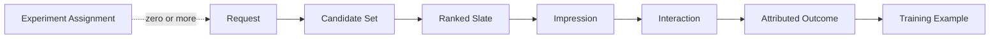

# 추천 시스템 피드백 데이터

추천 데이터는 사용자의 자유로운 선호 표본이 아니다. 이전 정책이 보여준 항목과 위치에 조건부로 행동이 관측된다. 따라서 `노출 → 행동 → label → 학습 → 새 노출`의 폐루프에서 **무엇을 보여줬는지**를 먼저 기록해야 한다.

## 관측 단위를 분리한다



| 단위 | 의미 | 없을 때 생기는 문제 |
|---|---|---|
| Assignment | 실험 대상 단위와 배정된 variant | ITT 모집단과 SRM 검증 불가 |
| Request | 추천을 요청한 사용자, session과 맥락 | 요청별 재현과 장애 분석 불가 |
| Candidate | 각 source가 랭커에 올린 후보 | 후보 Recall과 source 기여 분석 불가 |
| Slate | 최종 순서와 정책 적용 결과 | 재랭킹과 위치 효과 분리 불가 |
| Impression | 사용자가 실제 볼 수 있게 노출된 항목 | 미노출을 거절로 오해 |
| Interaction | 클릭, 재생, 저장, 숨김 같은 행동 | 학습 label 부재 |
| Outcome | 구매, 완주, 재방문 같은 지연 결과 | 단기 proxy만 최적화 |

API가 응답한 항목과 화면에 실제 노출된 항목이 같다고 가정하지 않는다. Client rendering, 스크롤, 네트워크 실패로 response와 impression 사이에 차이가 생길 수 있다.

## 실용적인 이벤트 계약

### 공통 envelope와 인과관계

- 모든 event에 `eventSource`, `eventId`, `eventType`, `schemaVersion`, `eventTime`, `ingestionTime`을 둔다.
- `{eventSource, eventId}`를 중복 키로 사용한다. 같은 논리 event의 재시도는 같은 ID를 재사용하고, 사용자의 별도 반복 행동은 새 ID를 만든다.
- 실험이 있으면 `assignmentId -> requestId -> candidateSetId -> slateId -> impressionId -> interactionId -> outcomeId`를 연결한다. Assignment 뒤 Request나 Impression이 없을 수 있으며, 해당 단계가 없으면 부모 ID를 억지로 만들지 않고 누락 사유를 기록한다.
- API response와 실제 impression을 분리하고, interaction은 발생한 impression 또는 명시적 비노출 진입 경로를 참조한다.

### Request, 실험과 후보

- Bucketing 시점에 Request와 독립된 Assignment event를 남긴다. 필드는 `assignmentId`, `experimentId`, `variantId`, 가명 randomization unit, `assignedAt`, allocation과 salt version, 대상 population version이다.
- Triggered 분석을 쓰면 treatment의 영향을 받지 않는 `counterfactualTrigger`, `triggeredAt`과 trigger policy version을 양 variant에 기록한다. Assignment, Request와 Exposure 모집단을 별도 분모로 보존한다.
- `requestId`, 가명 처리한 `userId` 또는 `sessionId`, 요청 시각, surface, 기기, market과 필요한 맥락
- 해당 실험의 `assignmentId`, `bundleId`, 추천 API와 orchestration 버전
- 불변 `featureSnapshotRef` 또는 필요한 feature 값과 hash, `onlineFeatureWatermark`, `replayableUntil`
- `candidateSetId`, 정본 `itemId`, 필요하면 `offerId`, `candidateSource`, source 내부 rank와 원점수, `AvailabilityEvaluation`
- 후보 생성기, embedding과 index 버전, 생성 기준 시각

### Ranking과 Slate

- 공통 rank score, ranker와 feature schema 버전
- `decisionSlateId`, 응답 전 최종 재검사 뒤의 `servedSlateId`, 재랭킹 전후 위치, 적용된 정책과 탈락 사유
- [[Recommendation-System-Eligibility-Availability#공유 AvailabilityEvaluation|AvailabilityEvaluation]], 불변 policy input 참조, tie-break와 난수 생성기 version, stochastic 정책의 `randomSeed`
- Stochastic 정책은 최종 hard eligibility를 적용하고 고정한 `actionSpaceRef`에서 실행한다. `loggingPolicyVersion`, sampled `decisionSlateId`, 정확한 `servedSlateId`의 전체 `slatePropensity` 또는 estimator가 요구하는 slot별 조건부 propensity와 factorization version을 기록하며, seed는 선택 확률을 대신하지 않는다.

### Impression과 행동

- `impressionId`, 실제 노출 시각, 위치, slate 크기와 viewport 정보, viewability와 최소 dwell 기준 version, 중복 판정 key
- `interactionId`, 클릭, 재생, 시청 시간, 완주, 저장, 숨김과 신고
- 노출 시점의 `itemId`, `offerId`, model, policy, bundle, client/app과 card 또는 creative version
- 후속 행동을 연결할 attribution 기준과 종료 시각

이 목록은 제품마다 줄이거나 확장하는 설계 템플릿이다. 원본 특징 전체를 무기한 복제하라는 뜻이 아니다. 수집 전에 동의와 목적, 보유 기간, 삭제 전파와 접근 권한을 정하고, 이를 충족하지 못한 event는 학습 입력으로 사용하지 않는다.

Attribution은 안정 ID 연결을 우선한다. 시간 창과 사용자 ID만으로 추론한 연결은 `inferredAttribution=true`와 방법 version을 남겨 직접 연결된 row와 품질을 구분한다.

### Audit reconstruction과 decision replay

Audit reconstruction은 저장된 candidate, score, slate와 decision으로 당시 무엇이 노출됐는지 설명한다. Decision replay는 저장된 candidate set을 당시의 불변 feature snapshot, bundle, policy input, watermark, tie-break와 난수 상태로 다시 평가한다. 두 수준을 같은 재현이라고 부르지 않는다.

Replay에 필요한 artifact와 snapshot은 `replayableUntil`까지 보존하고, 하드웨어와 수치 연산 차이가 있으면 bitwise 일치 대신 사전 정의한 score와 순서 허용 오차를 사용한다. 참조가 만료된 요청은 audit만 가능하다고 표시한다.

## Explicit와 implicit feedback

| 신호 | 예 | 장점 | 해석 위험 |
|---|---|---|---|
| Explicit | 별점, 좋아요, dislike, 직접 선택한 관심사 | 의도가 비교적 명확 | 희소성, 입력 마찰, 자기선택 편향 |
| Implicit | 노출, 클릭, 시청, 구매, 체류 | 풍부하고 자연스럽게 수집 | 위치, UI, 상황, 실수와 목적이 섞임 |

Implicit event 횟수나 시간이 곧 선호 강도는 아니다. Implicit matrix factorization에서는 행동량을 preference 자체보다 관측에 대한 confidence로 해석할 수 있다.

## 미관측과 부정 신호를 구분한다

```text
not exposed  != rejected
exposed and not clicked != disliked
clicked != satisfied
```

- 미노출 아이템은 사용자가 판단할 기회가 없었다.
- 미클릭은 위치가 낮거나 보지 못했을 수 있다.
- 클릭 후 즉시 이탈은 제목에는 반응했지만 만족하지 않았을 수 있다.
- 숨김과 dislike는 강한 신호지만 버튼 위치와 기능 인지의 영향을 받는다.

Negative sampling은 미관측 중 일부를 학습 비교 대상으로 사용하는 근사다. 그것을 사용자의 확정적 dislike로 저장하면 안 된다.

## Label 정의에는 시간 창이 필요하다

행동은 서로 다른 지연을 가진다.

| Label | 가능한 기준 예 | 주의점 |
|---|---|---|
| Click | 노출 후 짧은 시간 안의 클릭 | 위치와 UI 영향 |
| Play | 재생이 실제 시작됨 | 자동 재생 분리 |
| Watch time | 재생 구간의 누적 시간 | 콘텐츠 길이와 background 재생 |
| Completion | 길이 대비 소비 비율 | 짧은 콘텐츠 유리 가능성 |
| Purchase | 정한 attribution window 안의 구매 | 여러 추천과 채널의 기여 중복 |
| Return visit | 이후 session 재방문 | 외부 캠페인과 계절성 |

Window가 닫히기 전에 negative로 확정하면 delayed positive가 오염된다. Training example에 label version, observation window, `labelAvailableAt`, `windowClosedAt`과 finalized 여부를 남겨 재생성할 수 있게 한다.

## 세 가지 편향

### Exposure bias

이전 추천기가 노출한 항목에 대해서만 행동이 생긴다. 인기 아이템은 더 많이 노출되고 더 많은 positive를 얻어 다시 추천될 가능성이 커진다.

### Position bias

상단 항목은 relevance와 무관하게 더 쉽게 선택된다. 노출 위치를 기록하고 모델 또는 실험 설계에서 위치 효과를 다룬다.

### Selection bias

Explicit rating처럼 사용자가 자발적으로 남긴 신호는 전체 사용자와 아이템을 대표하지 않을 수 있다. 활동량이 높은 사용자와 강한 의견이 과대표집된다.

이 편향들은 완전히 같은 문제가 아니며 로그 가중치 하나로 모두 제거되지 않는다.

## 학습 데이터 생성

1. 원천 event의 schema와 허용 값을 검증한다.
2. `{eventSource, eventId}` 중복, Bot, 테스트 계정과 비정상 session을 식별한다.
3. Request, slate, impression과 outcome을 정한 key와 window로 연결한다.
4. 추천 시점에 알 수 있었던 특징만 point-in-time join한다.
5. Label 정의와 sampling 정책에 버전을 붙인다.
6. 시간 순서로 train, validation과 test를 나누되 `labelAvailableAt <= trainingCutoff`인 label만 train에 넣는다.
7. 사용자, 아이템과 source별 분포를 기록해 재학습 간 변화를 비교한다.

Random split은 미래 행동과 아이템 상태가 과거 학습 예제에 섞일 수 있다. Temporal split만으로도 충분하지 않으며 각 row의 추천 시각을 기준으로 feature snapshot을 결합해야 한다. 지연 label은 최대 attribution window만큼 purge gap을 두거나 censoring과 delayed-feedback estimator를 명시한다.

## Propensity와 Off-policy 데이터

Propensity는 logging policy가 해당 action 또는 slate를 선택할 확률이다. 통제된 stochastic exploration을 수행하고 off-policy 평가나 보정을 계획한다면 정책이 slate를 선택한 시점에 기록하고 실제 Impression과 별도로 연결한다.

- 확률이 매우 작은 action은 inverse propensity weight가 커져 분산을 높인다.
- 새 정책이 고를 action을 과거 정책이 거의 노출하지 않았다면 support가 부족하다.
- Propensity가 없거나 잘못 기록되면 사후에 정확히 복원하기 어렵다.
- Slate는 전체 결합확률이나 `P(a_k | context, a_1...a_{k-1})` 형태의 slot별 조건부 확률과 계산 순서를 기록한다.
- Action space는 candidate set과 최종 eligibility 결과를 포함해 sample 전에 고정한다. 늦은 재검사나 fallback이 slate를 바꾸면 기존 결정을 폐기하고 새 action space에서 새 `decisionSlateId`로 정책 전체를 다시 sample해 그 확률을 기록하거나 `propensityStatus=INVALIDATED`로 OPE에서 제외한다. 단순 삭제, 압축이나 보충 뒤의 확률 재계산은 충분하지 않으며, 여러 proposed slate가 같은 served slate로 합쳐지는 명시적 composite mapping 확률을 구현하고 검증한 경우만 예외다. `VALID` 확률이 실제 `servedSlateId`와 일치할 때만 OPE에 사용하고 client의 부분 rendering은 별도 Impression으로 다룬다.
- Deterministic 정책 로그만으로 관측하지 않은 영역의 인과 효과를 식별할 수 없다.

Off-policy estimator는 실험을 완전히 대체하지 않는다. 편향을 줄이는 도구이며 overlap, 분산과 모델 가정을 함께 진단한다.

## 데이터 품질과 개인정보 운영

- Event volume, 누락률, 중복률과 schema violation을 source별로 감시한다.
- Request부터 outcome까지 orphan ID 비율과 인과관계 단절을 감시한다.
- Impression 대비 interaction 비율이 급변하면 UI 변경과 logging 장애를 먼저 확인한다.
- Event time과 processing time 지연을 분리해 freshness를 측정한다.
- 가명 ID의 연결 권한을 제한하고 원시 PII를 feature에 직접 복제하지 않는다.
- 보유 기간 만료와 사용자 삭제가 원천 로그, offline feature와 training dataset에 어떻게 전파되는지 정의한다.
- 민감 속성은 편의를 위해 수집하지 않고 정당한 목적, 접근 통제와 평가 계획이 있을 때만 다룬다.

구체적인 마스킹과 토큰화 방식은 [[PII-Masking|PII 마스킹과 최소 수집]]에 맡긴다. 이 문서는 원시 event, attribution, offline feature와 training dataset의 lineage 및 직접 삭제를 소유한다. Online user state, embedding/index, precomputed list/cache와 모델 영향 제거는 [[Recommendation-System-Serving-Operations|서빙과 운영]]이 소유한다.

## 관련 문서

- 파이프라인: [[Recommendation-System-Architecture|지식 지도]], [[Recommendation-System-Candidate-Generation|후보 생성]], [[Recommendation-System-Ranking-Reranking|랭킹]], [[Recommendation-System-Eligibility-Availability|가용성]]
- 평가: [[Recommendation-System-Evaluation-Experimentation|평가와 실험]], [[Recommendation-System-Off-Policy-Evaluation|OPE]], [[Recommendation-System-Online-Experimentation-Statistics|온라인 실험 통계]]
- 데이터: [[SCD-Type2|시점 기준 속성 조회와 SCD Type 2]], [[PII-Masking|PII 마스킹과 최소 수집]]

## 출처

- [Collaborative Filtering for Implicit Feedback Datasets - Hu, Koren, Volinsky](https://yifanhu.net/PUB/cf.pdf)
- [Recommendations as Treatments - Schnabel et al.](https://proceedings.mlr.press/v48/schnabel16.html)
- [Top-K Off-Policy Correction for a REINFORCE Recommender System - Google Research](https://research.google/pubs/top-k-off-policy-correction-for-a-reinforce-recommender-system/)
- [Batch Learning from Logged Bandit Feedback through Counterfactual Risk Minimization - JMLR](https://www.jmlr.org/papers/v16/swaminathan15a.html)
- [Off-policy Evaluation for Slate Recommendation - NeurIPS](https://proceedings.neurips.cc/paper/2017/hash/5352696a9ca3397beb79f116f3a33991-Abstract.html)
- [Point-in-time joins - Feast Documentation](https://docs.feast.dev/getting-started/concepts/point-in-time-joins)
- [Scoring and positional bias - Google for Developers](https://developers.google.com/machine-learning/recommendation/dnn/scoring)
- [Rules of Machine Learning - Google for Developers](https://developers.google.com/machine-learning/guides/rules-of-ml)
- [Data Quality for Trustworthy A/B Testing - Microsoft Research](https://www.microsoft.com/en-us/research/articles/data-quality-fundamental-building-blocks-for-trustworthy-a-b-testing-analysis/)
- [Capturing Delayed Feedback in Conversion Rate Prediction - AAAI](https://ojs.aaai.org/index.php/AAAI/article/view/16587)
- [CloudEvents specification v1.0.2 - CNCF](https://github.com/cloudevents/spec/blob/v1.0.2/cloudevents/spec.md)
