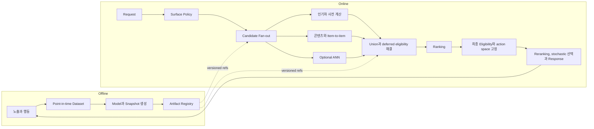

# 추천 시스템 서빙과 운영

추천 서빙의 정합성 단위는 모델 파일 하나가 아니라 요청에 실제 사용되는 component의 **versioned serving bundle**이다. 규칙과 사전 계산 목록만 쓰는 bundle도 유효하며, encoder와 ANN index는 해당 source를 도입했을 때만 포함한다.

## 온라인과 오프라인 경로



Artifact를 독립적으로 배포하면 형식 오류 없이 품질만 무너지는 조합이 생길 수 있다. 배포와 rollback은 호환 집합을 가리키는 bundle 단위로 수행한다.

## Serving Bundle 계약

공통 manifest는 `bundleId`, candidate source 목록과 버전, 사용한다면 taxonomy와 assignment snapshot version, ranker와 reranker policy, immutable feature service 또는 definition ID, feature schema와 offline/online transform hash, 집계 window와 default policy, eligibility와 fallback policy, source별 deadline과 base order를 가진다. 사용하지 않는 component는 암묵적 최신값을 가리키지 않고 manifest에서 제외 상태를 명시한다.

각 source는 필요한 artifact만 참조한다. 사전 계산 목록은 snapshot과 watermark, item-to-item은 graph 또는 table snapshot, 모델 source는 model과 feature schema를 가진다. ANN source일 때만 query/candidate encoder, embedding 차원과 정규화, 거리 함수, index snapshot과 update epoch가 필수다.

같은 차원의 embedding이라고 같은 의미 공간은 아니다. Candidate encoder를 다시 학습했다면 item을 새로 embedding하고 대응하는 index와 query encoder를 함께 검증한다. Ranker가 읽는 feature 정의와 모든 policy version도 bundle에 고정한다. 요청 시작 시 하나의 immutable manifest를 pin하고 `bundleId`를 모든 하위 호출에 전달하며, 처리 중 active alias나 최신 feature 정의를 다시 조회하지 않는다.

### 호환성 실패 예

- Query encoder v2가 v1 item index를 조회해 결과 품질만 급락
- Ranker v2가 v1 feature의 missing을 0으로 조용히 대체
- 한 index에 서로 다른 candidate encoder의 vector가 혼합
- 사전 계산 목록 v2를 v1 정본 ID나 eligibility policy로 해석
- Model alias와 index alias의 전환 순서가 엇갈려 부분 rollout 노출

모든 응답과 impression에 `bundleId`, feature definition과 transform hash, degradation mode와 주요 artifact version을 기록한다.

## Freshness와 Point-in-time correctness

두 계약을 구분한다.

- Point-in-time correctness: 학습 row가 추천 당시 알 수 있었던 feature만 사용하는가
- Online freshness: 지금 읽은 최신 값이 surface가 허용한 나이 안에 있는가

Online store가 entity별 최신 값 하나를 보관해도 그 값이 오래됐을 수 있다. Feature group마다 entity key, event/created timestamp, surface별 max age, missing policy와 offline/online transform hash를 정의한다. 이 정의의 immutable version이 serving bundle의 feature reference와 일치해야 한다.

최근 session 행동, 장기 사용자 profile과 catalog metadata는 변화율이 다르므로 같은 TTL과 fallback을 쓰지 않는다. Missing과 실제 값 0도 구분한다.

## Batch Baseline과 Stream Delta

많은 추천은 대량 계산한 baseline에 실시간 신호를 덧붙이는 hybrid가 현실적이다.

- Batch: 전체 item embedding, 장기 profile, 인기 집계, precomputed list
- Stream: 최근 클릭과 시청, 재고와 제공 상태, session intent
- Online: 두 상태를 결합하되 기준 snapshot과 watermark를 기록

권장 파생 상태는 `baseSnapshotId`, `streamWatermark`, `lastEventTime`, `lateEventWindow`, `servingParameterEpoch`다.

늦게 도착한 구매와 완주를 버리면 장기 가치 item이 과소평가될 수 있다. 반대로 오래된 batch snapshot이 최신 delta를 덮어쓰지 않도록 snapshot과 tombstone 순서를 관리한다. Kafka와 window 구현은 [[MQ-Kafka-Streams|Kafka Streams]]에 맡긴다.

## 선택적 ANN source lifecycle

이 절은 bundle에 ANN source가 있을 때만 적용한다. ANN이 없는 baseline과 full-catalog scoring은 index lifecycle 없이 같은 manifest, rollout과 fallback 계약을 사용한다.

### 같은 embedding 공간의 증분 변경

- 신규 item upsert
- 비활성 또는 삭제 item remove
- 지원되는 범위의 metadata 갱신
- Update lag와 indexed catalog cardinality 감시

### Embedding 공간 자체 변경

- Candidate encoder 재학습
- 차원, normalization 또는 distance metric 변경
- Feature 의미와 tokenization 변경

공간이 바뀌면 기존 index에 vector를 섞지 않는다. 전체 item을 새로 embedding해 index B를 만들고, active A와 병행해서 exact 대비 Recall, coverage, p99와 eligibility를 검증한 뒤 bundle을 전환한다.

Index 구조와 HNSW, IVF 튜닝은 [[Vector-Similarity-Search|벡터 유사도 검색]]과 [[OpenSearch-Vector-Search|OpenSearch 벡터 검색]]에서 다룬다.

## End-to-end Deadline

`request deadline = feature assembly + candidate fan-out + merge/filter + ranking/reranking/hard rules + serialization reserve`로 분해해 각 단계의 예산과 남은 시간을 전달한다.

Stage를 늘린다고 자동으로 빨라지지 않는다. Queueing과 fan-out tail latency가 절약한 compute보다 커질 수 있으므로 후보 수, 모델 크기와 단계별 budget을 함께 튜닝한다.

각 candidate source는 독립 deadline을 가진다. 선택적 source가 timeout이면 남은 후보로 진행하되 `missingSource`, underfill과 품질 저하를 기록한다. 보편적인 법적, 안전 제약과 surface policy가 hard로 선언한 eligibility는 어떤 degradation에서도 우회하지 않는다.

## Cache와 Fallback

Personalized cache는 최종 truth가 아니라 다시 검사할 추천 artifact다.

```text
CachedRecommendation
- itemIds, bundleId, eligibilityPolicyVersion
- createdAt, eventWatermark, maxAge
- sourceContributions
```

Cache key에는 사용자 또는 session, surface, market, entitlement class, experiment variant와 bundle을 고려한다. 반환 직전에 versioned eligibility policy를 실행하고 [[Recommendation-System-Eligibility-Availability#공유 AvailabilityEvaluation|AvailabilityEvaluation]]을 기록한다.

### Fallback ladder

1. 같은 policy로 검증된 precomputed personalized list
2. Segment popularity와 trending
3. Global popularity 또는 editorial safe list

Ranker timeout에서는 source별 검증된 base order를 사전 정의한 blend policy로 합치되 canonical dedup과 활성 surface의 hard filter는 유지한다. Reranker timeout에서도 eligibility evaluator는 별도로 실행한다. 모든 fallback은 `degradationMode`와 reason으로 정상 개인화와 구분한다. Stochastic 선택 뒤 늦은 재검사나 fallback이 slate를 바꾸면 기존 결정을 폐기하고 새 action space에서 정책 전체를 새 ID로 다시 sample하거나 OPE 무효 상태로 기록한다. 단순 삭제, 압축과 보충 뒤 기존 propensity를 재사용하지 않는다.

## 관측 항목

| 축 | 추천 고유 지표 |
|---|---|
| Feature | group별 age, missing/default 비율, materialization lag |
| Candidate | source별 yield, timeout, duplicate, filter rejection, underfill |
| Index, 사용 시 | snapshot과 epoch, upsert/delete lag, cardinality, bundle mismatch |
| Serving | stage별 p50/p95/p99, deadline exceeded, degradation mode |
| Quality | rank score 분포, source contribution, cached/fallback 비율 |
| Feedback | impression에서 feature, training과 serving 반영까지의 age |

Schema anomaly, training-serving skew, distribution drift와 단순 stale/missing은 원인과 대응이 다르므로 같은 경보 하나로 합치지 않는다. Artifact lineage로 dataset, pipeline run, model과 index의 영향 범위를 역추적한다.

## Rollout, Replay와 Rollback

1. Offline 평가와 보존 기간 안의 저장 요청 decision replay를 통과한 bundle만 shadow에 올린다.
2. Shadow에서 invariant, source 차이, constraint와 SLO를 확인한다.
3. 사전 정의한 canary 크기와 hold window로 시작한다.
4. [[Recommendation-System-Evaluation-Experimentation#출시와 단계 승급 게이트|실험 승급 게이트]]를 통과한 경우에만 ramp한다.
5. Rollback trigger가 발생하면 검증된 이전 호환 bundle로 원자적으로 전환한다.
6. Rollback target의 artifact 보존 기간, 호환성 검사와 drill 결과를 기록한다.

원자적 전환은 active alias가 하나의 immutable manifest를 가리키도록 바꾸는 것을 뜻한다. 새 요청만 새 bundle을 pin하고 이미 시작한 요청은 기존 bundle을 끝까지 사용한다.

`requestId`만으로 decision replay가 되지는 않는다. [[Recommendation-System-Feedback-Data#Audit reconstruction과 decision replay|피드백 계약]]의 candidate set, 불변 feature snapshot, watermark, bundle, policy input, tie-break, 난수 생성기 version과 seed를 `replayableUntil`까지 보존한다. 범위는 개인정보와 저장 비용 계약을 따른다.

## 삭제 전파

직접 주소 가능한 원시 로그 삭제와 학습된 모델의 영향 제거는 같은 작업이 아니다.

```text
원시 이벤트 -> 시점 정합 feature와 training dataset
-> trained model과 선택적 embedding/index -> precomputed list와 cache
```

Lineage는 이 순서의 산출물이 아니라 dataset, training run, model과 serving artifact 사이의 의존 간선을 추적하는 별도 metadata 계층이다. 적용되는 법과 정책에 맞춰 보유 기간과 삭제 범위를 정하고, 오래된 snapshot이나 replay가 삭제 데이터를 되살리지 않도록 tombstone과 cutoff를 둔다. 협업 필터링이나 여러 사용자 로그로 학습한 모델의 영향 제거는 retrain 또는 검증된 unlearning 절차와 별도 SLA가 필요하다. 일반 PII 처리는 [[PII-Masking|PII 마스킹과 최소 수집]]에 맡긴다.

## 관련 문서

- 시스템: [[Recommendation-System-Architecture|지식 지도]], [[Recommendation-System-OTT-Discovery-Architecture|통합 디스커버리]], [[Recommendation-System-Page-Level-Optimization|페이지 단위 최적화]]
- 데이터와 검증: [[Recommendation-System-Feedback-Data|피드백]], [[Recommendation-System-Evaluation-Experimentation|평가와 실험]], [[Recommendation-System-Online-Experimentation-Statistics|온라인 실험 통계]], [[Recommendation-System-Eligibility-Availability|가용성]]
- 운영: [[Content-Availability-System-Design|콘텐츠 가용성]], [[Cache-Strategies|캐시]], [[Failure-Evolution-Under-Load|부하에서의 실패 진화]]

## 출처

- [Implement two-tower retrieval for large-scale candidate generation - Google Cloud](https://docs.cloud.google.com/architecture/implement-two-tower-retrieval-large-scale-candidate-generation)
- Feast: [Feature service and versioning FAQ](https://docs.feast.dev/getting-started/faq), [Online store](https://docs.feast.dev/getting-started/components/online-store)
- [Rules of Machine Learning - Google for Developers](https://developers.google.com/machine-learning/guides/rules-of-ml)
- [System Architectures for Personalization and Recommendation - Netflix](https://netflixtechblog.com/system-architectures-for-personalization-and-recommendation-e081aa94b5d8)
- [Monolith: Real Time Recommendation System - ByteDance](https://ceur-ws.org/Vol-3303/paper8.pdf)
- [RecPipe: Co-designing Models and Hardware for Recommendation - Gupta et al.](https://arxiv.org/abs/2105.08820)
- [Create and manage Vector Search indexes - Google Cloud](https://docs.cloud.google.com/vertex-ai/docs/vector-search/create-manage-index)
- [TensorFlow Data Validation](https://www.tensorflow.org/tfx/guide/tfdv)
- [ML Metadata](https://www.tensorflow.org/tfx/guide/mlmd)
- [Real-time recommendations and filters - Amazon Personalize](https://docs.aws.amazon.com/personalize/latest/dg/recommendations.html)
- [Recommendation Unlearning - Chen et al.](https://arxiv.org/abs/2201.06820)
- [개인화 추천 시스템 3, 모델 서빙 - 오늘의집](https://www.bucketplace.com/post/2025-03-14-%EA%B0%9C%EC%9D%B8%ED%99%94-%EC%B6%94%EC%B2%9C-%EC%8B%9C%EC%8A%A4%ED%85%9C-3-%EB%AA%A8%EB%8D%B8-%EC%84%9C%EB%B9%99/)
- [개인화 추천 시스템 4, Feature Store - 오늘의집](https://www.bucketplace.com/post/2025-12-17-%EA%B0%9C%EC%9D%B8%ED%99%94-%EC%B6%94%EC%B2%9C-%EC%8B%9C%EC%8A%A4%ED%85%9C-4-feature-store/)
