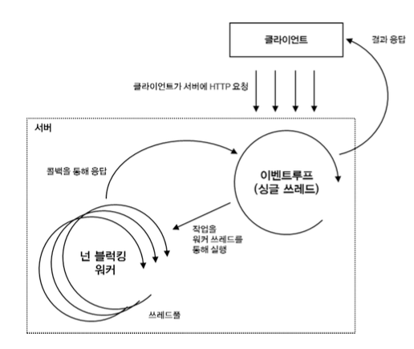

# node.js
웹 브라우저밖에서 돌아가는 JS 런타임



### 특징
1. 단일 쓰레드와 이벤트 기반
   ```
   1. 많은 요청을 받아서 처리할 수 있는 구조이다. 따라서 대규모 네트워크 프로그램을 개발하기에 적합한 형태이다.
   2. 메모리나 CPU를 많이 사용하는 작업에는 적합하지 않다.
   ```
2. 비동기 I/O
   ```
   1. 작업을 다른 쓰레드에서 처리하고 작업이 완료되면 콜백을 통해 알림
   2. 실행순서를 보장하지 않는 대신 성능이 좋음
   ```

### 실행 컨텍스트
1. 구성 요소
    ```
    1. Variable Environment 
    2. Lexical Environment
    3. This Binding
    ```
2. 컨텍스트 유형
    ```
    1. Global Context
    2. Function Context
    3. Module Context
    ```
