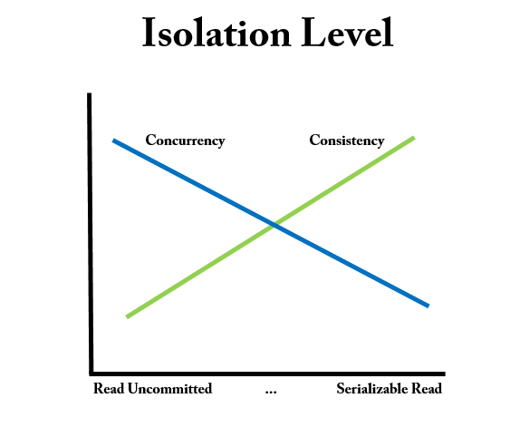

# DATABASE
Database란 사용자가 필요한 정보를 얻기 위해 논리적으로 연관된 데이터를 모아 구조적으로 통합해 놓은 것입니다.

DBMS는 Database Management System의 약자로 사용자와 데이터베이스를 연결해주는 소프트웨어입니다. 즉, DB를 관리하기 위한 시스템입니다.

### SQL

구조적 질의 언어로 SQL로 데이터베이스를 제어하고 관리할 수 있다.

1. 종류
	```
	1. DDL: 데이터베이스 구조를 정의, 수정, 삭제하는 언어이며 create, alter, drop이 있다.
    2. DML: 데이터베이스 내의 자료 검색, 삽입, 갱신, 삭제를 위한 언어로 select, insert, update, delete가 있다.
    3. DCL: 데이터의 무결성을 유지, 병행 수행 제어, 보호와 관리를 위한 언어로 commit, rollback, grant, revoke가 있다.
	```
2. Join
	```
    1. 두개 이상의 테이블들을 연결 또는 결합하여 데이터를 출력하는 것
    2. JOIN은 관계형 데이터베이스의 가장 큰 장점이면서 대표적인 핵심 기능이라고 할 수 있다.
    3. 일반적인 경우 행들은 PK나 FK값의 연관에 의해 JOIN이 성립된다.
    4. 하지만 어떤 경우에는 이러한 PK, FK가 없어도 논리적인 값들의 연관만으로 JOIN이 성립 가능하다.
	```
3. Inner Join
	```
    1. Equi Join(동등 조인)
    두개의 테이블간의 컬럼 값들이 서로 정확하게 일치하는 경우에 사용된다.
    비교연산자 =를 사용한 조인이다.
    동등 조건에 해당하는 튜플을 반환한다.
    2. Non-Equi Join
    두개의 테이블 간에 컬럼 값들이 서로 정확하게 일치하지 않는 경우에 사용된다.
    = 연산자가 아닌 Between, >, ≥. <, ≤ 등의 연산자들을 사용하여 JOIN을 수행한다.
	```
4. Left Join
	```
    1. 여러 테이블에서 한쪽에는 데이터가 존재하고 한쪽에는 데이터가 없는 경우 외부 조인을 사용한다. mysql의 경우 Left, Right로 외부 조인을 한다.
    2. Left Join의 경우 왼쪽에 해당하는 테이블의 결과를 전부 가져온 후, 오른쪽 테이블을 매칭한다.
    3. 매칭 되는 결과가 없을 경우 NULL로 표시된다.
    4. 조건에 맞지 않아도 외부 조인에 맞게 결과에 포함한다.
    5. 조인 조건은 WHERE절이 아닌 ON 절에 작성한다.
	```

### 정규화
이상 문제를 해결하기 위해 속성들끼리의 종속 관계를 분석하여 여러개의 릴레이션으로 분해하는 과정이다.

일반적으로 테이블을 여러개로 분해하면 속도는 상대적으로 느려질 수 있지만, 분해하지 않으면 이상 문제들이 발생한다.

1. 이상(Anomaly)의 종류
	```
    1. 삽입 이상: 릴레이션에 데이터를 삽입할 때 의도와 상관없이 원하지 않는 값들도 함께 삽입되는 현상이다 예들들어 홍길동 학생의 연락처만 추가하고 싶을 때, 과목코드가 비어 NULL 값을 가지게 되어 문제가 발생한다.
    2. 삭제 이상: 릴레이션에서 한 튜플을 삭제할 때 의도와 상관없는 값들도 함께 삭제되는 현상이다.예를들어 홍길동 학생이 과목을 수강 취소할 경우, 취소 사유를 물을 수 있는 유일한 정보인 연락처를 잃게된다.
    3. 갱신 이상: 릴레이션에서 튜플에 있는 속성 값을 갱신할 때 일부 튜플의 정보만 갱신되어 정보에 모순이 생기는 현상이다. 예를 들어 홍길동 학생이 연락처를 바꿨을 경우에 모든 과목에서 홍길동 학생의 연락처가 전부 갱신되어야 하는데 한 과목만 바뀌는 경우 발생한다.
	```
2. 1정규화
    ```
	1. 테이블(릴레이션)이 제 1정규형을 만족한다는 것은 다음과 같다.
    2. 어떤 릴레이션에 속한 모든 도메인이 원자값만으로 되어있다.
    3. 모든 속성에 반복되는 그룹이 나타나지 않는다.
    4. 기본키를 사용하여 관련 데이터의 각 집합을 고유하게 식별할 수 있어야 한다.
	```
3. 2정규화
	```
	1. 기본키가 아닌 모든 속성이 기본키에 대해 완전 함수적 종속을 만족하는 제 2정규형
    2. 부분적 함수 종속을 제거하는 과정이다.
    3. 함수적 종속? X의 값에 따라 Y의 값이 결정될 때 X → Y로 표현하는데, 이를 Y는 X에 대해 함수적 종속을 가진다고 한다. 예를들어 학번을 알면 이름을 알 수 있다. 학번(X)가 결정자, 이름(Y)이 종속자라고 한다.
    4. 부분적 함수 종속: 기본키가 복합키일 경우 기본키중 하나만으로 Y의 값을 결정할 수 있을 때
	```
4. 3정규화
    ```
	1. 기본키가 아닌 모든 속성이 기본키에 대해 이행적 함수 종속 관계를 만족하는 제 3정규형
    2. 이행적 함수 종속: 기본키에 함수적 종속이 된 것이 아닌 후보키에 함수적 종속이 되어 있는 경우를 말한다.
	```
5. 보이스-코드 정규화
	```
	1. BCNF의 모든 결정자는 후보키여야 한다. 즉, 후보키가 일반속성에 종속되지 않아야 한다.
	```

### 트랜잭션
데이터베이스의 상태를 변화시키는 하나의 논리적인 작업 단위이며, 여러개의 연산이 수행될 수 있다. 하나의 트랜잭션은 commit되거나 rollback된다.

여러개의 작업을 하나의 논리적인 단위로 묶어서 반영과 복구를 조정할 수 있기 위해 사용한다.

따라서 데이터의 부정합이 일어났을 경우 롤백을 하여 데이터의 부정합을 방지할 수 있다.

예를 들어서 결제를 진행하는 경우 계좌에서 출금 ⇒ 주문 및 결제 완료하는 것을 하나의 논리적인 작업의 단위로 묶어서 반영과 복구를 조정할 수 있다.

ACID
1. Atomicity(원자성)
	```
	1. 트랜잭션의 연산은 데이터베이스에 모두 반영되든지 아니면 전혀 반영되지 않아야 한다.
	2. 트랜잭션내의 모든 명령은 반드시 완벽히 수행되어야 하며, 모두가 수행되지 않고 어느 하나라도 오류가 발생하면 트랜잭션 작업 이전으로 되돌려서 원자성을 보장
	```
2. Consistency(일관성)
	```
	1. 트랜잭션 수행 전과, 수행 완료 후의 상태가 같아야 한다.
	2. 명시적인 일관성: 기본키, 외래키 등과 같은 무결성 제약조건, 무결성 제약조건을 해치지 않는 데이터들에 대해서만 트랜잭션이 성공적으로 수행되어야 한다.
	3. 비명시적인 일관성: 계좌 이체에서 A계좌에서 출금이 일어나고 그 돈이 B계좌로 입금된다 했을 때, 트랜잭션의 전과 후 두 계좌 잔고의 합이 같아야 한다.
	```
3. Isolation(독립성, 격리성)
	```
	1. 둘 이상의 트랜잭션이 동시에 병행 실행되는 경우 어느 하나의 트랜잭션 실행중에 다른 트랜잭션의 연산이 끼어들 수 없다.
	2. 수행중인 트랜잭션은 완전히 완료될 때까지 다른 트랜잭션에서 수행결과를 참조할 수 없다.
	3. 읽기 일관성과 동시성에 영향을 미치는 성질
	```
4. Durability(영속성, 지속성)
	```
	1. 성공적으로 완료된 트랜잭션의 결과는 시스템이 고장나더라도 영구적으로 반영되어야 한다.
	```

### 트랜잭션 격리 수준
트랜잭션 격리 수준이 중요한 이유는, 격리 레벨을 어떻게 설정하느냐에 따라 읽기 일관성이 달라지기 때문이다.

즉, 트랜잭션 격리 수준에 따라 데이터 조회 결과가 달라질 수 있다는 말이다.

이처럼 트랜잭션 격리 수준에 따라 데이터 조회가 달라지게 하는 기술을 MVCC(Multi Version Concurrency Consistency)라고 한다.

1. 레벨0: Read Uncommited
	```
	1. 트랜잭션에서 아직 처리중인 데이터를 다른 트랜잭션에서 읽는 것을 허용
    2. Dirty Read, Non-Repeatable Read, Phantom Read 현상 발생
    3. Mysql에서는 설정 가능하지만 권장하지 않음
	```
2. 레벨1: Read Commited
	```
	1. Dirty Read 방지: 트랜잭션이 커밋되어 확정된 데이터를 읽는 것을 허용
    2. Non-Repeatable Read, Phantom Read 현상 발생
    3. 대부분의 RDBMS가 기본 모드로 채택하고 있는 격리 수준
	```
3. 레벨2: Repeatable Read
	```
	1. Mysql InnoDB에서 기본으로 채택하고 있는 격리 수준
    2. 선행 트랜잭션이 읽은 데이터는 트랜잭션이 종료될 때까지 후행 트랜잭션이 갱신하거나 삭제하는 것은 불허함으로써 같은 데이터를 두 번 쿼리했을 때 일관성 있는 결과를 리턴
    3. Phantom Read 현상 발생
	```
4. 레벨3: Serializable Read
	```
	1. 선행 트랜잭션이 읽은 데이터를 후행 트랜잭션이 갱신하거나 삭제하지 못할 뿐만 아니라 중간에 새로운 레코드를 삽입하는 것도 막아줌. 완벽하게 읽기 일관성 모드를 제공
    2. INSERT, UPDATE, DELETE 전부 불가능하고 READ시 DML 작업이 동시에 진행될 수 없다.
	```

### 트랜잭션 격리 수준을 설정시 발생하는 문제점들
트랜잭션 격리 수준을 너무 낮게 하면 읽기 일관성을 재대로 보장할 수 없고, 너무 높게 하면 읽기 일관성은 완벽하게 보장하지만 데이터를 처리하는 속도(동시성)가 느려지게 된다.


    
따라서 트랜잭션 격리 수준은 일관성 및 동시성과도 연관이 있다는 것을 알 수 있다.

### Index
데이터베이스의 테이블의 동작 속도를 높여주는 자료구조이다.

책의 찾아보기와 같으며 Key-Value 형식으로 이루어져 있다. SortedList로 구현되어있기 떄문에 인덱스를 생성할 때마다 내부적으로 정렬되어 저장된다.

결론적으로 인덱스란 CUD 성능을 희생하고 Read에 대한 성능을 높이는 기능이다.

1. 순차 I/O VS 랜덤 I/O
    ```
	1. 순차IO: 물리적으로 인접한 페이를 차례대로 읽는 순차 접근 방식, 원하는 데이터를 찾기 위해서 풀 스캔 방식을 사용해야 하며 풀 테이블 스캔에 사용
    2. 랜덤IO: 물리적으로 떨어진 페이지들에 임의로 접근하는 임의 접근 방식이며 인덱스 레인지 스캔에 사용됨
	```
2. Primary Key VS Secondary Key
    - PK는 우리가 흔히 알고 있는 식별자를 의미한다. 테이블에서 PK를 생성하면 Index에 PK에 관한 인덱스가 생긴 것을 볼 수 있다. 즉 PK는 레코드를 대표하는 컬럼의 값으로 만들어진 인덱스를 의미한다. PK를 제외한 나머지 인덱스들을 SK라고 한다.
3. Unique VS Non-Unique
    - 데이터의 중복 허용 여부로 구분하면 유니크 인덱스와 유니크 하지 않은 인덱스로 나눌 수 있다. 인덱스가 유니크한지 아닌지는 DBMS의 쿼리를 실행해야 하는 옵티마이저한테 중요하다 값이 유니크하면 유니크 인덱스에 대해 동등 조건으로 검색한다는 것을 옵티마이저에게 알려줄 수 있다.
4. B-Tree
	```
	1. 데이터 접근 퍼포먼스가 데이터 증가량에 따라서 결코 선형적으로 증가하지 않는다.
    2. 컬럼의 값을 변경하지 않고, 원래의 값을 이용해 인덱싱하는 알고리즘
    3. Root, Branch, Leaf Node로 구성
    4. 각 노드는 페이지를 의미하고 InnoDB에서 페이지란 디스크에 데이터를 저장하는 기본단위다.
    5. 블록이라고 불리기도 하고 디스크의 모든 읽기 및 쓰기 작업의 최소 단위가 된다.
    6. 인덱스도 페이지 단위로 관리되며 모든 페이지의 크기는 16KB로 고정되어 있다.
    7. 루트와 브런치 노드는 인덱스 레코드와 자식 노드 주소를 가지고 있으며 리프 노드는 인덱스 레코드와 레코드 주소를 가지고 있다. 인덱스 레코드는 해당 인덱스에 대한 레코드 값을 의미한다.
    8. 리프 노드의 레코드 주소는 실제 테이블에 저장되어 있는 레코드를 가리키게 된다.
	```
5. Mysql에서 레드 블랙 트리말고 B-Tree를 사용하는 이유
    - 레드 블랙 트리 자체는 효율적이지만 대용량 데이터의 경우 트리의 높이를 제어할 수 없다.
	- 트리의 높이가 높다면 그만큼 데이터를 조회하는데 시간이 많이 소모된다는 것이다.
	- B-Tree는 루트 ⇒ 브런치 ⇒ 리프 ⇒ 데이터 조회 방식으로 조회되기 떄문에 IO를 효과적으로 하기 위해 B-Tree를 선택하였다.
6. 인덱스 레인지 스캔
	```
	1. 인덱스 풀 스캔보다 빠르며, 검색해야할 인덱스의 범위가 결정됐을 때 사용하는 방식이다.
    2. 리프 노드에서 시작할 지점을 찾으면 그 다음부터는 리프 노드의 레코드만 순서대로 읽으면 된다. 리프 노드의 끝까지 읽으면 리프 노드간의 링크를 통해 다음 리프 노드를 찾아서 스캔한다.
    3. 최종적으로 스캔 종료 지점을 찾으면 지금까지 읽은 레코드를 사용자에게 반환하고 쿼리를 종료한다.
    4. 인덱스를 통해 읽어야 할 데이터가 전체의 20 ~ 25%를 넘으면 인덱스를 사용하지 않고 테이블 스캔 방식이 더 효율적인 처리 방식이 된다.
    5. 인덱스를 읽을 때 랜덤 IO를 통해 가져오게 되는데 이는 하나의 행에 대해 일일히 시스템 콜을 하게되어 효율이 떨어진다고 함.
    6. 인덱스 레인지 스캔은 Mysql에서 실행 계획을 볼 때 range로 나온다.
	보통 const, ref, range 접근 방법을 구분해서 얘기하는 경우는 거의 없고 이 세가지를 통틀어서 인덱스 레인지 스캔 또는 레인지 스캔이라고 말하는 경우가 많다.
    7. 주로 <, >, IS NULL, BETWEEN, IN, LIKE 등의 연산을 이용해 인덱스를 검색할 때 사용됨
	```
7. 인덱스 풀 스캔
	```
	1. 인덱스의 처음부터 끝까지 스캔하는 방식을 말한다.
    2. 리프 노드의 시작 혹은 끝으로 이동하여 리프 노드를 연결하는 LinkedList를 따라서 처음부터 끝까지 탐색하는 방식이다.
    3. 인덱스의 크기는 테이블의 크기보다 훨씬 작기 때문에 테이블 풀 스캔보다 빠른 방식이다.
	```
8. 클러스터링 인덱스
	```
	1. PK 값이 비슷한 레코드까리 묶어서 저장하는 것
    2. PK에 대해서만 적용되는 내용이며 Mysql에서 PK를 생성하는 경우 자동으로 인덱스가 생성되는데 해당 인덱스를 클러스터링 인덱스라고 한다.
    3. 테이블당 하나만 생성이 가능하다. 따라서 PK에 의해 레코드의 저장 윛치가 결정되며 PK가 변경되면 저장 위치도 변경된다.
    4. InnoDB는 항상 클러스터링 인덱스로 저장된다. 즉 테이블의 레코드가 PK값으로 정렬되어 저장된다는 의미이다.
    5. 공간 지역성이 좋아서 PK 기반으로 범위 검색이 빠르다.
    6. PK의 변경이 느리다. PK가 자주 변경되는 값으로 설정된 경우 DB 성능 이슈가 발생할 수 있다.
	매번 변경될 때마다 저장 위치가 조정되면서 성능 이슈가 발생한다.
	그래서 자주 변경되는 값은 유니크키로 잡고 PK를 AUTO_INCREMENT를 사용한 인조키를 사용하게 된다.
	```
9. 논 클러스터링 인덱스
	```
	1. 클러스터링 인덱스에 비해서 검색 속도는 느린 반면에 CUD 속도는 빠르다.
    2. 리프 노드 자체가 데이터가 아니고, 데이터가 위치하는 주소를 가지고 있는 형태이다.
    3. 사용자가 등록하는 인덱스들이 논 클러스터링 인덱스에 속한다.
    4. 클러스터 인덱스는 페이지를 알기 때문에 해당 페이지를 바로 펴는 것이고,
	논 클러스터 인덱스는 책 뒤의 찾아보기에서 원하는 내용과 페이지를 찾고 이동하는 것
	테이블 풀 스캔은 책을 처음부터 한장한장 넘기면서 원하는 내용을 찾는 것 이라고 생각하면 된다.
	```

### 실행계획
1. select type: select문의 유형
	```
	1. SIMPLE: 단순 쿼리문
    2. PRIMARY: 서브쿼리를 감싸는 외부 쿼리, UNION이 포함될 경우 첫번째 쿼리문
    3. SUBQUERY: 독립적으로 수행되는 서브쿼리 (SELECT, WHERE에 추가된 서브쿼리)
    4. DERIVED: FROM절에 작성된 서브쿼리 (UNION, UNION ALL로 합쳐진 SELECT 문)
    5. DEPENDENT SUBQUERY: 서브쿼리가 바깥쪽 SELECT 쿼리에 정의된 컬럼을 사용
    6. DEPENDENT UNION: 외부에 정의된 컬럼을 UNION으로 결합된 쿼리에서 사용
    7. MATERIALZED: IN 구문의 서브쿼리를 임시 테이블로 생성한 뒤 조언을 수행
    8. UNCAHEABLE SUBQUERY: RAND(), UUID() 같이 조회마다 결과가 달라지는 경우
	```
2. type
	```
	1. SYSTEM: 테이블에 데이터가 없거나 한개만 있는 경우
    2. CONST: 조회되는 데이터가 단 1건일 때
    3. EQ_REF: 조인이 수행될 때 테이블의 데이터에 PK 혹은 고유 인덱스로 딱 1건의 데이터 조회
    4. REF: EQ_REF와 비슷하나 데이터가 2건 이상일 경우
    5. INDEX: 인덱스 풀 스캔
    6. RANGE: 인덱스 레인지 스캔
    7. ALL: 테이블 풀 스캔
	```
    
3. key: 옵티마이저가 실제로 선택한 인덱스
4. key_len: 실제로 사용할 인덱스의 길이
5. ref: key안의 인덱스와 비교하는 컬럼
6. rows: SQL문을 수행하기 위해 접근하는 데이터의 모든 행수
7. extra
    ```
	1. Using index : 물리적인 데이터 파일을 읽지 않고 인덱스만 읽어서 처리
    2. Using where : WHERE 절로 필터시
    3. Distinct : 중복 제거시
    4. Using temporary : 데이터의 중간 결과를 저장하고자 임시 테이블을 생성, 보통 DISTINCT, GROUP BY, ORDER BY 구문이 포함된 경우 임시 테이블을 생성
    5. Using Filesort : 정렬 시
	```

실행계획은 서술된 순서대로 처리되는 것이 이상적임.

### Mysql 최적화
1. Cluster
	```
	1. DB 서버를 여러대 두는 방법
    2. 데이터베이스 서버간의 동기화를 통해 항상 일관성 있는 데이터를 얻을 수 있다.
    3. 로드밸런싱을 통해 각각의 서버에서 트래픽을 나눠서 처리할 수 있다.
    4. HA(High Availability)을 통해 접근이 거의 항상 가능하다.
    5. 여러개의 서버가 한개의 DB 스토리지를 공유하기에 DB 스토리지에서 병목이 생길 수 있다.
	```
2. Replication
	```
	1. 데이터베이스 구조의 복제본을 가진다는 것
    2. 데이터가 여러 곳에 복제되기 때문에 한 DB에 문제가 생기더라도 다른 DB에 같은 데이터가 저장되어 있기 떄문에 데이터를 잃지 않을 수 있다.
    3. 여러곳에 데이터베이스를 두게되면 지연을 줄일 수 있다.
    4. Replication Lag: 다른 복제본으로 복사되는 시간
    5. 복사되는 시간이 길어지면 데이터의 일관성이 달라질 수 있다.
    6. Synchronous replication: 클라이언트가 쓰기 요청시 모든 복제본에 바뀐 데이터를 적용한 후에 쓰기가 성공했다는 메시지를 보내주는 것이다.
	데이터 일관성을 지킬 수 있으나 모든 복제본에 쓰기를 해야해서 시간이 오래걸린다. 복제본 하나라도 쓰기에 실패하면 쓰기 자체가 실패
    7. Asynchronous replication: 클라이언트가 쓰기 요청시 원본에 적용 후 바로 클라이언트에서 쓰기 성공메시지를 보낸 후
	변경메시지를 바로 보내고 바뀐 데이터를 적용한다. 쓰기가 빨라지지면 쓰기가 실패하게 된다면 데이터 일관성이 지켜지지 않게 된다.
	```

	[AWS에서 실제로 적용되는 Replication](https://aws.amazon.com/ko/rds/features/read-replicas/)
3. Sharding
	```
	1. Row 단위로 나눠서 테이블을 저장하는 방법이다. 데이터를 각자 다른 데이터베이스 서버에 저장한다.
    2. 인덱스의 사이즈가 너무 큰 경우에 나누면 데이터베이스 접근시 시간이 줄어듬
    3. 지역별로 나누는 경우 데이터베이스 분산이 되어서 더 빠른 처리 속도를 가진다.
    4. 샤딩은 최후의 수단으로 다른 방법을 최대한 찾아보고 그 방법이 다 사용할 수 없는 경우 사용해야 한다. 프로그램의 복잡도를 높이고 한 곳에서 데이터를 사용하지 못하게 된다.
	```
 