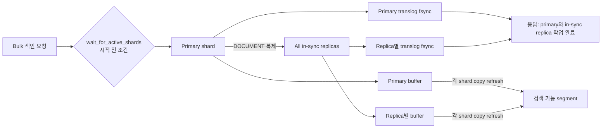

# OpenSearch 아키텍처 한 장 지도

한 줄 요약 — 원장은 MySQL에 남기고, OpenSearch는 검색 전용 read model로 옆에 둔다. 둘 사이를 잇는 동기화 파이프라인이 도입의 진짜 비용이고, OpenSearch 내부는 텍스트를 term으로 분해한 역색인을 shard로 나눠 분산 실행하는 구조다.

아래 4장은 바깥에서 안으로 줌인한다. 이 문서는 세부를 붙이는 뼈대이고, 각 그림의 정본은 [[OpenSearch-Architecture]], [[OpenSearch-vs-RDB-Search]], [[OpenSearch-Indexing-Internals]], [[OpenSearch-Query-Relevance]]다. 그림에서 파란 상자는 OpenSearch 내부, 노란 상자는 도입 비용이 사는 곳이다.

## 그림 1. 서비스 전체에서 OpenSearch가 앉는 자리

볼 것: OpenSearch는 DB를 대체하지 않는다. 원장 옆에 붙는 파생 저장소이고, 도입 판단과 대가는 전부 이 그림에서 결정된다.

```mermaid
flowchart LR
  C["클라이언트"] --> API["API 서버"]
  API -->|"쓰기 (transaction)"| DB[("MySQL<br/>source of truth")]
  DB -->|"binlog"| SYNC["CDC 또는 Outbox<br/>동기화 파이프라인"]
  SYNC -->|"비동기 bulk 색인<br/>지연이 존재"| OS[("OpenSearch<br/>검색 read model")]
  API -->|"검색, 패싯, 랭킹"| OS
  API -->|"read-after-write<br/>원장 조회"| DB
  classDef rdb fill:#E9EDF3,stroke:#8A94A3,color:#1B2430; classDef os fill:#1E63C4,stroke:#17509E,color:#FFFFFF; classDef cost fill:#E8B84B,stroke:#9A6410,color:#1B2430;
  class DB rdb; class OS os; class SYNC cost;
```

- **도입의 대가**: 노란 상자 하나가 새로운 운영 시스템이 된다. dual-write gap, 이벤트 순서 역전, 원본과의 정합성 검증, freshness SLO가 전부 이 구간에서 나온다. 러닝 커브가 아니라 이게 첫 번째 비용.
- **읽기가 두 갈래인 이유**: refresh 기본 1초의 near real-time이라 방금 쓴 걸 바로 봐야 하는 화면은 MySQL을 읽는다. 검색, 패싯, 관련도 정렬만 OpenSearch로 간다.
- **격리**: 동기화가 비동기인 덕에 OpenSearch가 죽어도 원장 쓰기는 산다. 검색엔진 장애가 주문 실패가 되면 안 되기 때문에 일부러 끊어 둔 것.

### 그림 1-보충. 노란 상자를 펼치면 — 워커는 어디 있나

비동기 워커로 색인하는 구조는 노란 상자의 내용물이다. 설계 포인트는 워커 유무가 아니라 워커가 읽는 이벤트의 출발점이 커밋된 사실이냐다.

```mermaid
flowchart LR
  API["API 서버"] -->|"1. 같은 transaction에<br/>outbox row까지 커밋"| DB[("MySQL<br/>+ outbox 테이블")]
  DB -->|"binlog CDC 또는<br/>outbox polling"| CAP["변경 capture"]
  CAP --> Q["큐 (Kafka, SQS)"]
  Q --> W["Indexer worker<br/>bulk 색인, 재시도, DLQ"]
  W --> OS[("OpenSearch")]
  API -.->|"commit 후 직접 발행 = dual write<br/>유실, 유령 문서, 순서 역전"| Q
  classDef rdb fill:#E9EDF3,stroke:#8A94A3,color:#1B2430; classDef os fill:#1E63C4,stroke:#17509E,color:#FFFFFF; classDef cost fill:#E8B84B,stroke:#9A6410,color:#1B2430;
  class DB,CAP,Q rdb; class OS os; class W cost;
```

- **점선(dual write)이 함정인 이유**: DB transaction과 큐 발행은 원자적으로 묶을 수 없다. commit 성공 후 발행 실패면 검색에서 유실, 발행 성공 후 rollback이면 유령 문서, 재시도와 병렬 소비가 겹치면 옛 값이 최신을 덮는 순서 역전.
- **그래서 출발점을 확정된 변경으로**: outbox(이벤트 row를 같은 transaction에 커밋)나 CDC(binlog에는 커밋된 것만 나옴)는 애플리케이션 dual-write gap을 제거한다. 다만 capture 지연과 장애 복구, 보존 기간 안의 replay는 여전히 운영해야 한다.
- **worker 쪽에 남는 숙제**: at-least-once 전달을 쓰면 멱등 색인(`_id`를 도메인 ID로), 원본 version 기반 순서 방어, DLQ와 재처리가 필요하다. 구조는 [[OpenSearch-Indexing-Internals|색인 내부의 동기화 절]], 어긋났을 때의 진단과 DLQ 운영은 [[OpenSearch-Indexing-Pipeline-Reliability|파이프라인 신뢰성]].

## 그림 2. 클러스터 내부 — index는 shard로 쪼개져 node에 분산

볼 것: index 하나(primary 3, replica 1세트)가 node 3대에 어떻게 놓이는지. P는 primary, R은 replica.

```mermaid
flowchart TB
  subgraph CL["Cluster — index: contents"]
    direction LR
    subgraph N1["Node 1"]
      P0["P0"]
      R1["R1"]
    end
    subgraph N2["Node 2"]
      P1["P1"]
      R2["R2"]
    end
    subgraph N3["Node 3"]
      P2["P2"]
      R0["R0"]
    end
  end
  classDef pri fill:#1E63C4,stroke:#17509E,color:#FFFFFF; classDef rep fill:#E9EDF3,stroke:#8A94A3,color:#1B2430;
  class P0,P1,P2 pri; class R0,R1,R2 rep;
```

저장 계층의 줌인 체인: `Index → Shard 1개 = Lucene index 1개 = immutable segment 묶음`

- **배치 규칙**: 같은 데이터의 primary와 replica는 절대 같은 node에 놓이지 않는다. node 하나가 죽어도 모든 shard의 사본이 살아 있게 하는 장애 내성 장치.
- **segment는 불변**: 문서 수정은 segment를 고치는 게 아니라 새 버전 색인과 이전 버전 삭제 표시다. 그래서 update가 공짜가 아니고, background merge가 뒤에서 청소한다.
- **shard 수가 성능 문제인 이유**: 검색 하나가 shard 수만큼 fan-out된다. 너무 잘게 쪼개면 조회와 병합 비용이, 너무 크면 복구와 hot spot이 문제. [[OpenSearch-Shard-Sizing|샤드 사이징]]이 따로 있는 이유.

## 그림 3. 쓰기 여정 — 문서가 term이 되어 역색인에 박히기까지

볼 것: 검색이 빠른 이유는 검색 시점이 아니라 색인 시점에 일을 미리 해두기 때문. 비용을 읽기에서 쓰기로 옮긴 구조다.

```mermaid
flowchart LR
  DOC["JSON 문서<br/>title: 서울의 봄"] --> AN["Index analyzer<br/>char filter → Nori tokenizer → token filter"]
  AN --> T["term<br/>서울, 봄"]
  T --> II["역색인<br/>term → posting list(문서 목록)"]
  classDef plain fill:#E9EDF3,stroke:#8A94A3,color:#1B2430; classDef os fill:#1E63C4,stroke:#17509E,color:#FFFFFF;
  class DOC,AN,T plain; class II os;
```

### B-tree와 역색인을 같은 데이터로 비교

문서 세 건: #1 서울의 봄, #2 봄날은 간다, #3 겨울왕국

B-tree index(MySQL)는 컬럼 값 전체를 정렬해 보관한다. 정렬 순서로 범위를 좁히는 구조다.

| 정렬된 키 | 행 |
|---|---|
| 겨울왕국 | #3 |
| 봄날은 간다 | #2 |
| 서울의 봄 | #1 |

`LIKE '서울%'`는 정렬상 연속 구간이라 탈 수 있다. `LIKE '%봄%'`은 봄이 어느 위치에든 올 수 있어 정렬로 못 좁힌다 — 인덱스가 있어도 전부 훑는다.

역색인(OpenSearch)은 색인할 때 미리 term으로 분해해 term에서 문서 목록으로 바로 간다.

| term | posting list |
|---|---|
| 겨울 | #3 |
| 봄 | #1, #2 |
| 서울 | #1 |

봄 검색은 term 하나를 찾아 목록을 읽으면 끝. 중간 문자열이라는 개념 자체가 사라진다 — 전부 term 조회다.

### 색인 성공과 검색 가시성은 다른 경계



이 그림은 기본 `DOCUMENT` replication과 `index.translog.durability=request`를 전제한다. Primary와 각 in-sync replica는 연산을 적용하고 자기 translog를 sync하며, primary는 이 복제 작업이 완료된 뒤 응답한다. `wait_for_active_shards`는 쓰기를 시작하기 위한 활성 copy 수 조건이지 응답을 기다릴 replica 일부를 고르는 옵션이 아니다. 검색 가시성은 각 shard copy의 refresh 경계다. `SEGMENT` replication이나 `async` durability에서는 시점이 달라진다.

## 그림 4. 읽기 여정 — query 하나가 분산 실행되고 병합되기까지

볼 것: 요청을 받은 node(coordinator)가 shard들에 뿌리고, 각 shard가 로컬에서 점수까지 매긴 top-K를 다시 모은다.

```mermaid
flowchart LR
  Q["query: 서울 봄"] --> SA["Search analyzer<br/>색인과 같은 규칙으로 term 분해"]
  SA --> CO["Coordinator node"]
  CO --> S0["Shard 0<br/>postings 조회 + BM25 점수<br/>local top-K"]
  CO --> S1["Shard 1<br/>동일"]
  CO --> S2["Shard 2<br/>동일"]
  S0 --> MG["Coordinator 병합<br/>전체 top-K"]
  S1 --> MG
  S2 --> MG
  MG --> RES["응답"]
  classDef plain fill:#E9EDF3,stroke:#8A94A3,color:#1B2430; classDef os fill:#1E63C4,stroke:#17509E,color:#FFFFFF;
  class Q,SA,CO,MG,RES plain; class S0,S1,S2 os;
```

- **term이 만나야 검색이 된다**: 검색어는 field의 `search_analyzer`로 분해된다. Index analyzer와 search analyzer는 같을 수도 있고 edge n-gram 색인과 standard 검색처럼 의도적으로 다를 수도 있다. 두 analyzer가 같아야 하는 것이 아니라 생성하는 term이 query 의도에 맞게 호환돼야 한다. 분석 결과가 어긋나면 관련 문서를 놓치거나 0건이 될 수 있다.
- **점수는 로컬, 병합은 위에서**: BM25 점수(문서 내 빈도와 corpus 희소성)는 각 shard가 매기고, coordinator는 top-K만 모아 최종 순위를 만든다. 관련도 랭킹이 RDB에 없는 바로 그 기능.

## 지도와 0단계 읽기의 매핑

| 읽는 절 ([[OpenSearch-vs-RDB-Search]]) | 지도 위치 |
|---|---|
| B-tree vs 역색인, 오개념 1번 | 그림 3의 두 표 — 정렬 탐색이라 못 좁힌다 vs term 조회 |
| 검색엔진 도입의 대가 | 그림 1의 노란 동기화 구간과 그림 3의 refresh 경계 |
| 도입 판단 사다리 | 그림 1로 들어올지 말지의 판단. 요구가 1~3단이면 이 그림 전체가 과설계 |
| MySQL FULLTEXT의 한계 | 그림 3의 역색인을 MySQL 안에서 흉내 낼 때 빠지는 것 — 형태소, 랭킹 튜닝 |

## 이 지도의 용도

읽으면서 각 개념을 그림 위 위치에 붙이는 뼈대다. 외우는 대상이 아니다. 1단계 아웃풋은 이 문서를 닫고 그림 1, 3, 4를 빈 종이에 다시 그리는 것 — 예시 문서는 실무 도메인으로 바꿔서. 그려지지 않는 부분이 다음에 읽을 곳이다.

## 관련 문서

- [[OpenSearch|OpenSearch 학습 지도]]
- [[OpenSearch-vs-RDB-Search|도입 판단 프레임 (0단계 정본)]]
- [[OpenSearch-Architecture|분산 실행 모델 상세]]
- [[OpenSearch-Indexing-Internals|색인 내부와 가시성 경계]]
- [[OpenSearch-Query-Relevance|BM25와 Query DSL]]

## 출처

- [Document APIs - OpenSearch Documentation](https://docs.opensearch.org/latest/api-reference/document-apis/index/) / [TransportWriteAction - OpenSearch source](https://github.com/opensearch-project/OpenSearch/blob/main/server/src/main/java/org/opensearch/action/support/replication/TransportWriteAction.java) / [Segment replication](https://docs.opensearch.org/latest/tuning-your-cluster/availability-and-recovery/segment-replication/index/) / [Search analyzer](https://docs.opensearch.org/latest/field-types/mapping-parameters/search-analyzer/)
