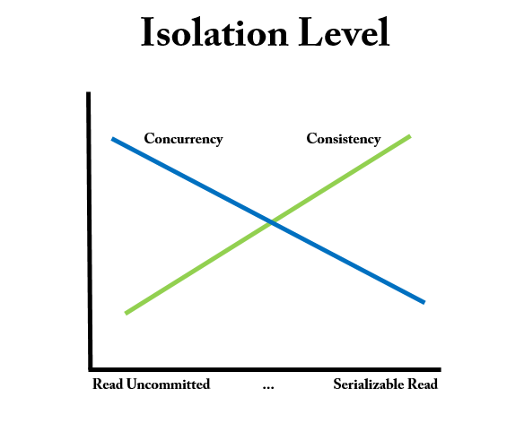

# 트랜잭션 격리 수준

트랜잭션 격리 수준이 중요한 이유는, 격리 레벨을 어떻게 설정하느냐에 따라 읽기 일관성이 달라지기 때문이다.

즉, 트랜잭션 격리 수준에 따라 데이터 조회 결과가 달라질 수 있다는 말이다.

이처럼 트랜잭션 격리 수준에 따라 데이터 조회가 달라지게 하는 기술을 MVCC(Multi Version Concurrency Consistency)라고 한다.

## 레벨
### 레벨0: Read Uncommited
```
1. 트랜잭션에서 아직 처리중인 데이터를 다른 트랜잭션에서 읽는 것을 허용
2. Dirty Read, Non-Repeatable Read, Phantom Read 현상 발생
3. Mysql에서는 설정 가능하지만 권장하지 않음
```

### 레벨1: Read Commited
```
1. Dirty Read 방지: 트랜잭션이 커밋되어 확정된 데이터를 읽는 것을 허용
2. Non-Repeatable Read, Phantom Read 현상 발생
3. 대부분의 RDBMS가 기본 모드로 채택하고 있는 격리 수준
```

### 레벨2: Repeatable Read
```
1. Mysql InnoDB에서 기본으로 채택하고 있는 격리 수준
2. 선행 트랜잭션이 읽은 데이터는 트랜잭션이 종료될 때까지 후행 트랜잭션이 갱신하거나 삭제하는 것은 불허함으로써 같은 데이터를 두 번 쿼리했을 때 일관성 있는 결과를 리턴
3. Phantom Read 현상 발생
```

### 레벨3: Serializable Read
```
1. 선행 트랜잭션이 읽은 데이터를 후행 트랜잭션이 갱신하거나 삭제하지 못할 뿐만 아니라 중간에 새로운 레코드를 삽입하는 것도 막아줌. 완벽하게 읽기 일관성 모드를 제공
2. INSERT, UPDATE, DELETE 전부 불가능하고 READ시 DML 작업이 동시에 진행될 수 없다.
```

## 격리 수준을 설정시 발생하는 문제점들
트랜잭션 격리 수준을 너무 낮게 하면 읽기 일관성을 재대로 보장할 수 없고, 너무 높게 하면 읽기 일관성은 완벽하게 보장하지만 데이터를 처리하는 속도(동시성)가 느려지게 된다.



따라서 트랜잭션 격리 수준은 일관성 및 동시성과도 연관이 있다는 것을 알 수 있다.
