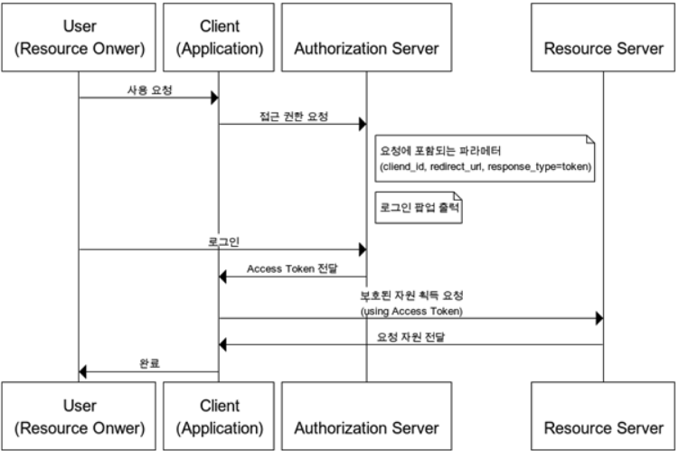
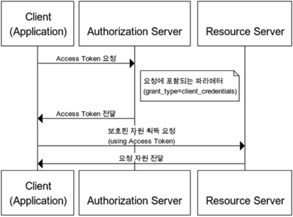

# HTTP

### 특징
- 비연결성(Connectionless): 클라이언트와 서버가 한번 연결을 맺은 후에 요청에 대한 응답을 마치면 논리적으로는 연결이 되어 있다고 생각하고 실제 물리적인 연결을 끊어버리는 것
- 연결을 끊어버리는 이유: 다수의 클라이언트와 연결을 지속할 경우 많은 리소스가 낭비됨. 그래서 응답을 마친 후 연결을 끊어서 리소스를 줄이고 더 많은 연결을 할 수 있도록 한다.
- 무상태(Stateless): server가 클라이언트의 요청을 받을 시 어떠한 데이터도 유지하지 않아 server는 클라이언트를 식별하지 못한다. 그래서 쿠키와 세션을 사용해서 데이터를 저장한다.

### RESTful API
서버안의 자원에 대해서 정의하고 자원에 대한 주소를 지정하는 방법론이다.

리소스와 행위를 명시적이고 직관적으로 분리해야 한다.

리소스는 URI로 표현되는데 리소스가 가리키는 것은 명사이며 복수형으로 표현해야 한다.

행위는 HTTP 메서드로 표현하고 GET(조회), POST(생성), PUT(전체 수정, 없다면 추가), PATCH(일부 수정), DELETE를 분명한 목적으로 사용한다.

메시지는 헤더와 바디를 명확하게 구분해야한다. 메타데이터는 헤더에 리소스에 관련된 내용은 바디에 담는다.

### Socket
서버와 클라이언트간 실시간으로 메시지를 교환하기 위한 통신 방법이다.

양방향 통신으로 서로 원할 때 데이터를 주고 받을 수 있다.

연결지향적으로 실시간 네트워킹(채팅, 게임, 주식)에 사용된다.

1. Opening Handshake(연결 수립을 요청하는 헤더)
	```
	1. HTTP 1.1 이상이여야 한다.
	2. Upgrade는 현재 프로토콜에서 다른 프로토콜로 업그레이드 또는 변경할 때 사용한다. 그래서 HTTP에서 웹 소켓으로 변경해준다. 
	이 값이 없거나 다른 값이면 cross-protocol attack으로 간주하고 웹 소켓 접속을 중지시킨다.
	3. Connection은 현재의 전송 완료 후 network를 유지할 것인지에 대한 정보.
	4. Sec-WebSocket-Key는 유효한 요청인지 확인하기 위해 사용하는 키 값.
	5. Sec-WebSocket-Protocol은 사용하고자 하는 하나 이상의 웹 소켓 프로토콜 지정.
	필요한 경우만 사용 Origin의 경우 모든 브라우저는 보안을 위해 이 헤더를 보낸다.
	대부분 어플리케이션은 이 헤더가 없는 요청을 거부하며, 이러한 이유로 CORS 정책이 만들어졌다.
	6. 상태 응답 코드 101은 프로토콜 전환을 서버가 승인했음을 알리는 코드.
	7. Upgrade와 Connection은 동일하게 넣어줘야 한다.
	```
2. Data Transfer(데이터 전송)
	```
	1. 웹소켓 연결이 수립되면 데이터 전송이 시작된다.
	2. 클라이언트와 서버가 메시지라는 개념으로 데이터를 주고 받는다.
	3. 한개 이상의 메시지는 프레임으로 구성
	4. 핸드세이크가 끝난 시점부터 서버와 클라이언트는 서로가 살아 있는지 확인하기 위해 heartbeat 패킷을 보내며, 주기적으로 ping을 보내 체크
	```
3. Closing Handshake(연결 종료를 요청하는 헤더)
	```
	1. 클라이언트나 서버가 커넥션 종료를 위한 컨트롤 프레임 전송.
	2. 컨트롤 프레임은 핸드세이크를 종료하라는 데이터를 가지고 있음.
	3. 이에 대한 응답으로 close 프레임 전송
	```

다만, 서로 문자열만 주고 받을 수 있으며, 문자열의 해독을 어플리케이션단에서 처리해야 한다.

HTTP의 경우 형식을 정해 놓아서 모두가 따르기만 하면 해석이 쉽지만 웹 소켓은 형식을 정해 놓지 않아서 해석이 어렵다.

### Cookie
세션관리, 개인화, 트래킹에 사용된다.

서버는 응답시 Set-Cookie 헤더를 전송할 수 있다.

브라우저는 Cookie 헤더를 통해 이전에 저장했던 쿠키들을 회신한다.

속성의 경우는 다음과 같다.
1. Domain의 경우 쿠키를 전송할 호스트 주소가 아니라면 전송하지않는다.
2. Path는 Domain의 경로에 해당하지 않는 경우 전송하지 않는다.
3. Secure는 HTTPS를 사용하는 경우에만 전송된다.
4. HttpOnly는 XSS 공격을 방지하기 위해서 사용한다. JS의 Document.cookie API에 접근할 수 없다.
5. SameSite는 CSRF 공격을 방지하기 위해서 사용한다. (https://junhyunny.github.io/information/security/spring-boot/spring-security/cross-site-reqeust-forgery/)

쿠키의 종류
1. 세션 쿠키(메모리에 저장되며 브라우저 종료시 쿠키를 삭제)
2. 퍼머넌트 쿠키(일정 기간동안 유지되는 쿠키, 브라우저가 종료되어도 유지됨)
3. 서드파티 쿠키(방문한 도메인과 다른 도메인의 쿠키, 유입경로를 추적하기 위한 쿠키)

### Session
일정시간동안 같은 사용자로부터 들어오는 일련의 요구를 하나의 상태로 보고 그 상태를 일정하게 유지시키는 기술이다.

중요한 정보를 클라이언트에 저장하지 않고 서버에 저장하여 관리하기 떄문에 사용자 정보가 노출되지 않는다.

클라이언트를 구별하기 위해서 각각의 Session ID를 부여하고, 이를 쿠키를 통해 클라이언트에게 전달한다.

단, 서버에서 클라이언트의 상태를 모두 유지하고 있어야 하므로, 클라이언트 수에 따라 메모리나 디스크 또는 DB에 부하가 증가할 수 있다.

### Token
인증받은 사용자들에게 토큰을 발급하고 서버에 요청을 할 때 헤더에 토큰을 함께 보내도록 하여 유효성 검사를 한다.

이러한 시스템에서는 사용자의 인증 정보를 서버의 세션에 유지하지 않고 클라이언트 측에서 들어오는 요청만으로 작업을 처리한다.

상태를 유지하지 않아서 Stateless한 구조를 가지며 클라이언트와 서버가 연결되지 않아 확장에 용이하다.

### JWT
JSON Web Token의 약자로, 사용자의 정보를 JSON 객체로 표현한 토큰이다.

1. 구조
	```
	1. header(정보 암호화할 해싱 알고리즘, 토큰 타입)
	2. payload(토큰이 가진 정보, key-value 형식으로 이루어져있음)
	3. signature(인코딩된 header와 payload를 더하고 비밀키로 해싱함, 토큰의 위변조 여부를 확인하는데 사용)로 구분된다.
	```
2. 장점
	```
	1. header와 payload를 가지고 signature를 생성하여 데이터 위변조를 막을 수 있다.
	2. 인증 정보에 대한 별도의 저장소가 필요없다. JWT는 토큰에 대한 기본정보와 전달할 정보 및 토큰이 검증됬음을 증명하는 서명 등 필요한 모든 정보를 자체적으로 가지고 있다.
	```
3. 단점
	```
	1. 토큰의 길이가 길어서 인증 요청이 많아지면 네트워크 부하가 심해진다.
	2. payload 자체는 암호화되지 않아서 유저의 중요한 정보는 담을 수 없다.
	3. 토큰은 한번 발급되면 유효기간이 만료될 때 계속 사용되어 탈취당하게 되면 대처하기 힘들다.
	```
4. 보안 전략
	```
	1. 토큰의 만료 기한을 짧게 설정하여 토큰이 탈취되어도 빠르게 만료되기 때문에 피해를 최소화 할 수 있다.
	2. Refresh Token을 발급하여 Access Token이 만료되어도 Refresh Token을 검증하여 새로운 Access Token을 발급할 수 있다. 
	이렇게 하면 사용자가 자주 로그인할 필요도 없다.
	하지만 서버는 Refresh Token을 별도로 저장하고 있어야 하므로 JWT의 장점을 완벽하게 누릴 수 없다는게 단점이다.
	```

### OAuth2
타사 서비스의 정보에 우리가 만든 서비스의 접근을 인가하여 사용자를 인증한다.

사용자들이 비밀번호를 제공하지 않고 다른 웹사이트 상의 자신들의 정보에 대해서 접근 권한을 부여할 수 있는 공통적인 수단으로서 사용되는 표준 프로토콜이다.

1. 용어
	```
	1. Resource Server: OAuth2 서비스를 제공하고 자원을 관리하는 서버
	2. Authorization Server: Client가 Resource Server의 서비스를 사용할 수 있게 인증하고 토큰을 발급해주는 서버
	3. Resource Owner: Resource Server의 계정을 소유하고 있는 사용자
	4. Client: Resource Server의 API를 사용하여 데이터를 가져오려고 하는 사이트
	5. Access Token: 자원 서버에 자원을 요청할 수 있는 토큰
	6. Refresh Token: 권한 서버에 접근 토큰을 요청할 수 있는 토큰
	```
2. 인증절차 종류
	```
	1. Authorization Code Grant
	리소스 접근을 위해, Authorization Server에서 받은 권한 코드로 리소스에 대한 액세스 토큰을 받는 방식이며 기본이 되는 방식이다. 다른 인증 절차에 비해 보안성이 높기에 주로 사용한다.
	```
	

	```
	2. Implicit Grant
	액세스 토큰을 즉시 반환받아 이를 인증에 이용하는 방식으로 브라우저 기반의 JS 애플리케이션(SPA)에 가장 적합하도록 설계되었다.
	Implicit 방식에서는 권한 부여 승인 코드 없이 바로 access token이 발급된다.
	Access Token을 획득하기 위한 절차가 간소화되기에 응답성과 효율성은 높아지지만 Access Token이 URL로 전달된다는 단점이 있다.
	그러므로 Refresh Token 사용이 불가능한 방식이며, 이 방식에서 권한 서버는 client_secret을 사용해 클라이언트를 인증하지 않는다.
	```
	

	```
	3. Resource Owner Password Credentials Grant
	Resource Owner에서 ID, Password를 전달 받아 Resource Server에 인증하는 방식으로 신뢰할 수 있는 Client일 때 사용가능하다. refresh Token의 사용도 가능하다.
	```
	
	
	```
	4. Client Credentials Grant
	Client가 컨텍스트 외부에서 엑세스 토큰을 얻어 특정 리소스에 접근을 요청할 때 사용하는 방식이다.
	즉, 클라이언트의 자격증면만으로 Access token을 획득하는 방식이다.
	```
	

### HTTP 상태 응답 코드
- 2xx: 성공(요청을 정상적으로 받았으며 인식했고 수용하였다.)
- 3xx: 리다이렉션(요청 완료를 위해 추가 작업 조치가 필요하다.)
- 4xx: 클라이언트 오류(요청의 문법이 잘못되었거나 요청을 처리할 수 없다.)
- 5xx: 서버 오류(서버가 명백히 유효한 요청에 대해 충족을 실패했다.)

### XSS
웹 사이트 관리자가 아닌 이가 웹 페이지에 악성 스크립트를 통해 정보를 탈취하는 것

### CSRF
사용자가 자신의 의지와 상관없이 공격자가 의도한 행위를 특정 웹 사이트에 요청하게 하는 것

### CORS
교차 출처 리소스 공유로 HTTP 헤더를 사용하여 한 origin에서 실행중인 웹 어플리케이션이 다른 origin에서 선택한 자원에 접근할 수 있는 권한을 부여하도록 브라우저에 알려주는 정책이다.
