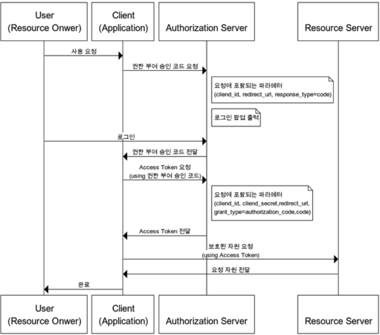
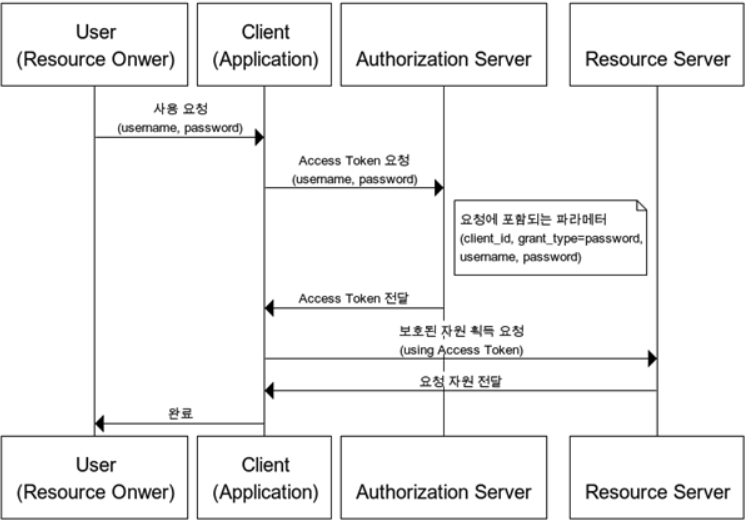

# OAuth2

타사 서비스의 정보에 우리가 만든 서비스의 접근을 인가하여 사용자를 인증한다.

사용자들이 비밀번호를 제공하지 않고 다른 웹사이트 상의 자신들의 정보에 대해서 접근 권한을 부여할 수 있는 공통적인 수단으로서 사용되는 표준 프로토콜이다.

## 용어
```
1. Resource Server: OAuth2 서비스를 제공하고 자원을 관리하는 서버
2. Authorization Server: Client가 Resource Server의 서비스를 사용할 수 있게 인증하고 토큰을 발급해주는 서버
3. Resource Owner: Resource Server의 계정을 소유하고 있는 사용자
4. Client: Resource Server의 API를 사용하여 데이터를 가져오려고 하는 사이트
5. Access Token: 자원 서버에 자원을 요청할 수 있는 토큰
6. Refresh Token: 권한 서버에 접근 토큰을 요청할 수 있는 토큰
```

## 인증절차 종류
```
1. Authorization Code Grant
리소스 접근을 위해, Authorization Server에서 받은 권한 코드로 리소스에 대한 액세스 토큰을 받는 방식이며 기본이 되는 방식이다. 다른 인증 절차에 비해 보안성이 높기에 주로 사용한다.
```


```
2. Implicit Grant
액세스 토큰을 즉시 반환받아 이를 인증에 이용하는 방식으로 브라우저 기반의 JS 애플리케이션(SPA)에 가장 적합하도록 설계되었다.
Implicit 방식에서는 권한 부여 승인 코드 없이 바로 access token이 발급된다.
Access Token을 획득하기 위한 절차가 간소화되기에 응답성과 효율성은 높아지지만 Access Token이 URL로 전달된다는 단점이 있다.
그러므로 Refresh Token 사용이 불가능한 방식이며, 이 방식에서 권한 서버는 client_secret을 사용해 클라이언트를 인증하지 않는다.
```


```
3. Resource Owner Password Credentials Grant
Resource Owner에서 ID, Password를 전달 받아 Resource Server에 인증하는 방식으로 신뢰할 수 있는 Client일 때 사용가능하다. refresh Token의 사용도 가능하다.
```


```
4. Client Credentials Grant
Client가 컨텍스트 외부에서 엑세스 토큰을 얻어 특정 리소스에 접근을 요청할 때 사용하는 방식이다.
즉, 클라이언트의 자격증면만으로 Access token을 획득하는 방식이다.
```

