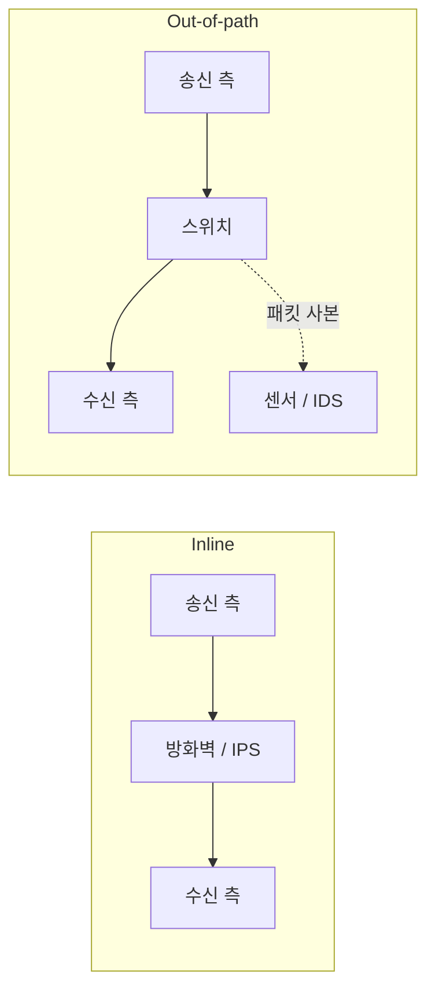

# 인라인과 아웃오브패스: 네트워크 장비 배치 구조

네트워크 장비 배치의 두 가지 주된 형태는 트래픽이 반드시 통과하는 경로 위에 놓는 인라인(inline)과, 경로 밖에서 트래픽의 사본만 받아 보는 아웃오브패스(out-of-path)다. NIST SP 800-94도 IDPS 센서 배치를 inline과 passive 두 가지로 나눠 설명한다. 앞은 제어를, 뒤는 가시성을 얻고, 기준은 장비의 이름이 아니라 원본 트래픽이 그 장비를 통과해야 하는지다.

다만 실제 제품에는 두 칸 중 하나에 깔끔히 들어가지 않는 구성도 있다. Cisco FTD의 tap 모드는 장비를 인라인으로 배치하되 트래픽 흐름은 건드리지 않고 패킷마다 사본을 떠서 분석한다. 반대로 NIST SP 800-94가 설명하는 수동 센서의 session sniping은 경로 밖에 있으면서도 양쪽 끝에 TCP reset을 보내 연결을 끊으려 시도한다. 그래서 두 배치를 출발점으로 삼되 배치와 동작 모드를 따로 확인한다.

한 줄 요약: **인라인은 톨게이트라 막을 수 있지만 고장 나면 길이 막히거나 검사가 빠지고, 아웃오브패스는 단속 카메라라 기록만 하지만 고장 나도 길은 열려 있다.**

## 두 배치의 비교

도식은 한 방향의 흐름을 단순화한 것이다.

| 구분 | 인라인(Inline) | 아웃오브패스(Out-of-path) |
|---|---|---|
| 트래픽 | 장비를 통과해야 다음 홉으로 간다 | 원본은 그대로 흐르고 사본만 받는다 |
| 할 수 있는 일 | 통과(allow), 차단(drop), 변형(NAT, TLS 종료, 부하분산) | 관찰, 기록, 탐지, 경보 |
| 대표 장비 | 라우터, 방화벽, IPS, WAF, 로드밸런서, 프록시 | IDS, 패킷 캡처 센서, 흐름 수집기, 성능 모니터 |
| 장애 영향 | 장비가 멈추면 경로가 끊기거나 검사 없이 통과한다 | 장비가 멈춰도 원본 트래픽에 영향이 없고 관측만 중단된다 |
| 성능 영향 | 처리량, 초당 패킷 수와 검사 지연이 경로 전체에 반영된다 | 복제 경로와 미러 출력 대역폭, 센서의 수집과 분석 용량만 진다 |
| 얻는 것 | 제어 | 가시성 |

### 인라인: 통과해야 하므로 개입할 수 있다

인라인 장비는 패킷의 흐름에 직접 개입한다. 방화벽이 정책으로 통과와 차단을 결정하고, IPS가 공격 시그니처에 걸린 패킷을 버리고, 로드밸런서가 목적지를 바꾸고, 프록시가 TLS를 종료한다. 모두 트래픽이 자기를 지나가기 때문에 가능한 일이다. 인라인 센서는 방화벽이 놓이는 자리, 즉 외부 연결점과 내부 세그먼트 경계에 두고, 검사 대상이 우회 경로로 빠지지 않는지 함께 확인한다.

- **forward, allow**: 다음 구간으로 전달하거나 정책상 통과를 허용한다.
- **drop**: 패킷을 폐기한다.
- **bypass**: 검사를 거치지 않고 장비를 그대로 통과시킨다. 관리자가 켜는 bypass 모드와 장애 시 하드웨어 bypass가 여기 속하며 검사를 마치고 정상 전달된 패킷을 bypass라고 부르지는 않는다.

인라인 장비도 관측과 기록을 수행한다. 인라인은 제어 전용이라는 뜻이 아니라 직접 제어할 수 있는 경로상의 위치를 뜻한다.

대가는 둘이다. 장비의 처리량과 지연이 곧 경로의 처리량과 지연이 되고 장비 장애가 곧 경로 장애가 된다. 그래서 인라인 장비는 이중화하고 장애 시 동작을 미리 정한다.

- **fail-closed**: 장비가 죽으면 트래픽도 끊는다. 검사 없는 통과를 허용하지 않는 보안 우선 정책이다.
- **fail-open**: 장비가 죽으면 검사 없이 통과시킨다. 가용성 우선 정책이다.

실제 동작은 장애 종류와 제품 구성에 따라 다르다. Cisco IPS의 inline bypass처럼 검사 프로세스가 멈췄을 때 작동하는 소프트웨어 bypass는 운영체제가 살아 있을 때만 동작하므로 장비 전원 장애까지 처리하지 못한다. 전원 장애에도 회선을 유지하려면 인라인 포트 쌍을 물리적으로 직결하는 하드웨어 bypass가 필요하다. FMC 7.0 문서는 FTD의 하드웨어 bypass 지원 대상으로 Firepower 9300, 4100 시리즈, 2100 시리즈의 특정 네트워크 모듈을 들고, 전원 장애뿐 아니라 애플리케이션 크래시와 섀시 재부팅, 업그레이드를 트리거로 든다. 다만 같은 문서는 하드웨어 bypass가 계획되지 않은 장애를 위한 기능이라 계획된 소프트웨어 업그레이드 중에는 자동 발동하지 않고 업그레이드 끝에 FTD 애플리케이션이 재부팅될 때 관여한다고 덧붙인다. 이 경우에도 트래픽은 검사 없이 흐른다. 이중화, 소프트웨어와 하드웨어 bypass의 적용 범위, 복구 후 검사 재개를 각각 확인한다.

### 아웃오브패스: 사본만 보므로 막을 수 없다

아웃오브패스 장비는 스위치의 포트 미러링이나 TAP이 만든 사본을 읽기 전용으로 처리한다. 원본은 이미 목적지로 가고 있으므로 장비가 무엇을 발견해도 그 패킷을 막을 수는 없다. 대신 원본 흐름에 영향이 없고, 센서의 분석 지연이 원본의 처리 단계가 되지 않으며, 장비를 붙이거나 떼는 일이 서비스에 지장을 주지 않고, 같은 사본을 여러 도구에 나눠 줄 수 있다. 다만 사본을 만드는 스위치와 복제 트래픽이 쓰는 자원까지 영향이 없는 것은 아니다.

수동 센서도 간접 대응은 할 수 있다. 연결을 끊으려고 양쪽 끝에 TCP reset을 보내는 session sniping 기법이 있고, 방화벽이나 라우터에 ACL 변경을 요청할 수도 있다. 그러나 모두 사후 대응이라 reset이 공격보다 먼저 도착하지 못하는 경우가 많고, 단일 패킷으로 끝나는 공격은 ACL이 적용되기 전에 이미 대상에 도착할 수 있다. NIST SP 800-94는 session sniping이 TCP에만 쓸 수 있고 더 효과적인 방지 기능이 생겨 예전만큼 널리 쓰이지 않는다고 본다. 차단이 목적이면 인라인으로 배치한다.

## 사본을 만드는 방법

| 방법 | 원리 | 장점 | 한계 |
|---|---|---|---|
| 포트 미러링(SPAN) | 스위치가 감시 대상 포트나 VLAN의 트래픽을 미러 포트로 복제 | 이미 있는 스위치의 설정만으로 가능, 저렴 | 미러 포트 대역폭이 감시 대상 합계보다 작으면 사본 유실, 미러 포트 수 제한, 설정 오류 시 일부 트래픽 누락, 고부하 시 사본 누락 |
| 네트워크 TAP | 회선 사이에 끼운 장비가 매체의 신호를 그대로 복제 | 스위치와 무관하게 전체 트래픽 확보, 수동형(passive)은 전원이 필요 없어 TAP 전원 장애가 회선 장애로 이어지지 않는다 (벤더 제품 설명 기준, 제품별 확인 필요) | 별도 구매, 설치 시 회선 중단, 전이중 양방향을 합치는 처리 필요 |
| 패킷 브로커(IDS 로드밸런서) | 여러 SPAN과 TAP의 사본을 모아 규칙에 따라 여러 센서로 분배 | 센서마다 필요한 트래픽만 전달, 나뉜 세션 재조립 | 추가 장비와 비용 |

포트 미러링은 Cisco에서 SPAN(Switched Port Analyzer)이라고 부른다. 설정은 세 가지로 이루어진다.

- **source**: 복제할 포트나 VLAN과 방향. RX는 그 스위치 포트로 들어오는 방향, TX는 나가는 방향이다.
- **destination**: 복제 트래픽을 내보내 센서가 받는 포트.
- **범위**: 양방향이나 여러 관측 지점을 함께 고르면 합산 부하가 커지고, 같은 패킷의 사본이 중복될 수 있다.

### 부하: CPU 사용량만으로 판단하지 않는다

포트 미러링의 부하는 흔히 오해된다. 미러링 구현은 제품마다 다르다. Cisco Catalyst 9300 문서는 SPAN이 source 포트의 스위칭에 영향을 주지 않는다고 하고, Nexus 3550-T 문서는 복제를 전부 하드웨어가 수행하고 supervisor CPU는 관여하지 않는다고 한다. 그러니 미러링을 켜면 항상 CPU 부하가 커진다고 일반화할 수 없다. 반대로 복제 비용이 없는 것도 아니다. 장비가 지원하는 복제 자원과 세션 수, 내부 전달 경로, 출력 포트와 센서 용량을 함께 확인하고, 소프트웨어로 복제하는 환경이면 CPU와 메모리 대역폭도 고려한다.

실제 병목은 미러 destination이다. 1Gbps 전이중 포트 하나에서 RX와 TX를 동시에 미러링하면 사본 유입량은 합계 약 2Gbps라 1Gbps 출력 포트 하나로는 담을 수 없고, 여러 포트를 한 미러 포트로 모으면 합계가 넘치는 순간 사본이 버려진다. 버퍼는 순간적인 증가만 흡수하고 지속적인 용량 부족은 해결하지 못한다. Catalyst 9300은 oversubscribed destination에서 패킷이 드롭될 수 있다고, IOS XE의 ERSPAN은 출력 대역폭이 부족하면 초과분을 버린다고 명시한다. 센서는 자기가 받은 스트림만으로는 빠진 패킷이 있었는지 알 수 없다.

### 원본과 완전히 같은 기록인가

미러링을 모든 비트와 모든 패킷의 보존 보장으로 이해하면 안 된다. 복제 시점, 모델과 설정에 따라 다음 차이가 생길 수 있다.

- VLAN 태그나 MAC 주소가 스위치 내부 처리 후의 형태로 나타날 수 있다. Catalyst 9300에서 egress(TX) SPAN은 라우팅으로 TTL, MAC, QoS 값이 바뀐 뒤의 사본을 보내고 ingress(RX) SPAN은 변경 전의 사본을 보낸다. Nexus 3550-T는 ingress SPAN만 지원하는데 그 사본이 VLAN 태그 제거와 목적지 MAC 재작성 같은 ingress rewrite 이후의 형태이고 SPAN 출력은 항상 untagged다. 두 플랫폼의 동작 예이므로 다른 스위치에 그대로 적용하지 않는다.
- 오류 프레임이 복제 대상에서 빠질 수 있다. Nexus 3550-T는 FCS 오류 프레임을 미러하지 않는다.
- 미러 출력 혼잡 때문에 사본이 누락될 수 있다.
- 센서에서도 캡처 길이 제한(snaplen)과 수집 버퍼 드롭이 추가로 생긴다. [[Packet-Capture-and-Wireshark#캡처 운영 체크포인트|캡처 누락 확인]]

## IDS와 IPS: 같은 탐지, 다른 배치

침입 탐지(intrusion detection)는 시스템과 네트워크의 이벤트를 관찰해 보안 정책 위반의 징후를 찾는 일이고 침입 방지(intrusion prevention)는 탐지에 더해 찾아낸 사건을 막으려 시도하는 일이다. 제품이 탐지 로직을 공유하더라도 막으려면 트래픽이 자기를 지나가야 하므로 IPS는 인라인, IDS는 아웃오브패스가 기본이다.

- 센서라는 이름 자체가 배치 방식을 결정하지 않는다. 같은 센서 소프트웨어를 인라인에 두면 IPS, 미러 포트에 두면 IDS로 동작하는 제품이 많다. 다만 배치는 차단할 수 있는지를 정할 뿐이고 실제로 차단하는지는 동작 모드가 정한다. FMC 7.0 문서가 설명하는 FTD의 tap 모드처럼 인라인으로 배선하고도 패킷 사본만 분석하는 구성이 있다.
- 인라인 IPS의 오탐은 정상 트래픽 차단이 된다. 새 시그니처는 차단으로 올리기 전에 탐지만 하는 구성에서 먼저 검증한다. 아웃오브패스 센서로 볼 수도 있고, 인라인 장비를 그대로 두고 tap 모드로 돌릴 수도 있다. FMC 7.0 문서는 인라인처럼 배선한 상태에서 tap 모드로 어떤 침입 이벤트가 생기는지 보고 그 결과로 정책과 drop 규칙을 다듬으라고 안내하며, tap 모드가 트래픽에 따라 FTD 성능에 큰 영향을 줄 수 있다는 점도 함께 적는다.
- 사본을 어떤 규칙으로 분석하느냐에 따라 같은 센서가 장애 분석 도구, 성능 모니터, IDS가 된다. 수집 구조는 같고 분석 규칙이 다르다.

경계 보안 체인에서 방화벽, IPS, WAF가 로드밸런서 앞에 인라인으로 서는 순서는 [[Network-Perimeter-Security|네트워크 경계 보안]]. 페이로드까지 검사하는 DPI를 어느 배치에 둘지는 [[Network-Encapsulation#DPI(Deep Packet Inspection): 내용물까지 검사|DPI]].

## 클라우드에서의 같은 구분

물리 포트가 없는 클라우드에서도 구분은 유지된다. 인라인 삽입은 트래픽을 가상 어플라이언스로 우회시켜 통과시키는 구성으로, AWS에서는 [[ELB|Gateway Load Balancer]]가 방화벽, IDS/IPS, DPI 어플라이언스를 경로 위에 끼우는 역할을 한다. GWLB 엔드포인트를 애플리케이션 서브넷 라우팅 테이블의 next hop으로 두어 트래픽이 어플라이언스를 거쳐 돌아오게 하고, GWLB와 어플라이언스 사이는 GENEVE(UDP 6081)로 캡슐화한다. 아웃오브패스 관찰은 VPC Traffic Mirroring이 interface 유형 ENI의 트래픽 사본을 필터와 패킷 절단을 거쳐 out-of-band 보안과 모니터링 어플라이언스로 보내고, 흐름 로그가 메타데이터를 남긴다. [[Network-Traffic-Monitoring|흐름 단위 모니터링]]

## 설계 체크포인트

- 목적이 차단인지 관찰인지 먼저 정한다. 차단이면 인라인, 관찰이면 아웃오브패스가 기본이다. 인라인에 두고도 초기에는 tap이나 탐지 전용으로 운영할 수 있으므로 배치와 동작 모드를 각각 정한다. 둘 다 필요하면 장비를 나눈다.
- 양방향 트래픽, 우회 경로와 관측 위치를 그리고 센서가 보는 범위를 명시한다.
- 인라인 장비는 처리량 여유, 지연 예산, 이중화, fail-open과 fail-closed 정책을 함께 정하고 프로세스, 링크, 전원 장애와 센서 중단 시 통신과 관측에 어떤 영향이 생기는지 각각 시험한다.
- 미러링은 미러 포트 대역폭과 세션 수 한계 안에서 꼭 필요한 포트, VLAN과 방향만 지정한다. 평시와 최대 트래픽량, 초당 패킷 수, RX와 TX 합계와 중복 사본을 계산한다.
- 사본 유실은 source 포트, 미러 출력, 센서의 드롭 카운터를 따로 확인한다. 카운터의 의미와 제공 범위는 제품 문서로 확인한다.
- 센서가 패킷을 놓쳤다고 원본 통신도 같은 패킷을 잃었다고 판단하지 않는다. 반대로 캡처에 보인다고 애플리케이션의 수신과 처리까지 끝났다는 뜻도 아니다.
- 여러 도구가 같은 트래픽을 봐야 하면 미러 포트를 늘리기보다 패킷 브로커로 한 번 모아 나눈다.
- 아웃오브패스 센서는 원본에 영향이 없다는 이유로 방치되기 쉽다. 사본 유실과 센서 다운은 감시 공백이므로 경보 대상으로 둔다.

## 면접 체크포인트

- 인라인과 아웃오브패스의 정의, 제어와 가시성이라는 목적 차이
- 인라인 장비의 장애가 경로 장애가 되는 이유와 fail-open, fail-closed, 소프트웨어 bypass와 하드웨어 bypass의 차이
- 포트 미러링의 실제 병목이 미러 포트 대역폭인 이유, RX와 TX를 함께 미러링하면 사본이 두 배가 되는 이유, TAP과의 차이
- 사본이 원본과 비트 단위로 같지 않을 수 있는 이유 (rewrite 반영, 오류 프레임 제외, 출력 혼잡, 센서 드롭)
- IDS와 IPS가 탐지를 공유하고 배치와 동작 모드가 다르다는 점, 인라인 tap 모드처럼 두 배치로 깔끔히 나뉘지 않는 구성, 수동 센서의 간접 대응이 차단에 약한 이유
- 클라우드에서 GWLB가 인라인 삽입, Traffic Mirroring이 아웃오브패스 관찰에 해당하는 구조

## 출처

- [Inline 구조와 Out of path 구조 — 널널한 개발자 TV](https://www.youtube.com/watch?v=XBPXxFip4xs&list=PLXvgR_grOs1BFH-TuqFsfHqbh-gpMbFoy&index=19)
- [NIST, SP 800-94: Guide to Intrusion Detection and Prevention Systems (IDPS)](https://nvlpubs.nist.gov/nistpubs/Legacy/SP/nistspecialpublication800-94.pdf)
- [Cisco, Catalyst 9300 Network Management Configuration Guide: Configuring SPAN and RSPAN](https://www.cisco.com/c/en/us/td/docs/switches/lan/catalyst9300/software/release/17-9/configuration_guide/nmgmt/b_179_nmgmt_9300_cg/configuring_span_and_rspan.html)
- [Cisco, Nexus 3550-T NX-OS System Management Configuration Guide 10.2(x): Configuring SPAN](https://www.cisco.com/c/en/us/td/docs/dcn/nexus3550/3550-t/sw/102x/configuration/Cisco-Nexus-3550-T-System-Management-Configuration-Guide/cisco-nexus-3550t-system-management-configuration-guide-102x/3550-T-system-management-configuration-guide-102x-configuring-span.pdf)
- [Cisco, Configuring ERSPAN](https://www.cisco.com/c/en/us/td/docs/routers/ios-xe/lan-wan/lan-wan/m_lnsw-conf-erspan.html)
- [Cisco, Security Manager 4.24 User Guide: Managing IPS Device Interface](https://www.cisco.com/c/en/us/td/docs/security/security_management/cisco_security_manager/security_manager/424/User/csm-user-guide-424/chapter37-managing-ips-device-interface.html)
- [Cisco, Firepower Management Center Configuration Guide 7.0: Inline Sets and Passive Interfaces for Firepower Threat Defense](https://www.cisco.com/c/en/us/td/docs/security/firepower/70/configuration/guide/fpmc-config-guide-v70/inline_sets_and_passive_interfaces_for_firepower_threat_defense.html)
- [AWS, Gateway Load Balancer User Guide: What is a Gateway Load Balancer?](https://docs.aws.amazon.com/elasticloadbalancing/latest/gateway/introduction.html)
- [AWS, Amazon VPC Traffic Mirroring Guide: What is Traffic Mirroring?](https://docs.aws.amazon.com/vpc/latest/mirroring/what-is-traffic-mirroring.html)
- [Wireshark, User's Guide](https://www.wireshark.org/docs/wsug_html/)
- [Network Taps — Gigamon](https://www.gigamon.com/products/access-traffic/network-taps.html)

## 관련 문서

- [[Network-Perimeter-Security|네트워크 경계 보안 (보안 장비 배치 순서)]]
- [[Packet-Capture-and-Wireshark|패킷 캡처와 Wireshark (캡처 위치, SPAN/TAP, 캡처 누락)]]
- [[Network-Encapsulation|캡슐화와 데이터 단위 (DPI)]]
- [[Proxy-Internals|프락시 동작 구조 (경로 위 스트림 중계 장비)]]
- [[Proxy-Trust-and-Anonymity|중계 경로의 신뢰 모델 (아웃바운드 프락시와 Tor 통제)]]
- [[Physical-DataLink-Layer|L1/L2 물리와 데이터링크 (스위치 전달)]]
- [[ELB|AWS ELB (Gateway Load Balancer)]]
- [[Network-Traffic-Monitoring|네트워크 트래픽 모니터링]]
- [[네트워크보안(NetworkSecurity)|네트워크 보안 인덱스]]
- [[네트워크(Network)|네트워크 문서 지도]]
