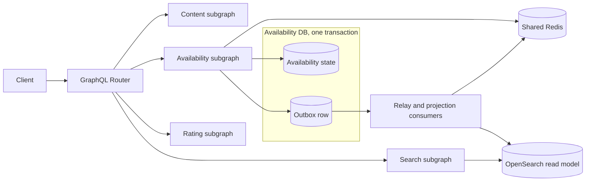

# 콘텐츠 가용성 조회 시스템 설계

콘텐츠 상세 API가 기본 정보, 평점, 국가별 OTT 제공처를 조합하고 일부 서비스가 실패해도 유용한 응답을 유지해야 한다. 이 사례는 그 문제를 Federation의 실행 경계, Redis 캐시, 장애 격리, OpenSearch read model의 수렴으로 푼다.

GraphQL Federation은 여러 subgraph schema를 supergraph로 합치고 Router가 query plan을 실행하는 수단이다. 클라이언트 정규화 캐시와 HTTP 캐시는 [[GraphQL-Caching]]의 범위이며, 여기서는 Availability subgraph가 소유하는 서버 측 Cache-Aside를 다룬다.

## 요구사항과 선택

- B2C 조회에서는 최신성보다 가용성을 우선하되, 오래된 데이터의 나이는 숨기지 않는다.
- 제공처가 없다는 확인과 장애로 알 수 없다는 상태를 구분하고, 가용성 실패가 콘텐츠 전체로 번지지 않게 한다.
- 멀티 인스턴스가 공용 Redis를 사용하며, 원본 보호를 위해 콘텐츠별로 갱신을 직렬화한다.
- DB를 원본으로 두고 Redis와 OpenSearch를 파생 상태로 수렴시키며, 공용 가용성과 사용자 개인화는 분리한다.
- 구현 전 peak QPS, hot key 비율, p95 latency, freshness SLO, 최대 stale 허용 시간과 market 수를 확정한다.

## 전체 그림



- Router는 저장소를 직접 읽지 않는다. 각 subgraph가 자기 필드와 캐시 정책을 소유한다.
- Availability state와 Outbox row는 같은 DB transaction으로 기록한다. Redis와 OpenSearch는 다시 만들 수 있는 파생 상태다.
- 상세의 `Content.availability`는 Availability subgraph가 소유한다. 검색은 Search subgraph의 별도 `SearchHit.availabilitySnapshot` 필드가 OpenSearch의 마지막 snapshot, projection revision과 관측 시각을 제공하고 조회 시점 freshness를 계산한다.

## Federation 실행 모델

Apollo Federation에서 subgraph schema들은 composition을 거쳐 supergraph schema가 된다. 이는 GraphQL 표준 자체가 아니라 Apollo Federation의 아키텍처다. Router는 operation별 query plan을 사용하며, cache miss에서 만든 plan을 기본 in-memory cache에 보관할 수 있다.

```graphql
# Availability subgraph
type Content @key(fields: "id") {
  id: ID!
  availability(market: Market!): ContentAvailabilityResult
}
```

`ContentAvailabilityResult`의 concrete type, offer와 revision 의미는 [[Content-Availability-Data-Contract|콘텐츠 가용성 데이터 계약]]이 소유한다. 이 문서는 Federation 실행 경계와 장애 처리만 정의한다.

- `@key(fields: "id")`는 subgraph 사이의 같은 entity를 식별한다. Router는 `__typename`과 key로 representation을 만들어 reference resolver에 전달한다.
- Field ownership과 데이터 의존성이 query plan을 정한다. Content의 `id`를 얻은 뒤 Availability와 Rating이 서로 독립이면 병렬로 fetch할 수 있다.
- Router가 entity representation들을 묶어도 reference resolver가 건별로 DB를 읽으면 분산 N+1이 생긴다. subgraph 내부에서도 batch loader나 DataLoader가 필요하다.
- composition과 operation check를 배포 게이트에 두어 소유권 충돌과 실제 사용 중인 연산의 파손을 배포 전에 잡는다.

일반 GraphQL의 parse, validate, execute와 부분 오류 규칙은 [[GraphQL-Architecture-Map]], nullability 설계는 [[GraphQL-Schema-Design]]을 참고한다.

## 응답 계약과 장애 의미

Resolver가 처리한 원본 실패에 마지막 snapshot이 있으면 `ObservedContentAvailability`로, 유효한 snapshot이 없으면 `UnavailableContentAvailability`로 반환하고 metric에 남긴다. 전자는 non-null `snapshot`을 타입으로 보장한다. Consumer는 snapshot의 `observedAt`과 자기 surface 정책으로 freshness를 계산한다. Transport 실패, `availability` resolver 자체의 미처리 오류와 아래 Non-Null chain 위반은 `availability = null`과 GraphQL error가 되며, 이를 빈 offer 목록으로 바꾸지 않는다. 정확한 상태와 `offers=[]`의 의미는 [[Content-Availability-Data-Contract|데이터 계약]]을 따른다.

GraphQL 오류는 실패한 response position이 nullable이면 그 위치만 `null`이 된다. Non-Null 필드 오류는 Non-Null chain을 따라 전파되며, `ObservedContentAvailability.snapshot`과 그 필수 하위 값의 오류는 nullable `Content.availability`에서 멈춰 `Content`는 남는다. 반면 `deeplink`처럼 nullable인 하위 필드의 오류는 그 필드에서 멈춘다. `availability` 자체를 Non-Null로 바꾸면 오류가 더 상위로 전파되므로 현재 계약에서는 nullable을 유지한다.

## Redis 읽기와 갱신

공용 Redis를 쓰는 멀티 인스턴스 구조에서는 다음 상태 머신을 기본으로 삼는다.

1. `CACHE_FRESH`: `softExpiresAt` 전의 snapshot을 즉시 반환한다.
2. `CACHE_STALE`: `softExpiresAt`이 지난 snapshot을 반환하고, 콘텐츠별 잠금을 얻은 한 요청만 백그라운드 갱신한다.
3. `MISS`: 잠금 획득자가 원본을 동기 조회한다. 나머지는 짧게 기다린 뒤 캐시를 재조회하거나 `UnavailableContentAvailability`를 반환한다.
4. 원본 갱신 성공: `stateRevision`, `projectionRevision`, `observedAt`, `softExpiresAt`, 데이터를 함께 저장한다.
5. 원본 갱신 실패: hard TTL 전이면 stale snapshot을 유지하고, snapshot이 없으면 `UnavailableContentAvailability`다.

```text
availability:{market}:{contentId}
lock:availability:{market}:{contentId}
```

- soft TTL은 애플리케이션이 freshness를 판단하는 시각이고, hard TTL은 Redis가 키를 제거하는 물리 만료다.
- soft TTL에 jitter를 넣어 같은 시점에 저장된 키가 한꺼번에 갱신되는 cache avalanche를 줄인다.
- 갱신 잠금은 전체 콘텐츠가 아니라 `{market}:{contentId}` 단위다. 서로 다른 콘텐츠 조회를 막지 않는다.
- 잠금은 `SET key token NX PX ttl`로 얻고, 소유 token이 일치할 때만 해제한다. 잠금은 중복 갱신을 줄일 뿐 정합성을 보장하지 않으므로 모든 cache write에 `projectionRevision` guard를 적용한다.
- not found를 원본에서 확인했을 때만 짧은 negative cache를 둔다. 생성 event는 marker를 제거하고, timeout과 5xx는 not found로 저장하지 않는다.

`softExpiresAt`은 원본 보호를 위한 공용 cache refresh 시각이며 surface별 `freshMaxAge`를 대신하지 않는다. Consumer가 snapshot age를 계산해 더 엄격한 freshness를 요구하면 내부 `refreshAvailability(projectionKey, minObservedAt, deadline, policyVersion)` command를 호출하고, 같은 lock과 fence 규칙으로 bounded refresh한 뒤 snapshot을 다시 평가한다. Command는 `REFRESHED`, `UNCHANGED`, `FAILED`를 구분하며 public client가 임의의 max age로 원본 호출을 증폭시키지 못하게 한다.

일반 Cache-Aside는 [[Cache-Strategies]], stampede와 안전한 잠금은 [[Cache-Stampede]], 구현 예시는 [[NestJS-Caching-Integration]]을 참고한다.

## 변경과 파생 저장소 수렴

DB 변경과 Redis, OpenSearch 갱신을 직접 dual write하면 중간 실패 시 정합성이 깨진다. 원본 변경과 Outbox event를 같은 DB transaction에 넣고, commit 뒤 projector가 파생 저장소를 갱신한다.

- Event는 [[Content-Availability-Data-Contract|가용성 데이터 계약]]의 전체 snapshot, `projectionKey`와 revision을 운반한다.
- Writer는 upstream 조회 전에 DB에서 `projectionKey`별 `observationFence`를 원자 발급한다.
- Commit transaction은 row lock 또는 CAS로 fence와 가능한 upstream source version의 비퇴행을 확인한 뒤 revision을 발급하고 snapshot과 Outbox를 함께 저장한다. 오래된 writer는 commit하지 않는다.
- `(projectionKey, projectionRevision)` unique constraint 충돌은 transaction을 재시도한다. Redis refresh lock이나 consumer guard에 writer 순서 보장을 맡기지 않는다.
- commit 뒤 해당 `projectionRevision`의 Redis 스냅샷을 best-effort로 적용하면 stale window를 줄일 수 있지만 read-after-write 보장은 아니다. 강한 보장이 필요하면 해당 읽기를 원본으로 보내거나 기대 revision을 확인한다.
- 파생 저장소 갱신 실패 때문에 이미 유효한 DB transaction을 보상하지 않는다. event를 재시도하고 DLQ, reconciliation으로 복구한다.
- Consumer는 같은 key의 더 큰 `projectionRevision`만 적용하며 Redis의 비교와 쓰기는 원자 연산으로 묶는다. OpenSearch `_id`와 external version 범위도 데이터 계약과 같아야 한다.
- 권리 종료는 삭제하지 않고 더 큰 revision의 `offers=[]` snapshot으로 투영한다. Projection 자체 삭제는 같은 `_id`와 revision을 보존한 애플리케이션 수준의 `deleted=true` durable tombstone 문서를 기본으로 하며 검색 query가 이를 제외한다.
- OpenSearch physical delete는 삭제 version을 `index.gc_deletes` 동안만 보존하고 기본값도 60초이므로 순서 보장 장치로 사용하지 않는다. Physical delete가 필요하면 모든 write가 확인하는 외부 durable revision barrier를 먼저 운영한다.
- Reindex는 active snapshot과 tombstone을 함께 옮기며 destination의 `version_type=external`로 source external `_version`을 보존한다. DB 재적재는 각 document에 `version=projectionRevision&version_type=external`을 지정한다. Reconciliation은 stored `_version`도 대조하며, 이를 보장할 수 없으면 외부 barrier를 먼저 적재한다. Tombstone은 barrier가 더 작은 replay와 backfill을 차단하고 모든 대상 index가 수렴했음이 증명된 뒤에만 physical delete하며, 외부 barrier가 없으면 제거하지 않는다.

| event 방식 | 장점 | 추가 비용 |
|---|---|---|
| 전체 snapshot | 중간 event가 유실돼도 최신 event 하나로 수렴, 재처리 단순 | payload가 큼 |
| delta | payload가 작음 | 순번 공백 감지, 누락 재조회, 순서 보장이 필요 |

OTT 제공처 목록처럼 한 entity의 상태가 작고 정합성이 중요하면 versioned snapshot이 운영상 단순하다. 대용량 상태라 delta를 택하면 연속 revision 검증과 snapshot 재적재 경로를 함께 둔다. 자세한 dual write 해법은 [[Transactional-Outbox]], 검색 projection 복구는 [[OpenSearch-Indexing-Pipeline-Reliability]]을 참고한다.

## 캐시 키와 개인화 분리

`market`은 한국, 미국처럼 OTT 제공 결과가 달라지는 비즈니스 차원이다. AWS region과 같은 인프라 위치와 구분하며, 결과에 영향을 주는 모든 차원을 키에 포함한다.

```text
availability:{market}:{contentId}  # 모든 사용자가 공유하는 제공처
subscriptions:{subjectId}:{market} # 사용자가 구독 중인 OTT
```

두 값을 병렬 조회한 뒤 응답에서 조합한다. `contentId × subjectId` 완성 결과를 저장하는 방식보다 공용 캐시 적중률이 높고, 사용자별 무효화 fan-out과 개인정보 노출 범위가 작다. 구독 캐시만 실패하면 offer는 보여줄 수 있지만 구독 여부는 `UNKNOWN`으로 유지한다. 추천 surface의 CTA와 fallback 판정은 [[Recommendation-System-Eligibility-Availability|추천 자격 조건과 가용성]]이 소유하며, 결제 권한처럼 보안에 영향을 주는 판단은 fail closed한다.

## 장애 시나리오

| 장애 | 사용자 응답 | 복구 경로 |
|---|---|---|
| 원본 실패, stale 있음 | 마지막 snapshot, freshness는 consumer가 계산 | 잠금 획득자만 재시도 |
| Redis 실패, 원본 정상 | 원본 조회, local single-flight와 동시성 제한 | 짧은 timeout, Redis 복구 |
| Availability 일부 인스턴스 실패 | 정상 인스턴스로 retry | load balancer health check |
| Availability 전체 장애 | 상세의 가용성 필드는 `null`과 error | 검색은 OpenSearch 마지막 snapshot 사용 가능 |
| 사용자 구독 조회만 실패 | 제공처 표시, 구독 여부 `UNKNOWN` | 개인화 경로만 재시도 |

Availability subgraph가 완전히 내려가면 그 내부 Redis에 데이터가 있어도 Router가 직접 꺼낼 수 없다. Router가 실행 중 Search subgraph로 재계획하지도 않는다. Gateway response cache는 선택 가능한 외부 방어선이고, 검색용 snapshot은 Search subgraph의 별도 field와 read path가 소유한다.

## 운영 지표

- cache hit, miss, `CACHE_STALE` 응답률, snapshot age p95/p99와 `observationStatus` 비율
- 원본 refresh 실패율과 시간, 콘텐츠별 잠금 경합률, subgraph별 latency, timeout, error
- Outbox lag, retry, DLQ 적재량과 DB 대비 Redis, OpenSearch의 `projectionRevision` drift

## 관련 문서

- 추천: [[Recommendation-System-OTT-Aggregator-Design-Proposal|OTT 통합 서비스 추천 시스템 초기 설계안]], [[Recommendation-System-Eligibility-Availability|추천 자격 조건과 가용성]]
- GraphQL: [[GraphQL-Federation|Federation 개념]], [[GraphQL-Architecture-Map|실행과 부분 오류]], [[GraphQL-Schema-Design|nullability 설계]], [[GraphQL-Caching|클라이언트 캐시와 HTTP 전송]]
- 캐시: [[Cache-Strategies|Cache-Aside]], [[Cache-Stampede|stampede와 TTL jitter]], [[Cache-Invalidation|post-commit invalidation]], [[Distributed-Lock|분산 잠금]]
- 데이터 수렴: [[Content-Availability-Data-Contract|가용성 데이터 계약]], [[Transactional-Outbox]], [[OpenSearch-Indexing-Pipeline-Reliability]], [[Idempotent-Consumer]]
- 설계 진행: [[External-Service-Resilience|timeout, bulkhead, circuit breaker]], [[System-Design-Interview|시스템 설계 인터뷰 프레임]]

## 출처

- Apollo GraphOS: [entities](https://www.apollographql.com/docs/graphos/schema-design/federated-schemas/entities/intro), [composition](https://www.apollographql.com/docs/graphos/schema-design/federated-schemas/composition)
- Apollo Router: [request lifecycle](https://www.apollographql.com/docs/graphos/routing/request-lifecycle), [query plans](https://www.apollographql.com/docs/graphos/schema-design/federated-schemas/reference/query-plans), [query plan caching](https://www.apollographql.com/docs/graphos/routing/query-planning/caching)
- Apollo GraphOS: [schema checks](https://www.apollographql.com/docs/graphos/platform/schema-management/checks), [N+1 handling](https://www.apollographql.com/docs/graphos/schema-design/guides/handling-n-plus-one), [NestJS federation](https://docs.nestjs.com/graphql/federation)
- [GraphQL Specification September 2025 — Handling Execution Errors](https://spec.graphql.org/September2025/#sec-Handling-Execution-Errors)
- Redis: [Cache-aside](https://redis.io/docs/latest/develop/use-cases/cache-aside/), [SET](https://redis.io/docs/latest/commands/set/), [Distributed Locks](https://redis.io/docs/latest/develop/clients/patterns/distributed-locks/)
- [AWS Prescriptive Guidance — Transactional outbox pattern](https://docs.aws.amazon.com/prescriptive-guidance/latest/cloud-design-patterns/transactional-outbox.html)
- [OpenSearch — Index document](https://docs.opensearch.org/latest/api-reference/document-apis/index-document/)
- [OpenSearch — Delete document](https://docs.opensearch.org/latest/api-reference/document-apis/delete-document/)
- [OpenSearch — Index settings](https://docs.opensearch.org/latest/install-and-configure/configuring-opensearch/index-settings)
- [OpenSearch — Reindex documents](https://docs.opensearch.org/latest/api-reference/document-apis/reindex/)
