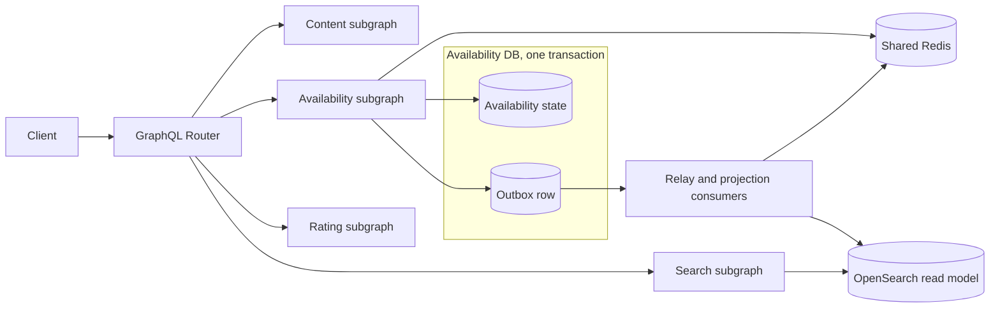

# 콘텐츠 가용성 조회 시스템 설계

콘텐츠 상세 API가 기본 정보, 평점, 국가별 OTT 제공처를 조합하고 일부 서비스가 실패해도 유용한 응답을 유지해야 한다. 이 사례는 그 문제를 Federation의 실행 경계, Redis 캐시, 장애 격리, OpenSearch read model의 수렴으로 푼다.

GraphQL Federation은 여러 subgraph schema를 supergraph로 합치고 Router가 query plan을 실행하는 수단이다. 클라이언트 정규화 캐시와 HTTP 캐시는 [[GraphQL-Caching]]의 범위이며, 여기서는 Availability subgraph가 소유하는 서버 측 Cache-Aside를 다룬다.

## 요구사항과 선택

- B2C 조회에서는 최신성보다 가용성을 우선하되, 오래된 데이터의 나이는 숨기지 않는다.
- 제공처가 없다는 확인과 장애로 알 수 없다는 상태를 구분하고, 가용성 실패가 콘텐츠 전체로 번지지 않게 한다.
- 멀티 인스턴스가 공용 Redis를 사용하며, 원본 보호를 위해 콘텐츠별로 갱신을 직렬화한다.
- DB를 원본으로 두고 Redis와 OpenSearch를 파생 상태로 수렴시키며, 공용 가용성과 사용자 개인화는 분리한다.
- 구현 전 peak QPS, hot key 비율, p95 latency, freshness SLO, 최대 stale 허용 시간과 market 수를 확정한다.

## 전체 그림



- Router는 저장소를 직접 읽지 않는다. 각 subgraph가 자기 필드와 캐시 정책을 소유한다.
- Availability state와 Outbox row는 같은 DB transaction으로 기록한다. Redis와 OpenSearch는 다시 만들 수 있는 파생 상태다.
- 상세의 `Content.availability`는 Availability subgraph가 소유한다. 검색은 Search subgraph의 별도 `SearchHit.availabilitySnapshot` 필드가 OpenSearch의 마지막 스냅샷과 상태, projection revision, 관측 시각을 제공한다.

## Federation 실행 모델

Apollo Federation에서 subgraph schema들은 composition을 거쳐 supergraph schema가 된다. 이는 GraphQL 표준 자체가 아니라 Apollo Federation의 아키텍처다. Router는 operation별 query plan을 사용하며, cache miss에서 만든 plan을 기본 in-memory cache에 보관할 수 있다.

```graphql
# Content subgraph
type Content @key(fields: "id") {
  id: ID!
  title: String!
}

# Availability subgraph
type Content @key(fields: "id") {
  id: ID!
  availability(market: Market!): ContentAvailability
}

type ContentAvailability {
  providers: [Provider!]
  status: AvailabilityStatus!
  observedAt: DateTime
}

enum AvailabilityStatus { FRESH STALE UNAVAILABLE }
```

- `@key(fields: "id")`는 `Content`가 subgraph 사이에서 같은 entity임을 식별한다.
- Router는 선행 subgraph에서 받은 `__typename`과 key 필드로 representation을 만들고, 대상 subgraph의 reference resolver에 전달한다.
- 응답이 `content { availability }`로 중첩됐다는 이유만으로 서비스 호출 순서가 정해지지는 않는다. field ownership과 데이터 의존성이 query plan을 정한다.
- Content에서 `id`를 얻은 뒤 Availability와 Rating이 서로 의존하지 않으면 두 fetch는 병렬로 실행할 수 있다. 선행 데이터가 필요한 fetch만 순차 실행한다.
- Router가 entity representation들을 묶어도 reference resolver가 건별로 DB를 읽으면 분산 N+1이 생긴다. subgraph 내부에서도 batch loader나 DataLoader가 필요하다.
- composition과 operation check를 배포 게이트에 두어 소유권 충돌과 실제 사용 중인 연산의 파손을 배포 전에 잡는다.

일반 GraphQL의 parse, validate, execute와 부분 오류 규칙은 [[GraphQL-Architecture-Map]], nullability 설계는 [[GraphQL-Schema-Design]]을 참고한다.

## 응답 계약과 장애 의미

| 상황 | `availability.providers` | `status` | GraphQL `errors` | 의미 |
|---|---|---|---|---|
| 최신 원본 또는 최신 캐시 | 목록 또는 `[]` | `FRESH` | 없음 | `[]`는 제공처가 없음을 확인함 |
| 원본 갱신 실패, stale 존재 | 마지막 목록 | `STALE` | 없음 | 성공한 fallback, `observedAt`으로 나이 공개 |
| 원본 실패를 resolver가 처리, stale 없음 | `null` | `UNAVAILABLE` | 없음 | 현재 알 수 없음 |
| subgraph 통신 또는 미처리 실행 실패 | `availability = null` | 없음 | 있음 | GraphQL 실행 실패 |

`STALE`은 오류가 아니라 품질 메타데이터가 붙은 정상 데이터다. 원본 갱신 실패는 로그와 metric으로 남기되, 사용자 응답에 불필요한 GraphQL error를 섞지 않는다. 반대로 transport 실패를 `[]`로 바꾸면 제공처가 없다는 잘못된 사실이 되므로 피한다.

현재 schema에서 `availability`는 가장 가까운 nullable 경계다. 미처리 실패는 여기까지 `null`로 전파되고 `Content`는 남는다. 필수값으로 선언하면 Non-Null 전파 범위만큼 상위 데이터가 `null`이 된다.

## Redis 읽기와 갱신

공용 Redis를 쓰는 멀티 인스턴스 구조에서는 다음 상태 머신을 기본으로 삼는다.

1. `FRESH`: 값을 즉시 반환한다.
2. `STALE`: 값을 즉시 반환하고, 콘텐츠별 잠금을 얻은 한 요청만 백그라운드 갱신한다.
3. `MISS`: 잠금 획득자가 원본을 동기 조회한다. 나머지는 짧게 기다린 뒤 캐시를 재조회하거나 `UNAVAILABLE`을 반환한다.
4. 원본 갱신 성공: `stateRevision`, `projectionRevision`, `observedAt`, `softExpiresAt`, 데이터를 함께 저장한다.
5. 원본 갱신 실패: hard TTL 전이면 stale을 유지하고, stale도 없으면 `UNAVAILABLE`이다.

```text
availability:{market}:{contentId}
lock:availability:{market}:{contentId}
```

- soft TTL은 애플리케이션이 freshness를 판단하는 시각이고, hard TTL은 Redis가 키를 제거하는 물리 만료다.
- soft TTL에 jitter를 넣어 같은 시점에 저장된 키가 한꺼번에 갱신되는 cache avalanche를 줄인다.
- 갱신 잠금은 전체 콘텐츠가 아니라 `{market}:{contentId}` 단위다. 서로 다른 콘텐츠 조회를 막지 않는다.
- 잠금은 `SET key token NX PX ttl`로 얻고, 소유 token이 일치할 때만 해제한다. 잠금은 중복 갱신을 줄일 뿐 정합성을 보장하지 않으므로 모든 cache write에 `projectionRevision` guard를 적용한다.
- not found를 원본에서 확인했을 때만 짧은 negative cache를 둔다. 생성 event는 marker를 제거하고, timeout과 5xx는 not found로 저장하지 않는다.

일반 Cache-Aside는 [[Cache-Strategies]], stampede와 안전한 잠금은 [[Cache-Stampede]], 구현 예시는 [[NestJS-Caching-Integration]]을 참고한다.

## 변경과 파생 저장소 수렴

DB 변경과 Redis, OpenSearch 갱신을 직접 dual write하면 중간 실패 시 정합성이 깨진다. 원본 변경과 Outbox event를 같은 DB transaction에 넣고, commit 뒤 projector가 파생 저장소를 갱신한다.

```json
{"contentId":"c-123","market":"KR","stateRevision":13,"projectionRevision":48,"observedAt":"2026-07-15T10:00:00Z","providers":[]}
```

- commit 뒤 해당 `projectionRevision`의 Redis 스냅샷을 best-effort로 적용하면 stale window를 줄일 수 있지만 read-after-write 보장은 아니다. 강한 보장이 필요하면 해당 읽기를 원본으로 보내거나 기대 revision을 확인한다.
- 파생 저장소 갱신 실패 때문에 이미 유효한 DB transaction을 보상하지 않는다. event를 재시도하고 DLQ, reconciliation으로 복구한다.
- `stateRevision`은 제공처 상태가 바뀔 때, `projectionRevision`은 authoritative source 관측에 성공할 때마다 `{market}:{contentId}`별로 증가한다.
- event consumer는 `projectionRevision`이 저장값보다 크면 적용하고, 같으면 중복으로, 작으면 늦게 도착한 event로 무시한다.
- 상태가 그대로여도 새 관측은 더 큰 `projectionRevision`과 `observedAt`을 발행한다. 단순 DB 재조회는 관측 시각을 바꾸지 않고 cache soft TTL만 갱신한다.
- Redis의 비교와 쓰기는 원자 연산으로 묶는다. OpenSearch는 `projectionRevision`을 `external` version으로 쓰며, 같은 version의 409는 성공한 중복으로 처리한다.

| event 방식 | 장점 | 추가 비용 |
|---|---|---|
| 전체 snapshot | 중간 event가 유실돼도 최신 event 하나로 수렴, 재처리 단순 | payload가 큼 |
| delta | payload가 작음 | 순번 공백 감지, 누락 재조회, 순서 보장이 필요 |

OTT 제공처 목록처럼 한 entity의 상태가 작고 정합성이 중요하면 versioned snapshot이 운영상 단순하다. 대용량 상태라 delta를 택하면 연속 revision 검증과 snapshot 재적재 경로를 함께 둔다. 자세한 dual write 해법은 [[Transactional-Outbox]], 검색 projection 복구는 [[OpenSearch-Indexing-Pipeline-Reliability]]을 참고한다.

## 캐시 키와 개인화 분리

`market`은 한국, 미국처럼 OTT 제공 결과가 달라지는 비즈니스 차원이다. AWS region과 같은 인프라 위치와 구분하며, 결과에 영향을 주는 모든 차원을 키에 포함한다.

```text
availability:{market}:{contentId}  # 모든 사용자가 공유하는 제공처
subscriptions:{subjectId}:{market} # 사용자가 구독 중인 OTT
```

두 값을 병렬 조회한 뒤 응답에서 조합한다. `contentId × subjectId` 완성 결과를 저장하는 방식보다 공용 캐시 적중률이 높고, 사용자별 무효화 fan-out과 개인정보 노출 범위가 작다. 구독 캐시만 실패하면 제공처 목록은 보여주고 구독 여부를 `UNKNOWN`으로 표시한다. 결제 권한처럼 보안에 영향을 주는 판단은 fail closed한다.

## 장애 시나리오

| 장애 | 사용자 응답 | 복구 경로 |
|---|---|---|
| 원본 실패, stale 있음 | `STALE` 제공처 표시 | 잠금 획득자만 재시도 |
| Redis 실패, 원본 정상 | 원본 조회, local single-flight와 동시성 제한 | 짧은 timeout, Redis 복구 |
| Availability 일부 인스턴스 실패 | 정상 인스턴스로 retry | load balancer health check |
| Availability 전체 장애 | 상세의 가용성 필드는 `null`과 error | 검색은 OpenSearch 마지막 snapshot 사용 가능 |
| 사용자 구독 조회만 실패 | 제공처 표시, 구독 여부 `UNKNOWN` | 개인화 경로만 재시도 |

Availability subgraph가 완전히 내려가면 그 내부 Redis에 데이터가 있어도 Router가 직접 꺼낼 수 없다. Router가 실행 중 Search subgraph로 재계획하지도 않는다. Gateway response cache는 선택 가능한 외부 방어선이고, 검색용 snapshot은 Search subgraph의 별도 field와 read path가 소유한다.

## 운영 지표

- cache hit, miss, stale 응답률, stale age p95/p99와 `FRESH`, `STALE`, `UNAVAILABLE` 비율
- 원본 refresh 실패율과 시간, 콘텐츠별 잠금 경합률, subgraph별 latency, timeout, error
- Outbox lag, retry, DLQ 적재량과 DB 대비 Redis, OpenSearch의 `projectionRevision` drift

## 관련 문서

- GraphQL: [[GraphQL-Architecture-Map|실행과 부분 오류]], [[GraphQL-Schema-Design|nullability 설계]], [[GraphQL-Caching|클라이언트 캐시와 HTTP 전송]]
- 캐시: [[Cache-Strategies|Cache-Aside]], [[Cache-Stampede|stampede와 TTL jitter]], [[Cache-Invalidation|post-commit invalidation]], [[Distributed-Lock|분산 잠금]]
- 데이터 수렴: [[Transactional-Outbox]], [[OpenSearch-Indexing-Pipeline-Reliability]], [[Idempotent-Consumer]]
- 설계 진행: [[External-Service-Resilience|timeout, bulkhead, circuit breaker]], [[System-Design-Interview|시스템 설계 인터뷰 프레임]]

## 출처

- [Apollo GraphOS — Introduction to entities](https://www.apollographql.com/docs/graphos/schema-design/federated-schemas/entities/intro)
- [Apollo GraphOS — Schema composition](https://www.apollographql.com/docs/graphos/schema-design/federated-schemas/composition)
- [Apollo Router — Request lifecycle](https://www.apollographql.com/docs/graphos/routing/request-lifecycle)
- [Apollo GraphOS — Query plans](https://www.apollographql.com/docs/graphos/schema-design/federated-schemas/reference/query-plans)
- [Apollo Router — Query plan caching](https://www.apollographql.com/docs/graphos/routing/query-planning/caching)
- [Apollo GraphOS — Schema checks](https://www.apollographql.com/docs/graphos/platform/schema-management/checks)
- [Apollo GraphOS — Handling the N+1 problem](https://www.apollographql.com/docs/graphos/schema-design/guides/handling-n-plus-one)
- [NestJS — GraphQL federation](https://docs.nestjs.com/graphql/federation)
- [GraphQL Specification September 2025 — Handling Execution Errors](https://spec.graphql.org/September2025/#sec-Handling-Execution-Errors)
- [Redis — Cache-aside](https://redis.io/docs/latest/develop/use-cases/cache-aside/)
- [Redis — SET](https://redis.io/docs/latest/commands/set/)
- [Redis — Distributed Locks](https://redis.io/docs/latest/develop/clients/patterns/distributed-locks/)
- [AWS Prescriptive Guidance — Transactional outbox pattern](https://docs.aws.amazon.com/prescriptive-guidance/latest/cloud-design-patterns/transactional-outbox.html)
- [OpenSearch — Index document](https://docs.opensearch.org/latest/api-reference/document-apis/index-document/)
