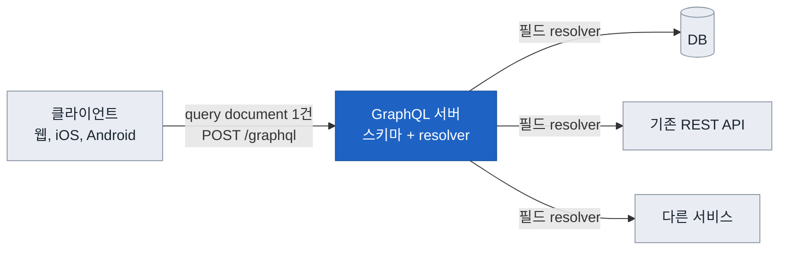
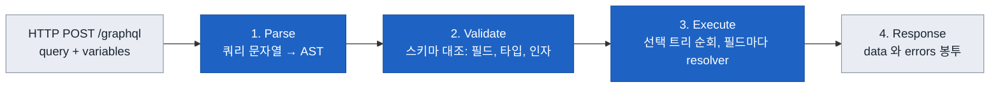
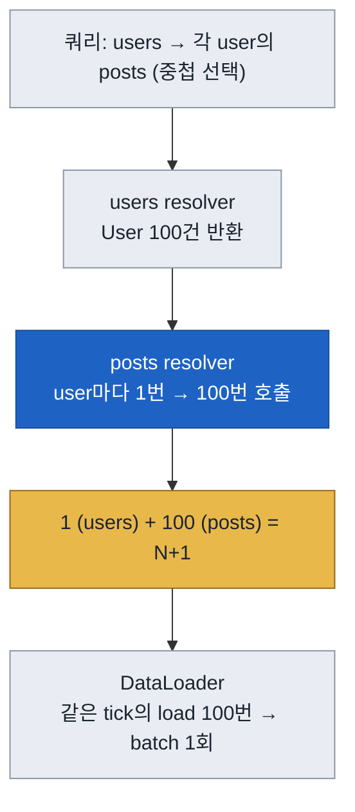

# GraphQL 전체 그림 한 장 지도

한 줄 요약 — GraphQL은 데이터를 저장하지 않는다. 단일 엔드포인트 뒤에서 스키마(타입 그래프)를 기준으로 클라이언트가 요청한 필드만 골라 resolver로 하나씩 채우는 실행 런타임이다. 요청 한 건은 parse→validate→execute→응답으로 흐르고, 성능과 안전의 비용은 execute 단계의 N+1(→DataLoader)과 무제한 쿼리(→실행 전 depth, complexity 제한)에서 나온다.

아래 네 그림은 바깥에서 안으로 줌인한다. 이 문서는 세부를 붙이는 뼈대이고, 개념 정본은 [[GraphQL]], 구현 정본은 [[NestJS-GraphQL]], 대안 비교는 [[API-Comparison]]이다. 파란 상자는 GraphQL 서버 내부, 노란 상자는 비용과 위험이 사는 곳이다.

## 그림 1. 서비스에서 GraphQL이 앉는 자리

볼 것: GraphQL은 저장소가 아니라, 여러 데이터 소스를 단일 엔드포인트 뒤에 묶어 클라이언트가 요청한 모양대로 돌려주는 조합 계층이다.

- **단일 엔드포인트**: 자원마다 URL을 파는 REST와 달리 `/graphql` 하나로 모든 쿼리, 뮤테이션을 받는다. 응답 모양은 서버가 아니라 클라이언트의 쿼리가 정한다.
- **저장소가 아니다**: 서버 자체엔 데이터가 없다. 각 필드 resolver가 DB, 기존 REST, 다른 서비스를 호출해 채운다. 도입은 새 저장소가 아니라 조합 계층을 얹는 일.
- **비용이 사는 곳**: resolver에서 데이터 소스로 나가는 화살표가 N+1과 지연이 터지는 지점. 이 화살표 개수가 곧 운영 난이도.

## 그림 2. 요청 한 건의 라이프사이클 (parse에서 응답까지)

볼 것: 요청은 같은 4단계를 탄다(사전 검증된 persisted 요청은 validate를 건너뛸 수 있다). 어느 단계에서 무엇을 막고 무엇을 채우는지가 성능과 안전의 전부다.

- **Parse**: 쿼리 문자열을 AST로. 문법 오류는 여기서 걸려 실행이 아예 없다.
- **Validate**: AST를 스키마와 대조해 없는 필드, 타입 안 맞는 인자를 거른다. 실패는 실행 시작 전의 request error라 응답에 부분 data가 아예 없다(실행 중 field error의 부분 성공과 구분). **depth, complexity 제한이 붙는 자리** — 스키마 검증 자체가 아니라 별도 custom 규칙, demand control로 얹는다. 실행 전에 돌아 악성 깊은 쿼리가 DB를 안 건드린다.
- **Execute**: 선택 트리를 위에서 아래로 순회하며 필드마다 resolver 호출. 뮤테이션 최상위 selection set은 스펙 실행 의미에 따라 순차 실행하고, 쿼리 필드는 병렬 실행할 수 있다. **N+1과 필드 단위 인가가 여기서** 일어난다.
- **Response**: 스펙이 허용하는 최상위 키는 셋이다 — `data`, `errors`, 그리고 구현이 자유롭게 쓰는 `extensions`(텔레메트리, rate limit 소모량 같은 부가 정보 객체). `data`와 `errors` 중 최소 하나는 있고, 둘 다 있으면 partial response다. 각 error 객체는 `message`와 (있으면) 문서 내 위치 `locations`를 담는다. 필드 하나가 실패하면 execute 중에 그 필드가 null이 되고, non-null이면 null이 nullable 상위까지 올라간다(null bubbling). 그 결과가 봉투에 담겨 부분 성공, 부분 실패로 나온다.

## 그림 3. 스키마는 타입 그래프, 쿼리는 부분 트리, 실행은 순회

볼 것: 스키마는 타입들이 필드로 이어진 그래프이고, 쿼리는 그 그래프의 부분 트리를 고른 것이다. 실행은 그 트리를 resolver로 순회하는 일이라 간선 하나가 resolver 호출 하나다.

- **간선 = resolver 호출**: `users`가 100건을 주면 그 아래 `posts` 간선은 사용자마다 한 번, 100번 불린다. 이 구조적 곱셈이 N+1이다.
- **DataLoader가 붙는 자리**: 같은 tick에 모인 `load(id)` 호출을 배치 1회로 접는다. 입력 키 순서 보존과 요청 스코프여야 하는 이유는 [[NestJS-GraphQL-DataLoader#DataLoader — N+1 해결|DataLoader 정본]]. 일부 구현은 배치 대신 selection set을 데이터 소스 최적화 쿼리로 직접 번역해 N+1을 피하기도 한다.
- **얕게 유지**: 모든 필드를 ResolveField로 쪼개면 라운드트립만 는다. 단순 필드는 부모 resolver가 한 번에 채우고, 무거운 연관만 별도 resolver로.

## 그림 4. 운영 관심사가 라이프사이클 어디에 붙나

볼 것: 개념 문서의 단점, 운영 항목이 각각 그림 2의 어느 단계에 핀으로 꽂히는지. 외우는 게 아니라 위치로 기억한다.

| 관심사 | 붙는 단계 | 왜 거기 |
|---|---|---|
| depth, complexity 제한 | validate (custom 규칙) | 실행 전에 막아야 DB를 안 건드림 |
| 필드, 타입 인가 | execute (resolver 진입) | 권한이 필드 단위라 resolver에서 판단 |
| N+1 → DataLoader | execute | 선택 트리 순회 중 배치 |
| 부분 실패 errors, null bubbling | execute → response | 전파는 execute에서 계산, data, errors 봉투로 response에 표면화 |
| HTTP 캐싱 손실 | 단일 POST 엔드포인트 특성 | persisted query + GET로 완화 |
| 필드 병목, 에러 관측 | execute | resolver 단위 metrics, trace, log 계측 (OpenTelemetry 같은 vendor-agnostic 도구) |

각 항목의 상세와 트레이드오프는 [[GraphQL#단점|개념 정본의 단점 절]]에 있다. 이 표는 그 목록을 흐름 위 위치로 다시 꽂은 것.

## NestJS는 이 그림 어디에

- **code-first 데코레이터**(`@ObjectType`, `@Field`) → 그림 3의 타입 그래프를 코드에서 생성. 스키마가 TS 클래스에서 파생된다.
- **`@Resolver`, `@Query`, `@ResolveField`** → 그림 2의 execute 단계 resolver. `@ResolveField`가 그림 3의 간선.
- **DataLoader REQUEST 스코프 provider** → 그림 3의 batch 지점.
- **`GqlAuthGuard`** → 그림 4의 인가(execute 진입). HTTP Guard와 달리 `GqlExecutionContext.create`로 컨텍스트를 꺼낸다.

구현 코드와 흔한 실수는 [[NestJS-GraphQL]] 정본. 이 지도는 그 코드가 전체 흐름의 어디에 앉는지만 표시한다.

## 이 지도의 용도

읽으면서 각 개념을 그림 위 위치에 붙이는 뼈대다. 외우는 대상이 아니다. 1단계 아웃풋은 이 문서를 닫고 그림 2(라이프사이클)와 그림 3(N+1이 왜 생기고 DataLoader가 어디 붙나)을 빈 종이에 다시 그리는 것 — 예시 쿼리는 본인 도메인으로 바꿔서. 그려지지 않는 부분이 다음에 읽을 곳이다.

## 관련 문서

- [[GraphQL|GraphQL 개념 정본 (스키마, resolver, 단점, REST 비교)]]
- [[NestJS-GraphQL|NestJS 구현 정본 (resolver, DataLoader, Subscription)]]
- [[API-Comparison|REST vs GraphQL vs gRPC 선택 가이드]]
- [[REST|REST, RESTful API]]

## 출처

- [GraphQL September 2025 Specification — Execution](https://spec.graphql.org/September2025/#sec-Execution)
- [graphql.org — Execution](https://graphql.org/learn/execution/)
- [graphql.org — Validation](https://graphql.org/learn/validation/)
- [graphql.org — Response](https://graphql.org/learn/response/)
- [graphql.org — Performance](https://graphql.org/learn/performance/)
- [graphql.org — Security (Demand control: depth, complexity, rate limiting)](https://graphql.org/learn/security/)
