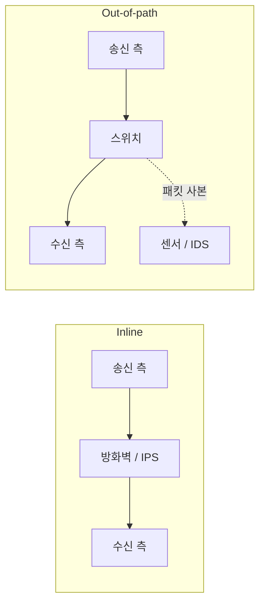

# 네트워크 장비의 설치 구조 — Inline과 Out-of-path

장비의 배치는 **원본 트래픽이 그 장비를 통과해야 하는가**로 구분한다. Inline은 해당 흐름의 전달 경로에 들어가고, Out-of-path는 경로 밖에서 사본을 받아 관찰한다. 물리 장비의 이름보다 실제 트래픽 경로와 동작 모드가 기준이다.

## 두 구조의 데이터 흐름

도식은 한 방향의 흐름을 단순화한 것이다. Inline은 도로의 톨게이트, Out-of-path 센서는 도로 옆의 관측 카메라에 비유할 수 있다.

| 비교 기준 | Inline | Out-of-path |
|---|---|---|
| 분석 대상 | 전달 경로에 있는 원본 트래픽 | 미러링이나 TAP 등으로 전달된 사본 |
| 직접 제어 | 장비 기능과 정책에 따라 원본을 전달하거나 폐기 가능 | 사본만으로 이미 지나간 원본 패킷을 직접 차단할 수 없음 |
| 주요 용도 | 라우팅, 방화벽 정책 집행, 인라인 IPS | 장애 분석, 트래픽 가시화, 수동 IDS |
| 분석 장비 장애 | 실제 전달 중단이나 검사 우회로 이어질 수 있음 | 센서 장애 자체는 보통 관측 중단으로 이어짐 |
| 주요 용량 제약 | 처리량, 초당 패킷 수, 검사 지연 | 복제 경로와 미러 출력 대역폭, 센서 수집/분석 용량 |

## Inline — 전달 전에 판단하는 위치

라우터, 방화벽과 인라인 IPS는 해당 흐름의 경로에 들어갈 수 있다. 패킷이 실제로 장비를 통과하므로 다음 구간으로 전달하기 전에 정책을 적용할 수 있다. 검사 대상이 우회 경로로 빠지지 않는지도 확인해야 한다.

- **Forward / Allow**: 다음 구간으로 전달하거나 정책상 통과를 허용한다.
- **Drop**: 패킷을 폐기한다.
- **Bypass**: 특정 검사나 처리 단계를 우회한다. 검사를 통과한 정상 패킷의 전달을 모두 바이패스라고 부르지는 않는다.

인라인 장비도 관측과 기록을 수행할 수 있다. Inline은 제어 전용이라는 뜻이 아니라 **직접 제어할 수 있는 경로상의 위치**를 뜻한다.

### 장애 시 통과와 차단

검사 엔진이 동작하지 않을 때 트래픽을 계속 통과시키는 fail-open과, 전달을 막는 fail-closed는 가용성과 검사 유지 사이의 선택이다.

실제 동작은 장애 종류와 제품 구성에 따라 다르다. 검사 프로세스 중단 때 작동하는 소프트웨어 바이패스가 장비 전원 장애까지 처리하는 것은 아니다. 이중화, 하드웨어 바이패스 지원과 복구 후 검사 재개를 각각 확인한다.

## Out-of-path — 사본을 관찰하는 위치

센서는 원본의 전달 완료를 기다리게 하지 않고 사본을 분석한다. 분석 목적이 연결 실패나 지연 조사이면 장애 분석에, 공격 패턴 탐지이면 IDS(Intrusion Detection System)에 활용한다. **센서라는 이름 자체가 배치 방식을 결정하지는 않는다.** 같은 보안 제품도 설정에 따라 인라인 또는 수동 감시 모드로 동작할 수 있다.

사본만 받는 센서는 그 사본을 버려도 원본 전달을 막지 못한다. 다만 탐지 후 방화벽 규칙 변경을 요청하거나 TCP 연결 종료를 시도하는 **간접 대응**은 가능하다. 이는 관측한 패킷을 전달 전에 차단하는 것과 다르며, 반응 전에 일부 트래픽이 이미 도착했을 수 있다.

관측 경로를 분리하면 센서의 분석 지연이 원본의 필수 처리 단계가 되지는 않는다. 그렇더라도 사본을 만드는 스위치와 복제 트래픽이 사용하는 네트워크 자원까지 영향이 없는 것은 아니다.

## 포트 미러링 — 필요한 사본을 센서에 전달

포트 미러링은 스위치가 선택한 포트나 VLAN의 트래픽을 복제해 모니터링 대상으로 보내는 기능이다. Cisco에서는 SPAN(Switched Port Analyzer)이라는 이름을 사용한다.

- **Source**: 복제할 포트/VLAN과 방향을 선택한다. RX는 해당 스위치 포트로 들어오는 방향, TX는 나가는 방향이다.
- **Destination**: 복제 트래픽을 내보내 센서가 받게 하는 포트다.
- **범위**: 송수신 양쪽이나 여러 관측 지점을 선택하면 합산 부하가 커지고 같은 패킷의 사본이 중복될 수도 있다.

### 원본과 완전히 같은 기록인가

미러링을 모든 비트와 모든 패킷의 보존 보장으로 이해하면 안 된다. 복제 시점, 모델과 설정에 따라 다음 차이가 생길 수 있다.

- VLAN 태그나 MAC 주소가 스위치 내부 처리 후의 형태로 나타날 수 있다.
- 오류 프레임이 복제 대상에서 빠지거나, 미러 출력 혼잡 때문에 사본이 누락될 수 있다.
- 센서에서도 캡처 길이 제한과 수집 버퍼 드롭이 추가로 발생할 수 있다. [[Wireshark-Packet-Analysis#캡처에 보이는 범위|캡처 범위와 누락]]

예를 들어 Nexus 3550-T NX-OS 10.2(x)의 SPAN 문서는 FCS 오류 프레임을 미러하지 않고, ingress rewrite 이후의 사본을 보내며 SPAN 출력이 untagged라고 설명한다. 이는 **해당 플랫폼의 동작 예**이므로 다른 스위치에 그대로 적용하지 않는다.

### CPU 사용량만으로 판단하지 않는다

미러링 구현은 제품마다 다르다. Nexus 3550-T의 위 구성에서는 복제를 하드웨어가 수행하고 supervisor CPU는 관여하지 않는다. 따라서 미러링을 켜면 항상 CPU 부하가 크게 증가한다고 일반화할 수 없다.

그렇다고 복제 비용이 없는 것도 아니다. 장비가 지원하는 복제 자원과 세션 수, 내부 전달 경로, 출력 포트와 센서 용량을 함께 확인한다. 소프트웨어로 복제하는 환경이면 CPU와 메모리 대역폭도 고려한다.

**단순 용량 예시**: 1 Gbps 전이중 포트에서 RX 1 Gbps와 TX 1 Gbps를 동시에 미러링하면 사본의 유입량은 합계 약 2 Gbps다. 이를 센서 방향의 1 Gbps 출력 하나로 계속 보내면 모두 담을 수 없다. 버퍼는 순간적인 증가를 흡수할 뿐 지속적인 용량 부족을 해결하지 못한다.

센서가 패킷을 놓쳤다고 원본 통신도 같은 패킷을 잃었다고 판단하지 않는다. 반대로 캡처가 보인다고 애플리케이션의 수신과 처리까지 완료됐다는 뜻도 아니다.

## 설계와 운영 확인 포인트

1. **목적**: 전달 전에 막아야 하는지, 사본을 보고 탐지와 분석을 할 것인지 정한다.
2. **경로**: 양방향 트래픽, 우회 경로와 관측 위치를 그린다. 센서가 보는 범위를 명시한다.
3. **용량**: 평시/최대 트래픽량, 초당 패킷 수, RX/TX 합계와 중복 사본을 계산한다.
4. **검증**: 원본 포트, 미러 출력, 센서의 드롭 카운터를 따로 확인한다. 카운터 의미와 제공 범위는 제품 문서로 확인한다.
5. **장애**: 인라인 장비의 프로세스/링크/전원 장애와 센서 중단 시 통신과 관측에 어떤 영향이 생기는지 시험한다.

핵심은 **직접 제어가 필요한 경로와 관측용 사본 경로를 구분하고, 두 경로의 장애와 용량을 따로 검증하는 것**이다. 미러링 범위는 분석 목적에 필요한 포트, VLAN과 방향으로 한정한다.

## 출처

- [YouTube, 네트워크 장비의 Inline과 Out-of-path 설치 구조 강의](https://www.youtube.com/watch?v=XBPXxFip4xs) — 사용자 제공 학습 메모를 바탕으로 정리. 영상 자막은 직접 대조하지 못했으며, 기술 설명은 공식 자료로 보완했다.
- [Cisco, Security Manager 4.24 User Guide: Managing IPS Device Interface](https://www.cisco.com/c/en/us/td/docs/security/security_management/cisco_security_manager/security_manager/424/User/csm-user-guide-424/chapter37-managing-ips-device-interface.html) — 인라인/수동 감시, 간접 대응과 바이패스
- [Cisco, Nexus 3550-T NX-OS System Management Configuration Guide 10.2(x): Configuring SPAN](https://www.cisco.com/c/en/us/td/docs/dcn/nexus3550/3550-t/sw/102x/configuration/Cisco-Nexus-3550-T-System-Management-Configuration-Guide/cisco-nexus-3550t-system-management-configuration-guide-102x/3550-T-system-management-configuration-guide-102x-configuring-span.pdf) — 해당 플랫폼의 하드웨어 복제와 프레임 변형/제외 조건
- [Cisco, Configuring ERSPAN](https://www.cisco.com/c/en/us/td/docs/routers/ios-xe/lan-wan/lan-wan/m_lnsw-conf-erspan.html) — 원격 미러링에서 출력 대역폭 부족으로 사본이 드롭되는 제품 사례
- [Wireshark, User's Guide](https://www.wireshark.org/docs/wsug_html/) — 캡처 범위, 길이 제한과 수집 버퍼

## 관련 문서

- [[Wireshark-Packet-Analysis]] — 캡처 구조, 사본의 해석과 수집 누락
- [[Physical-DataLink-Layer]] — MAC 기반 스위칭과 포트의 역할
- [[Network-Perimeter-Security]] — 방화벽, UTM과 WAF의 배치
- [[네트워크(Network)]] — 네트워크 문서 지도
